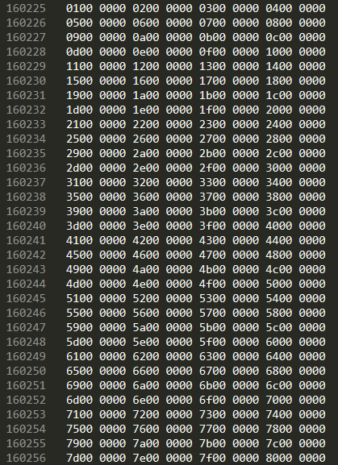

# PPT及PPTX文档结构解析：PPT文档

[TOC]

## 一、前言

由于工作原因，项目上需要通过JNI调用Office的能力，对PPT文档进行播放、翻页等操作，但一个特别的点在于，项目中使用了官方版本Office，并且未激活，这就意味着Office提供的一系列Windows COM组件，其中包含的绝大多数API都无法使用，因为Office COM组件本质上就是调用了Office应用程序的能力，假如Office应用程序在未激活的情况下无法使用某些功能，那么COM组件也无法完成。

因此，我们需要解决的就是寻找一个workaround，绕过调用COM组件的环节，直接实现某些功能。项目中对PPT的主要功能要求是需要将PPT的放映模式修改为展台模式，以限制用户操作对文档展示的影响。


## 二、简介

​	**PowerPoint原生存在三种放映模式：*

​	*(1)普通模式 (present)：即默认的放映模式，在此模式下，用户可以使用鼠标或上下键等进行翻页，用户的任何操作都不会受限*

​	*(2)浏览模式 (browse)：在此模式下，用户可以正常翻页和浏览，但不会显示演讲者视图*

​	*(3)展台模式 (kiosk)：在此模式下，用户的所有操作都会被屏蔽，无法翻页、无法结束*

------

如果使用COM组件，则需要调用Office的能力，在PPT文档放映时设置为展台模式，类似在PowerPoint中进行如下的操作：


*在按照上述方式修改放映方式之后保存PPT文档，发现该属性会被保存下来，因此我们有理由相信，通过其他的手段修改PPT文档，也可以实现类似的操作。

### PPT格式的文档

通过查阅微软官方文档（<https://docs.microsoft.com/en-us/openspecs/office_file_formats/ms-ppt/6d266473-cadd-49ad-a3cb-9f3601365b9e>），可以发现在PPT格式的文档中，SlideShowDocInfoAtom这个东西中就存放了我们要修改的属性。

### PPTX格式的文档

PPTX格式的文档我们都知道，其实就是个压缩包，可以通过压缩工具解压出来，里面包含了许多的xml文件，PPTX文档就是基于OpenXml这样的规约编写的一种规范化的文档。同样查阅微软官方文档（<https://docs.microsoft.com/zh-cn/office/open-xml/structure-of-a-presentationml-document?view=openxml-2.8.1>），可以发现在PPTX格式的文档中，存在一个presProps.xml，配置了PPTX放映的方式，修改它就可以达到我们的目的。


## 三、PPT文档处理详细解析

PPT文件(Office97-2003版本)是二进制的文件结构，文件形式为OLE(Object Linking and Embedding) compound file，是一系列数据块的集合。

在官网可以查看和下载复合文档结构的介绍文档[MS-CFB]（<https://docs.microsoft.com/en-us/openspecs/windows_protocols/ms-cfb/53989ce4-7b05-4f8d-829b-d08d6148375b>），这是针对复合类型文档的通用介绍，还需要结合PPT的介绍文档一起看[MS-PPT]（<https://docs.microsoft.com/en-us/openspecs/office_file_formats/ms-ppt/6be79dde-33c1-4c1b-8ccc-4b2301c08662>）。


再回到前言中提到的需要解决的问题，经过查阅相关文档，我们可以找到这样一个东西

**SlideShowDocInfoAtom**

(<https://docs.microsoft.com/en-us/openspecs/office_file_formats/ms-ppt/6d266473-cadd-49ad-a3cb-9f3601365b9e>)

在这个Atom中确实存在一个属性**fKioskMode**用来表示PPT文档在放映时的默认模式。

到这里为止，其实方向已经明确了，我们需要做的就是找到文档中的这个Atom，修改这个属性，将它设置为true就可以达到目的。


但是问题又来了，上面提到的相关文档又多又杂，完全不知道从什么地方入手。我们到底怎么去找到这个Atom，它究竟存放在哪里？

要解决上面的这些问题，就必不可少的需要对复合文档的基本结构有一定的了解。


### 3.1 OCE Compound File

#### 3.1.1  复合文档结构简介

复合文档是为了解决传统文件系统无法有效存储多种对象的问题，复合文档的结构化存储定义了如何将单个文件视为两种类型（存储对象和流对象）的分层集合，对应分别为目录和文件。如下图：

​	

​	

Storage为存储对象，其中包含了其下的子存储对象或子流对象的位置和大小信息；

Stream为流对象，其中就包含了所有的用户数据，是一些连续的字节序列。

#### 3.1.2 文档头

复合文档头在文件的开始，且其大小必定为512字节。这意味着第一个Sector的开始相对文件的偏移量为512字节。

复合文档头的结构如下：

```
Offset    Size       Contents                                           

0            8            复合文档文件标识：D0H CFH 11H E0H A1H B1H 1AH E1H

8            16          此文件的唯一标识(不重要, 可全部为0)

24          2            文件格式修订号 (一般为003EH)

26          2            文件格式版本号(一般为0003H)

28          2            字节顺序规则标识:：FEH FFH = Little-Endian  FFH FEH = Big-Endian

30          2            复合文档中sector的大小(ssz)，以2的幂形式存储, sector实际大小为s_size= 2ssz 字节(一般为9即512字节, 最小值为7即128字节)

32          2            short-sector的大小，以2的幂形式存储, short-sector实际大小为s_s_size = 2sssz 字节(一般为6即64字节，最大为sector的大小)

34          10          Not used

44          4            用于存放扇区配置表（SAT）的sector总数

48          4            用于存放目录流的第一个sector的SID

52          4            Not used

56          4            标准流的最小大小(一般为4096 bytes), 小于此值的流即为短流。

60          4            用于存放短扇区配置表（SSAT）的第一个sector的SID,或为–2 (End Of Chain SID)如不存在。

64          4            用于存放短扇区配置表（SSAT）的sector总数

68          4            用于存放主扇区配置表（MSAT）的第一个sector的SID,或为–2 (End Of Chain SID) 若无附加的sectors。

72          4            用于存放主扇区配置表（MSAT）的sector总数

76          436        存放主扇区配置表（MSAT）的第一部分，包含109个SID。
```


复合文档的二进制数据采用Little-Endian即小字节序存储，低8位存放在地址低位，高8位存放在地址高位。


#### 3.1.3 扇区和扇区链

##### 扇区

普通文件系统的文件多数是一整个连续的文件，而复合文件将文件数据划分成等长的扇区，其中头部扇区为文件头，其后接着一系列的扇区，扇区id为32位非负整数标识。这里有一点要注意，头后面的扇区并不一定都是0,1,2,3...这样的顺序，有可能头后方跟的扇区id为其他数，并且相邻扇区id也不一定连续，这个是根据头和目录的配置来决定的（在后面会涉及），如下图。


##### 扇区链

扇区的大小都是固定长度的，例如512字节，但是一个扇区显然并不一定能满足存放所有的用户数据，在数据量比较大的情况下，就需要多个扇区一组合成完整的数据。标识组合成一段完整数据的扇区表称为扇区链（sector chain），如下图。我们可以得到两组扇区链，分别是#0->#2->#4和#1->#3。


每个扇区都有不同的种类，例如上图的sector0，很显然存放了真实数据，因为他存在于一个扇区链中，并且他有后方的扇区id；但是像sector3，他是扇区链的最后一个，就会存在一个ENDOFCHAIN的标识（在后面会涉及）；同时，也可能存在一些扇区并未使用，其中没有存放用户数据，那么这类扇区就会被标识为空闲。

##### FAT和DIFAT

我们现在知道了存在扇区链这个东西，那么扇区链信息究竟存在哪呢？

在复合文档的所有扇区中，有一系列扇区，专门用来存放扇区链信息，这一系列扇区也被称为FAT（File Allocation Tables文件分配表），也可以被称作SAT（Sector Allocation Tables扇区分配表）。FAT中存放了一些列数字，这些数字可以看成一个数组，例如下图的FAT[0]，存放了sector0的下一个扇区id，以此类推。

​	

从上面可以看到，FAT本身也是存放在一些sector中的，那么就需要有一个地方来指定这些sector的位置，这些存放FAT的sector扇区被称为DIFAT（double-indirect file allocation table双间接分配表），也可被称作MSAT（Master Sector Allocation Table）

##### MiniFAT

由于扇区大小都是固定的，当我们需要存放一些远小于固定扇区大小的数据时，如果直接占用一个扇区，将会造成极大的空间浪费，特别是当扇区大小比较大的时候。因此有一些MiniSector专门用来存放这些数据，相对应地也会有MiniFAT用来指定MiniSector的扇区链，在这里不做深入。


#### 3.1.4 目录

上面说到了复合文档其实可以近似看成一个文件夹，里面存放了子文件夹和文件，那么需要一个地方来标识这些文件夹和文件的目录结构。同样的，文档中的某些FAT就存放了这些目录信息。目录以一连串的directory entry组成一个数组，且第一个entry必须指向根目录。复合文档中的storage或stream都有一个单独的directory entry与之对应。

​	

每一个目录entry都是固定的128字节，也就是说，在一个扇区大小为512字节的文档中，一个扇区中可以存放4个目录entry。


目录可以看成是一颗红黑树，并且有如下约束

```
红黑树：是一种特殊的二叉搜索树，每个节点要么为红色要么为黑色，红黑树的限制让这颗二叉树几乎是平衡的，使得对于红黑树的插入、删除和搜索比较高效，存在下面几个规则
(1) 每个节点为红色或黑色
(2) 根节点是黑色的
(3) 每个叶子的节点都是黑色的空节点
(4) 每个红色节点的两个子节点都是黑色的
(5) 从任意节点到所有字节点的路径都包含相同的黑色节点
```

对于复合文档的目录来说，根目录因为没有兄弟姐妹，所以颜色可以为红色也可以为黑色（为了满足红黑树的特性，我们以黑色为例）


每个entry按字节组成结构如下：

```
Offset     Size         Contents                                                  

0          64     		entry名称,为UTF-16编码的Unicode字符(2字节一个字符),以UTF-16中止空字符					     结尾(因此最大可见长度为31个字符)

64          2           用于存放名称占用的长度大小，不可以超过64

66          1           对象类型: 0x00 = 未知或未分配；0x01 = storage对象
								 0x02 = stream对象；0x05 = root storage对象

67          1           此入口的节点颜色: 0x00 = Red    0x01 = Black

68          4           左兄妹节点的Stream ID，若没有左节点就为－1。

72          4           右兄妹节点的Stream ID，若没有右节点就为－1。

76          4           其成员红黑树的根节点的Stream ID (若此入口为storage)，其他为－1。

80          16          假如该entry为storage，则包含一串GUID,若为stream，则全为0

96          4           用户标记(不重要, 可能全为0)

100        8            创建此入口的时间标记。大多数情况都不写。

108        8            最后修改此入口的时间标记。大多数情况都不写。

116        4            若此为流的入口，指定流的第一个sector或short-sector的SID,若此为根仓库入口，指定短流存放流的第一个sector的SID,其他情况，为0。

120        4            若此为流的入口，指定流的大小（字节）若此为根仓库入口，指定短流存放流的大小（字节）其他情况，为0。

124        4            未使用
```


#### 3.1.5 User-Defined Data Sectors

User-Defined是给用户预留的自定义扇区，用户可往里加入自定义的数据，同样的，这部分数据也需要一个扇区链来追踪，扇区链也是存放在FAT或mini FAT中。

#### 3.1.6 Range Lock Sector

range lock sector存在于文档偏移量0x7FFFFF00-0x7FFFFFFF处，正好在2GB大小之前。用来兼容小于2GB和大于2GB的文件。

#### 3.1.7 复合文档文件大小限制

扇区大小为512字节的文件大小不能大于2GB，扇区大小为4096字节的文件大小可以达到16TB。


### 3.2 PPT文档结构

#### 3.2.1 PPT文档基本信息

了解了复合文档的基本结构，我们就可以结合PPT文档来仔细看了，我们用7-zip打开一个PPT文档，可以看到里面的组成结构。


其中SummaryInformation和DocumentSummaryInformation存放了文档的一些基本信息。

Current User中存放了文档创建者、修改者、修改时间等信息。

Pictures顾名思义存放了图片信息。

PowerPoint Document中存放了绝大多数PPT相关的信息，当PPT中存在视频时，也会压缩进这个stream中。


在我们查到的SlideShowDocInfoAtom中，我们可以看到这样一行字“*Referenced by: DocumentContainer*”

说明这个Atom其实是隶属于DocumentContainer的一部分，而DocumentContainer是PowerPoint Document Stream(<https://docs.microsoft.com/en-us/openspecs/office_file_formats/ms-ppt/1fc22d56-28f9-4818-bd45-67c2bf721ccf>)的一部分，没错，就是对应了上图中的PowerPoint Document，那么思路就清晰了，我们需要打开PPT文档，读取PowerPoint Document，找到SlideShowDocInfoAtom。

#### 3.2.2 PowerPoint Document

问题再次产生，如何读取PowerPoint Document？

**有些第三方库支持直接读取PowerPoint Document Stream，例如java中的poi，这个会在下面延伸的时候讲到，在这里先介绍不通过第三方库读取这个Stream的方法*

查看PowerPoint Document Stream的官方文档，它介绍了总共10个构造整个Powerpoint Document的方法，非常的复杂和繁琐，它的目标用户是一些需要构造整个文档对象并处理的第三方。我们其实没有必要构造整个文档对象，大部分数据都是我们不关心的。

通过上面的知识，我们已经知道了怎么拿到整个文档的目录结构，下面就来试试看拿PowerPoint Document。


首先，我们需要读取文件头，以上面的PPT文档为例，按照3.1.2所述的方式来读取看看这个文档，下图是截取的该文档头部512字节的信息


**step1.** 读取偏移量30处的两个字节，对应图中的0x09,0x00，按照小字节序转换后，可得到0x0009，所以我们得到扇区的大小为2的9次方，即512字节

**step2.** 读取偏移量48处的4个字节，对应图中的0xb6,0x13,0x00,0x00，按照小字节序转换后，可得到0x000013b6，对应十进制5046，即存放目录流的第一个sector的SID为5046


到这里，其实我们已经可以找到第一个目录，观察到上图中其实PPT文档里存在的文件数为5个，而一个目录流中可以存放四个entry的信息，说不定第一个目录就能找到PowerPoint Document Stream呢。→_→

所以我们暂缓一下读取文档头的操作，先进到5046的扇区处看一下这第一个目录里面包含什么entry。

（1）文档偏移量指向512+512*5046处（因为文档头是512字节，后面按照SID顺序排列每一个扇区，一个扇区上面计算到是512字节），读取512字节的一个扇区，如下图，可将这512字节的扇区划分成四个部分，每部分128字节。


（2）读取第一个部分的前64个字节，然后转换成char，我们可得到这个entry的名称为“Root Entry”，这不是我们需要的。同样的，第二个部分前64字节得到名称为“Pictures”。第三个部分名称为“Current User”。第四个部分为“SummaryInformation”。

看来我们还是太年轻了，这第一个目录中并没有找到我们需要的文档流entry，那就老老实实先读完文档头吧。


**step3.** 读取文档头偏移量68处的4个字节，得到0xfe,0xff,0xff,0xff，对应0xfffffffe=-2，表示除了文档头中的部分数据记录了MSAT(DIFAT)，没有另外额外的扇区用来存放MSAT数据了。

**step4.** 再向后读取4个字节，得到0x00000000，这和3中的结论一致，额外存放MSAT的扇区数为0，那么我们只需要读取头部中存放的MSAT信息就可以了。

**step5.** 读取文档头偏移量76处的数据，四个字节作为一个单位，一共可以读到109个数据，本例中可以读到0x0000138e，0x0000138f，0x00001390等等，对应的SID为5006，5007，5008...而读到最后数据全为0xffffffff，即表示后面的数据都是空的了，至此，我们得到了存放MSAT的所有扇区位置

**step6.** 从上面的信息我们知道，MSAT中存放的是所有扇区链的信息，那么我们去遍历所有MSAT的数据，以上面的第一个MSAT即第5006个扇区为例，读取扇区中的所有数据，同样以四个字节为一个单位，如下图，我们可以得到这样一条链，1,2,3,4....127,128



**step7.** MSAT的数据都是连续的，所以以此类推，我们遍历完所有MSAT，可以得到一个很长的SID链，假设我们现在有一个sector X，那么这个sector接下去的一个sector id就为SID(X)，即SID链的第X位

**step8.** 现在，我们再回到上面得到的第一个目录流扇区5046，查SID链后，可以得到目录流的扇区链为5046，5047，-2，其中链最后的-2表示链结束，那么目录流的所有数据就存放在5046和5047两个扇区中，上面我们已经读取了5046，再按照同样的方法读取5047。我们惊喜地发现，5047中可以读到的第一个目录名称就是“PowerPoint Document”（下图红框），这就是我们要找的东西了。并且我们可以知道，“PowerPoint Document”的第一个扇区为2051（下图蓝框），并且总大小为1454976（下图绿框）。


#### 3.2.3 PowerPoint Document Stream组成结构

在Office官网上，对PowerPoint Document Stream的组成结构介绍非常详细，并且一上来就开始教你怎么去读取这个stream并且构造里面的所有对象，上来就看这个很容易陷进去，搞得思维混乱（至少笔者当时看这个看得脑阔疼），所以我们先对PowerPoint Document Stream的组成结构有一个简单了解再入手会比较好。

PowerPoint Document Stream中的数据组成单位为Record，可以分为Container Record和Atom Record两种，Container可以包含若干个Atom，Atom也可以脱离Container单独存在，可以参考下图理解一下。


所有的Record都由两部分结构组成，头部8字节存放基本信息，其他部分存放数据。而头部的8字节划分为以下几块：

```
recVer(4 bits)：标识Record data版本的无符号整数；如果是0xF，那么就代表了这个Record是一个Container
recInstance(12bits)：Record实例data的标识，不同的Record往往不同
recType(2bytes)：标识Record数据的类型
recLen(4bytes)：标识该Record头部后方数据长度的无符号整数
```

换句话说，我们如果找到了PowerPoint Document Stream的所有数据，那么根据它的结构，我们是可以一层层解析，找到我们需要的Record。

在开头我们提到，我们需要找的Record叫SlideShowDocInfoAtom，它存在于DocumentContainer中，那么，我们就开始找这个DocumentContainer吧

**step9.** 接上文，“PowerPoint Document”的第一个扇区为2051，我们先将偏移量定位到512+512*2051处，先读取后面的4个字节，我们发现，它是0x0f,0x00,0xe8,0x03，巧了，第三第四个字节0x03e8，对应的就是DocumentContainer的recType（事实上在多次验证后发现，DocumentContainer始终都存放在PowerPoint Document的头部）

**step10.** 紧接着，读取后面4个字节，对应DocumentContainer的数据大小，为0x0000466e=18030字节，当然这个数字并不算很大，我们可以一股脑把它的数据全部读入，但这只是理想情况，事实上，我们会遇到某些PPT文档，它的DocumentContainer本身就很大，几百MB甚至上GB，完全读入浪费资源且没必要。

**step11.** 因此，我们再向后读取8字节（因为如果是一个Container Record，它的数据部分其实是由若干个其他Record组合起来的），以此类推，我们可以通过读取头部、跳转对应长度的偏移量、再读取头部的方式，观察到整个DocumentContainer的所有组成部分，如下图，我们可以构造出其中的所有record。


**step12.** 查阅文档后知道，我们需要的SlideShowDocInfoAtom的recType为0x0401=1025，但是在上面没有找到。查看了DocumentContainer相关的介绍，发现SlideShowDocInfoAtom不是一定存在于文档中的，它是一个可选项，当没有设置的时候，Powerpoint程序就会使用默认的放映设置来进行放映。至此，其实路已经走得比较窄了，似乎已经没有其他的办法来达成我们的需求。对于这些没有SlideShowDocInfoAtom的文档，我们下面再讲其他的解决办法。

**step13.** 对于存在SlideShowDocInfoAtom的文档，就很好处理了，这个Record长度恒为88字节，下面以另一个存在此Atom的文档为例，找到1025的Record所在偏移量853438，读取下面的88个字节，我们可以看到，红框中的0104代表了此Record类型为我们需要的1025，而第84个字节为0x40，我们把它转换成二进制即01000000，但是这里要注意的是，这个地方因为8个bit都单独用来做标识，所以这里的比特序也需要遵循小端，即我们需要修改的第6位实际对应第3位，那么我们最后只需要把该值和00100000做或运算即可将只需要把第六位设成1，即01100000=0x60，甚至还可以把第一位改成1，让PPT循环放映，即11100000=0xe0，但一般情况下，展台模式默认就会循环放映，所以这一位不设置也没关系。


我们来看看最终结果，打开PPT，观察幻灯片放映设置里面的选项，发现“在展台浏览(全屏幕)”的选项被默认勾选上了，这个时候我们直接去放映，Powerpoint就会以展台模式打开它了。


**step ex1.** 在step12中，我们举的一个例子中不存在1025这个类型的Record，看起来似乎没有什么好办法来解决这个问题，于是我们寻找一下其他的思路。索性，org.apache.poi给我们提供了这样的能力，但poi的API没有单独提供这样的能力，需要我们自己做一些修改实现。这里要感谢stackoverflow上的某位国外开发者，给我提出的问题提供了一个很好的解决思路。传送门：https://stackoverflow.com/questions/53894044/how-to-change-ppt-presentation-mode-using-apache-poi-or-another-3-rd-library

简而言之，poi提供了能力可以让我们向文档中插入或删除Record，我们需要先使用poi构造一个文档对象slideshow，然后用slideshow.getDocumentRecord()得到一个Document对象，其实就对应了DocumentContainer。

**step ex2.** 然后，我们需要自己构造一个符合规则的Record对象，继承自RecordAtom，然后将第84个字节设置为10100000

```java
	/**
     * 参考https://msdn.microsoft.com/en-us/library/dd908143(v=office.12).aspx
     */
    private static class SlideShowDocInfoAtom extends RecordAtom {

        private byte[] data;

        public SlideShowDocInfoAtom(byte[] data) {
            this.data = data;
        }

        public SlideShowDocInfoAtom() {
            this.data = new byte[]{

                    //rh头文件
                    //rh.recVer,rh.recInstance; MUST be 0x0001 (小字节序)
                    (byte) 0x01, (byte) 0x00,
                    //rh.recType; MUST be 0x0401 = RT_SlideShowDocInfoAtom (小字节序)
                    (byte) 0x01, (byte) 0x04,
                    //rh.recLen; MUST be 0x00000050 (小字节序)
                    (byte) 0x50, (byte) 0x00, (byte) 0x00, (byte) 0x00,

                    //penColor画笔颜色，默认红色
                    //Red       //Green     //Blue        //index
                    (byte) 0xFF, (byte) 0x00, (byte) 0x00, (byte) 0xFE,

                    //restartTime
                    //展台模式翻页的时间间隔,设为整型的最大值7FFFFFFF (小字节序)
                    (byte) 0xFF, (byte) 0xFF, (byte) 0xFF, (byte) 0x7F,

                    //startSlide指定开始播放的页码
                    (byte) 0x00, (byte) 0x00,

                    //endSlide指定结束播放的页码
                    (byte) 0x00, (byte) 0x00,

                    //namedShow (64 bytes),默认全部0填充
                    (byte) 0x00, (byte) 0x00, (byte) 0x00, (byte) 0x00, (byte) 0x00, (byte) 0x00, (byte) 0x00, (byte) 0x00,
                    (byte) 0x00, (byte) 0x00, (byte) 0x00, (byte) 0x00, (byte) 0x00, (byte) 0x00, (byte) 0x00, (byte) 0x00,
                    (byte) 0x00, (byte) 0x00, (byte) 0x00, (byte) 0x00, (byte) 0x00, (byte) 0x00, (byte) 0x00, (byte) 0x00,
                    (byte) 0x00, (byte) 0x00, (byte) 0x00, (byte) 0x00, (byte) 0x00, (byte) 0x00, (byte) 0x00, (byte) 0x00,
                    (byte) 0x00, (byte) 0x00, (byte) 0x00, (byte) 0x00, (byte) 0x00, (byte) 0x00, (byte) 0x00, (byte) 0x00,
                    (byte) 0x00, (byte) 0x00, (byte) 0x00, (byte) 0x00, (byte) 0x00, (byte) 0x00, (byte) 0x00, (byte) 0x00,
                    (byte) 0x00, (byte) 0x00, (byte) 0x00, (byte) 0x00, (byte) 0x00, (byte) 0x00, (byte) 0x00, (byte) 0x00,
                    (byte) 0x00, (byte) 0x00, (byte) 0x00, (byte) 0x00, (byte) 0x00, (byte) 0x00, (byte) 0x00, (byte) 0x00,

                    //放映模式，A~H共8bit代表不同模式，F与H共存
                    //H                 G                  F          E           D                C              B               A
                    //fLoopContinuously,fWillSkipNarration,fKioskMode,fBrowseMode,fDocUseNamedShow,fUseSlideRange,fWillSkipBuilds,fAutoAdvance
                    (byte) Integer.parseInt("10100000", 2), //only fBrowseMode is set

                    //隐藏scroll bar+占位7bit
                    //              I
                    //0,0,0,0,0,0,0,fHideScrollBar
                    (byte) Integer.parseInt("00000000", 2),

                    //保留位
                    (byte) 0x00, (byte) 0x00 //unused

            };
        }

        /**
         * set to kiosk mode
         *
         * @param on
         */
        public void setfKioskMode(boolean on) {
            byte preMode = this.data[84];
            if (on) {
                //fLoopContinuously = 1,fKioskMode = 1
                preMode |= (byte) Integer.parseInt("10100000", 2);
            } else {
                //fBrowseMode = 1
                preMode |= (byte) Integer.parseInt("00010000", 2);
            }
            this.data[84] = preMode;
        }


        @Override
        public void writeOut(OutputStream out) throws IOException {
            out.write(data);
        }

        @Override
        public long getRecordType() {
            //参考https://msdn.microsoft.com/en-us/library/dd945336(v=office.12).aspx
            //RT_SlideShowDocInfoAtom:0x0401=1025
            return 1025;
        }
    }
```

**step ex3.** 最后，将自定义的Record插入到Document文档结尾前，最后将文档输出并关闭即可。

```java
  //创建默认Record，模式为kiosk
  slideShowDocInfoAtomRecord = new SlideShowDocInfoAtom();
  //将新建的record加入文档末尾之前
  // 1002 = 0x03EA = RT_EndDocumentAtom
  slideshow.getDocumentRecord().addChildBefore(
            slideShowDocInfoAtomRecord,
            slideshow.getDocumentRecord().findFirstOfType(1002));

  try (FileOutputStream fos = new FileOutputStream(targetPath)) {
            slideshow.write(fos);
  }
  slideshow.close();
```

**step ex4.** 看起来上面步骤好像天衣无缝啊，但是，naive。。。我们看看poi创建slideshow的源码

```java
public HSLFSlideShowImpl(DirectoryNode dir) throws IOException {
    super(handleDualStorage(dir));

    // First up, grab the "Current User" stream
    // We need this before we can detect Encrypted Documents
    readCurrentUserStream();

    // Next up, grab the data that makes up the
    //  PowerPoint stream
    readPowerPointStream();

    // Now, build records based on the PowerPoint stream
    buildRecords();

    // Look for any other streams
    readOtherStreams();
}

/**
 * Extracts the main PowerPoint document stream from the
 * POI file, ready to be passed
 *
 * @throws IOException
 */
private void readPowerPointStream() throws IOException {
    // Get the main document stream
    DocumentEntry docProps =
                (DocumentEntry) getDirectory().getEntry("PowerPoint Document");

    // Grab the document stream
    int len = docProps.getSize();
    InputStream is = getDirectory().createDocumentInputStream("PowerPoint Document");
    try {
        _docstream = IOUtils.toByteArray(is, len);
    } finally {
        is.close();
    }
}
```

在上面的readPowerPointStream方法中，我们发现，有一步IOUtils.toByteArray(is,len)，会将这个Powerpoint Document Stream完全读入内存，并创建一个一样大的字节数组。这种方式在面对一些比较大的文件时一个问题是加载时间会比较久，另一个问题在于，假如应用程序对jvm堆内存大小做了限制，那么很容易造成内存泄露。这应该是属于poi库没有考虑到的点，但是换句话说，假如不构造整个文档对象，也没有办法向文档中的某个位置加入某些数据，再将整个文档重新写入。因为复合文档不像普通文件，数据并不是顺序的，向某个地方插入数据后，可能整个文档的结构都需要重新排列，包括扇区链等等，并不是简单插入就可以的。


#### 3.2.4 小结

本节中介绍了PPT文档的组成结构以及设置展台模式的两种方式，但是两种方式各有优劣，都不能完美地解决问题，目前，在限制应用程序堆内存大小的情况下，暂时找不到其他更好的解决办法。如果有其他同学有比较好的建议，欢迎留言。


## 四、PPTX文档处理详细解析

PPTX文档是word2007之后推出的新格式文档，主要特点是遵循了openxml的规范，除媒体文件外，所有文件都以xml的形式存在，这种方式大大方便了第三方应用了解和集成使用office文档能力。我们知道，在PPT文档的时代，文档都是二进制的格式，构造和解析整个文档非常的繁琐，虽然二进制复合文档的文件空间利用率非常高，但是在硬盘等存储系统飞速发展的时代，文件大小已经不是一个问题了。

关于PPTX文档的结构解析，我没有找到比较独立的介绍，但是有针对OpenXML SDK的API文档，传送门：

https://docs.microsoft.com/zh-cn/office/open-xml/structure-of-a-presentationml-document?view=openxml-2.8.1


