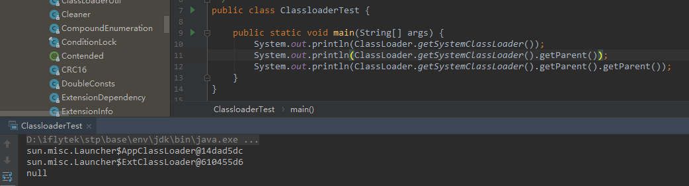

---

layout:     post
title:      PPT及PPTX文档结构解析
subtitle:   PPT文档
date:       2019-01-25
author:     skaleto
catalog: true
tags:
    - ppt&pptx

---

# Java类加载机制


## 简介

Java中所有的类，如果需要被使用，就需要被加载到内存中，jvm会通过加载、链接、初始化三个步骤对某个类进行初始化

##### 加载

加载过程中，jvm会读取.class文件的字节流，并且根据字节流创建java.lang.Class，在这个过程中，会把.class文件中的二进制数据读入内存，放在运行区域的方法区内。在堆区中创建java.lang.Class对象。

所有的类Class仅会创建一个Class对象。

##### 链接

(1) 验证，确保被加载的类满足Java虚拟机的规范，不会造成安全错误

(2) 准备，为类的静态成员分配内存，设置默认初始值（例如static int会默认设置一个0）

(3) 解析，将符号引用转换为直接引用（方法名、变量、类名等转换为物理地址）

##### 初始化

对类中的静态变量或静态代码块进行初始化

如果在初始化一个类时，它的父类还没有初始化，则优先初始化它的父类


## 类加载器

Java中存在下面四种类加载器


##### Bootstrap ClassLoader

加载jre目录下的\lib\rt.jar，由C++实现

##### Extension Classloader

加载jre目录\lib\ext下或启动命令-Djava.ext.dirs中指定目录的所有jar包

##### App Classloader

加载classpath或启动命令-Djava.class.path中指定目录的所有jar包

##### Custom Classloader

应用程序自己定义的Classloader


在一个加载器被加载的时候，它会向上检查相关的加载器是否已经被加载，而在实际加载的时候，它会向下尝试加载。这就是著名的双亲委派机制。


## 双亲委派机制

### 简介

某个类加载器在接收到加载类的请求时，先将加载人物委托给父加载器，如果父加载器可以完成类加载，就成功返回；如果父加载器无法完成，就自己去加载。

### 例子


ExtClassloader及AppClassLoader都是是在sun.misc.Launcher的静态内部类，两者都继承自URLClassloader和SecureClassloader，而在父类Classloader中，有如下一段代码

```java
public Class<?> loadClass(String name) throws ClassNotFoundException {
    return loadClass(name, false);
}


protected Class<?> loadClass(String name, boolean resolve)
    throws ClassNotFoundException
{
    synchronized (getClassLoadingLock(name)) {
        // 第一步，检查class是否已经被加载了
        Class<?> c = findLoadedClass(name);
        if (c == null) {
            long t0 = System.nanoTime();
            try {
            	// 如果没有加载，那么检查是否有双亲，即父类加载器
                if (parent != null) {
                	// 如果有父类加载器，则交给父类进行加载
                    c = parent.loadClass(name, false);
                } else {
                	// 如果没有父类加载器，则使用bootstrap加载器来加载，
                    c = findBootstrapClassOrNull(name);
                }
            } catch (ClassNotFoundException e) {
                // ClassNotFoundException thrown if class not found
                // from the non-null parent class loader
            }

            if (c == null) {
                // 如果还是无法加载这个类，就触发自身的findClass来完成加载
                long t1 = System.nanoTime();
                c = findClass(name);

                // this is the defining class loader; record the stats
                sun.misc.PerfCounter.getParentDelegationTime().addTime(t1 - t0);
                sun.misc.PerfCounter.getFindClassTime().addElapsedTimeFrom(t1);
                sun.misc.PerfCounter.getFindClasses().increment();
            }
        }
        if (resolve) {
            resolveClass(c);
        }
        return c;
    }
}


private Class<?> findBootstrapClassOrNull(String name){
    if (!checkName(name)) return null;

    return findBootstrapClass(name);
}

// return null if not found
// native code实现的bootstrap加载器
private native Class<?> findBootstrapClass(String name);
```

从代码来看，确实是遵循了这样一个加载的规则。


从下图上，我们可以看出不同Class


从下面代码的运行结果来看，当前类的加载器和其父类的加载器都可以看到符合上面的结构图，但是获取ExtClassLoader的时候发现打出的是null



我们接着来看一下代码，下面两个ClassLoader的构造方法表明classloader在创建的时候，如果没有parent传入，默认会去通过getSystemClassLoader获取系统类加载器作为他的parent，而ExtClassLoader在代码调试结果来看，parent为null，那么根据上面的逻辑，默认就会调用BootstrapClassloader完成加载

```Java
protected ClassLoader(ClassLoader parent) {
    this(checkCreateClassLoader(), parent);
}
protected ClassLoader() {
    this(checkCreateClassLoader(), getSystemClassLoader());
}
```


## 自定义类加载器

1）首先检查请求的类型是否已经被这个类装载器装载到命名空间中了，如果已经装载，直接返回；否则转入步骤2

2）委派类加载请求给父类加载器（更准确的说应该是双亲类加载器，整个虚拟机中各种类加载器最终会呈现树状结构），如果父类加载器能够完成，则返回父类加载器加载的Class实例；否则转入步骤3

3）调用本类加载器的findClass（…）方法，试图获取对应的字节码，如果获取的到，则调用defineClass（…）导入类型到方法区；如果获取不到对应的字节码或者其他原因失败，返回异常给loadClass（…）， loadClass（…）转抛异常，终止加载过程（注意：这里的异常种类不止一种）。


## 问题

1. 全限定名相同的两个类，一定相同吗？

不是的，jvm中两个类除了全限定名还需要它的Classloader实例来做唯一标识，也就是说全限定名相同的两个类，如果被两个不同的类加载器加载，他们还是不同的

2. Class.forName会调用哪个类加载器来完成加载？

   在构造方法中的initialize代表是否要完成加载过程中的初始化环节，从代码来看是拿到了调用方的classloader来进行加载

```java
@CallerSensitive
public static Class<?> forName(String className)
            throws ClassNotFoundException {
    Class<?> caller = Reflection.getCallerClass();
    return forName0(className, true, ClassLoader.getClassLoader(caller), caller);
}

@CallerSensitive
public static Class<?> forName(String name, boolean initialize,
                                   ClassLoader loader)
    throws ClassNotFoundException
{
    Class<?> caller = null;
    SecurityManager sm = System.getSecurityManager();
    if (sm != null) {
        // Reflective call to get caller class is only needed if a security manager
        // is present.  Avoid the overhead of making this call otherwise.
        // 使用反射获取调用方的class和classloader
        caller = Reflection.getCallerClass();
        if (sun.misc.VM.isSystemDomainLoader(loader)) {
            ClassLoader ccl = ClassLoader.getClassLoader(caller);
            if (!sun.misc.VM.isSystemDomainLoader(ccl)) {
                sm.checkPermission(
                    SecurityConstants.GET_CLASSLOADER_PERMISSION);
            }
        }
    }
    return forName0(name, initialize, loader, caller);
}

/** Called after security check for system loader access checks have been made. */
private static native Class<?> forName0(String name, boolean initialize,
                                            ClassLoader loader,
                                            Class<?> caller)
        throws ClassNotFoundException;
```

