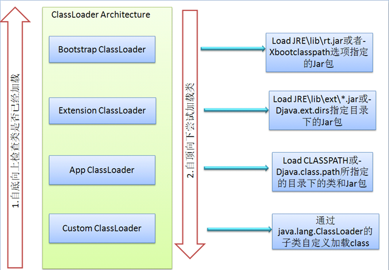

# Java类加载机制

## 简介

Java中所有的类，如果需要被使用，就需要被加载到内存中，jvm会通过加载、链接、初始化三个步骤对某个类进行初始化

##### 加载

加载过程中，jvm会读取.class文件的字节流，并且根据字节流创建java.lang.Class，在这个过程中，会把.class文件中的二进制数据读入内存，放在运行区域的方法区内。在堆区中创建java.lang.Class对象。

所有的类Class仅会创建一个Class对象。

##### 链接

(1) 验证，确保被加载的类满足Java虚拟机的规范，不会造成安全错误

(2) 准备，为类的静态成员分配内存，设置默认初始值（例如static int会默认设置一个0）

(3) 解析，将符号引用转换为直接引用（方法名、变量、类名等转换为物理地址）

##### 初始化

对类中的静态变量或静态代码块进行初始化

如果在初始化一个类时，它的父类还没有初始化，则优先初始化它的父类

## 类加载器

Java中存在下面四种类加载器

##### Bootstrap ClassLoader

加载jre目录下的\lib\rt.jar，由C++实现

##### Extension Classloader

加载jre目录\lib\ext下或启动命令-Djava.ext.dirs中指定目录的所有jar包

##### App Classloader

加载classpath或启动命令-Djava.class.path中指定目录的所有jar包

##### Custom Classloader

应用程序自己定义的Classloader

在一个加载器被加载的时候，它会向上检查相关的加载器是否已经被加载，而在实际加载的时候，它会向下尝试加载。

