---

layout:     post
title:      java核心知识点之集合
subtitle:   PPT文档
date:       2019-09-09
author:     skaleto
catalog: true
tags:
    - java

---

[TOC]


# JAVA核心知识点——集合

集合类存放于 Java.util 包中，主要有 3 种：set(集）、list(列表包含 Queue）和 map(映射)。

1.  Collection：Collection 是集合 List、Set、Queue 的最基本的接口。
2.  Iterator：迭代器，可以通过迭代器遍历集合中的数据
3.  Map：是映射表的基础接口

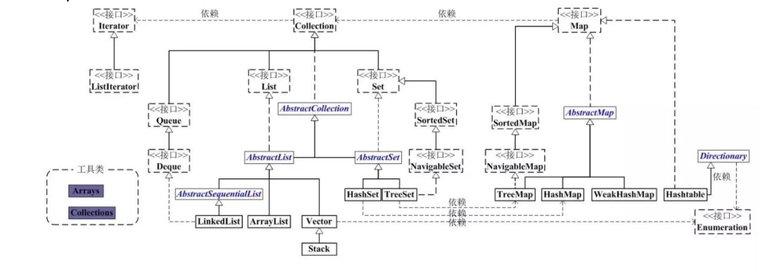


## Collection

### List

#### ArrayList

ArrayList 是最常用的 List 实现类，内部是通过数组实现的，它允许对元素进行快速随机访问。数组的缺点是每个元素之间不能有间隔，当数组大小不满足时需要增加存储能力，就要将已经有数组的数据复制到新的存储空间中。

当从 ArrayList 的中间位置插入或者删除元素时，需要对数组进行复制、移动、代价比较高。因此，它适合随机查找和遍历，不适合插入和删除。

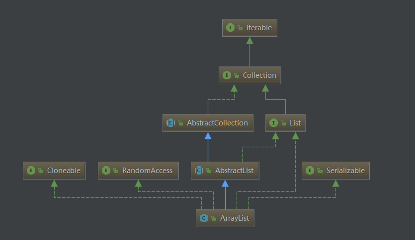

在ArrayList中，增加元素的时候，数组容量不够时，需要进行扩容

```java
/**
 * 非空情况下，默认的初始数组大小
 */
private static final int DEFAULT_CAPACITY = 10;

public boolean add(E e) {
    //在增加一个元素前，需要先检查一下数组长度够不够再放一个元素
    ensureCapacityInternal(size + 1);
    elementData[size++] = e;
    return true;
}

private void ensureCapacityInternal(int minCapacity) {
    if (elementData == DEFAULTCAPACITY_EMPTY_ELEMENTDATA) {
        minCapacity = Math.max(DEFAULT_CAPACITY, minCapacity);
    }
    ensureExplicitCapacity(minCapacity);
}

private void ensureExplicitCapacity(int minCapacity) {
    modCount++;
    //当所需的大小大于当前数组的真实大小时，需要扩容
    if (minCapacity - elementData.length > 0)
        grow(minCapacity);
}

private void grow(int minCapacity) {
    int oldCapacity = elementData.length;
    //扩容的办法是先尝试将容量调整为当前数组真实大小的1.5倍（右移1位÷2）
    int newCapacity = oldCapacity + (oldCapacity >> 1);
    //调整后的容量和所需的大小以及最大限制大小比较，得出最终容量
    if (newCapacity - minCapacity < 0)
        newCapacity = minCapacity;
    if (newCapacity - MAX_ARRAY_SIZE > 0)
        newCapacity = hugeCapacity(minCapacity);
    // minCapacity is usually close to size, so this is a win:
    elementData = Arrays.copyOf(elementData, newCapacity);
}
```


#### Vector

Vector与ArrayList非常类似，内部也是数组实现，不同的是它支持线程的同步，即某一时刻只有一
个线程能够写 Vector，避免多线程同时写而引起的不一致性，但实现同步需要很高的花费，因此，
访问它比访问 ArrayList 慢。

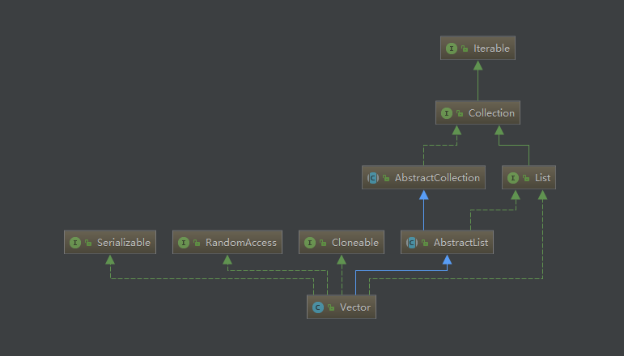

```java
//与ArrayList不同的地方在于，add方法加了锁，使得Vector线程安全
public synchronized void addElement(E obj) {
    modCount++;
    ensureCapacityHelper(elementCount + 1);
    elementData[elementCount++] = obj;
}

private void grow(int minCapacity) {
    int oldCapacity = elementData.length;
    //扩容的策略也与ArrayList不一样，优先扩容capacityIncrement大小，capacityIncrement未指定时扩容为2倍
    int newCapacity = oldCapacity + ((capacityIncrement > 0) ?
                                     capacityIncrement : oldCapacity);
    if (newCapacity - minCapacity < 0)
        newCapacity = minCapacity;
    if (newCapacity - MAX_ARRAY_SIZE > 0)
        newCapacity = hugeCapacity(minCapacity);
    elementData = Arrays.copyOf(elementData, newCapacity);
}
```


#### LinkedList

LinkedList 是用链表结构存储数据的，很适合数据的动态插入和删除，随机访问和遍历速度比较
慢。另外，他还提供了 List 接口中没有定义的方法，专门用于操作表头和表尾元素，可以当作堆
栈、队列和双向队列使用。

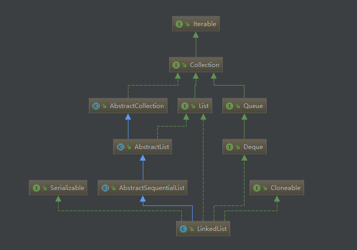

LinkedList的基本数据结构是Node

```java
private static class Node<E> {
    E item;
    Node<E> next;
    Node<E> prev;

    Node(Node<E> prev, E element, Node<E> next) {
        this.item = element;
        this.next = next;
        this.prev = prev;
    }
}
```

LinkedList的插入删除操作比较简单，我们主要看它的查询操作

```java
Node<E> node(int index) {
    //这里可以看到遍历的逻辑用了二分法，只需遍历index所在的半边
    if (index < (size >> 1)) {
        Node<E> x = first;
        for (int i = 0; i < index; i++)
            x = x.next;
        return x;
    } else {
        Node<E> x = last;
        for (int i = size - 1; i > index; i--)
            x = x.prev;
        return x;
    }
}
```

另外，从类图中我们看到，LinkedList实现了deque接口，所以我们可以用LinkedList来构造一个队列。

*题外话：如何反转一个链表？*

```java
假设有一个链表，其中的元素为A、B，结构为null->A->B->C->null，反转后为null->C->B->A->null

方式1：循环
以A为例，反转后，A的prev变为B，A的next变为null，以此类推，即每一个元素的prev变为其原本的next，而next变为原本的prev，但是不能直接转，我们需要几个临时节点来存放这些信息。
从逻辑角度来看，我们要做的就是令A.next=A.prev,A.prev=A.next，但是第一步之后A.next已经发生变化，所以需要一个节点来存放A.next
代码如下：
Node cur=head;
Node next=null;
Node prev=null;
while(cur!=null){
	next=cur.next;
	cur.next=prev;
	prev=cur;
	cur=next;
}

方式2：递归
不断将子链表进行递归，直到子链表为最后一个节点；把当前递归的头指向null，当前递归的头的下一个节点指向当前头
public static Node reverseList(Node head){
    if (head == null || head.next == null) {
        return head;
    }
    //递归
    Node newList = reverseList(head.next);

    head.next.next = head;
    head.next = null;
    return newList;
}
```


### Set

#### HashSet

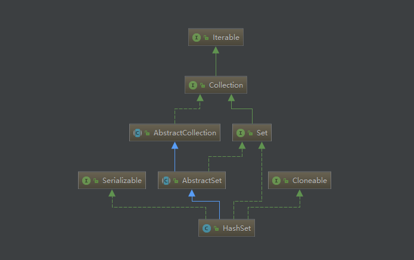

HashSet通过一个HashMap来存放数据，放入的数据作为map的key存放，因为map的key是唯一的，因此HashSet可以做到内部存放的元素为唯一

```java
// Dummy value to associate with an Object in the backing Map
private static final Object PRESENT = new Object();

public boolean add(E e) {
    //将数据作为key存入map中，值为一个空的Object
    return map.put(e, PRESENT)==null;
}
```


#### TreeSet

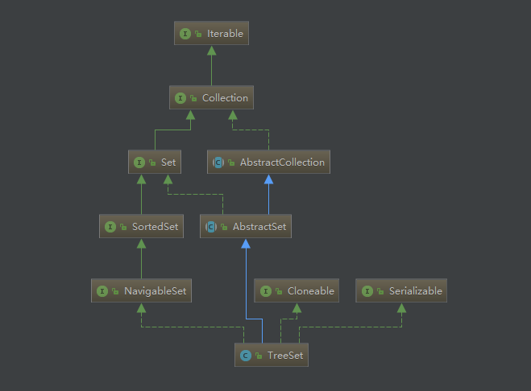

1.  TreeSet()是使用二叉树的原理对新 add()的对象按照指定的顺序排序（升序、降序），每增
加一个对象都会进行排序，将对象插入的二叉树指定的位置。
2.  Integer 和 String 对象都可以进行默认的 TreeSet 排序，而自定义类的对象是不可以的，自
己定义的类必须实现 Comparable 接口，并且覆写相应的 compareTo()函数，才可以正常使
用。
3.  在覆写 compare()函数时，要返回相应的值才能使 TreeSet 按照一定的规则来排序
4.  比较此对象与指定对象的顺序。如果该对象小于、等于或大于指定对象，则分别返回负整
数、零或正整数。


#### LinkedHashSet


### Queue


## Map

### HashMap

哈希表边存放的是哈希值。HashSet 存储元素的顺序并不是按照存入时的顺序（和 List 显然不
同） 而是按照哈希值来存的所以取数据也是按照哈希值取得。元素的哈希值是通过元素的
hashcode 方法来获取的, HashSet 首先判断两个元素的哈希值，如果哈希值一样，接着会比较
equals 方法 如果 equls 结果为 true ，HashSet 就视为同一个元素。如果 equals 为 false 就不是
同一个元素。
哈希值相同 equals 为 false 的元素是怎么存储呢,就是在同样的哈希值下顺延（可以认为哈希值相
同的元素放在一个哈希桶中）。也就是哈希一样的存一列。如图 1 表示 hashCode 值不相同的情
况；图 2 表示 hashCode 值相同，但 equals 不相同的情况

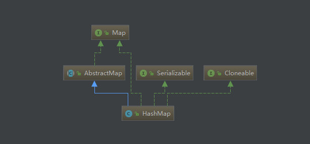

HashMap是一个非常经典的数据结构，我们先来看jdk1.8中它的内部结构。首先有一个每个元素都是链表的数组，当添加一个元素（key-value）时，就首先计算元素key的hash值，以此确定插入数组中的位置，但是可能存在同一hash值的元素已经被放在数组同一位置了，这时就添加到同一hash值的元素的后面，他们在数组的同一位置，但是形成了链表，所以说数组存放的是链表。而当链表长度太长时，链表就转换为红黑树，这样大大提高了查找的效率。

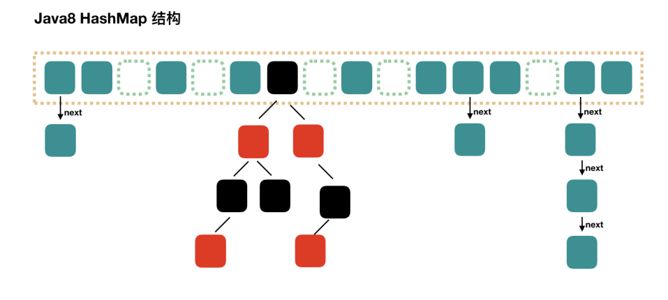

构造方法如下：

```java
//默认容量为16
static final int DEFAULT_INITIAL_CAPACITY = 1 << 4; // aka 16
//最大容量为2的30次方
static final int MAXIMUM_CAPACITY = 1 << 30;
//默认负载因子
static final float DEFAULT_LOAD_FACTOR = 0.75f;
/**
 * The table, initialized on first use, and resized as
 * necessary. When allocated, length is always a power of two.
 * (We also tolerate length zero in some operations to allow
 * bootstrapping mechanics that are currently not needed.)
 * HashMap内部用来存放数据的结构，是一个Node数组
 */
transient Node<K,V>[] table;

public HashMap(int initialCapacity, float loadFactor) {
        if (initialCapacity < 0)
            throw new IllegalArgumentException("Illegal initial capacity: " +
                                               initialCapacity);
        if (initialCapacity > MAXIMUM_CAPACITY)
            initialCapacity = MAXIMUM_CAPACITY;
        if (loadFactor <= 0 || Float.isNaN(loadFactor))
            throw new IllegalArgumentException("Illegal load factor: " +
                                               loadFactor);
        this.loadFactor = loadFactor;
    	//tableSizeFor将传入的容量大小参数转换为大于等于它的最小2次幂
        this.threshold = tableSizeFor(initialCapacity);
}

public HashMap(int initialCapacity) {
        this(initialCapacity, DEFAULT_LOAD_FACTOR);
}

public HashMap() {
        this.loadFactor = DEFAULT_LOAD_FACTOR; // all other fields defaulted
}

public HashMap(Map<? extends K, ? extends V> m) {
        this.loadFactor = DEFAULT_LOAD_FACTOR;
        putMapEntries(m, false);
}

/**
 * Returns a power of two size for the given target capacity.
 */
static final int tableSizeFor(int cap) {
        int n = cap - 1;
        n |= n >>> 1;
        n |= n >>> 2;
        n |= n >>> 4;
        n |= n >>> 8;
        n |= n >>> 16;
        return (n < 0) ? 1 : (n >= MAXIMUM_CAPACITY) ? MAXIMUM_CAPACITY : n + 1;
}
```

上面为什么要把容量的阈值设置为大于值的最小2次幂呢？带着这个问题我们往下看。

##### HashMap放入元素

放入元素的操作可以参考下图


```java
public V put(K key, V value) {
    return putVal(hash(key), key, value, false, true);
}

final V putVal(int hash, K key, V value, boolean onlyIfAbsent,
                   boolean evict) {
        Node<K,V>[] tab; Node<K,V> p; int n, i;
        if ((tab = table) == null || (n = tab.length) == 0)
            //为空的或大小为0的时候需要去做resize()扩充数组的长度
            n = (tab = resize()).length;
    	/**
    	 * 这个地方使用(n-1)&hash计算出了需要插入的数组位置的索引
    	 * n为数组的容量，是2的次方，这个地方可以解释我们上面为什么要设置n为2的次方了，见下方
    	 */
        if ((p = tab[i = (n - 1) & hash]) == null)
            //索引未被使用的时候，即当前桶中没有东西的时候，直接在当前索引插入一个新的节点
            tab[i] = newNode(hash, key, value, null);
        else {
            Node<K,V> e; K k;
            //索引位置处的节点hash值与当前需要放入的hash值相同，并且key也相等，则覆盖替换这个节点
            if (p.hash == hash &&
                ((k = p.key) == key || (key != null && key.equals(k))))
                e = p;
            //如果key不相同，且索引位置处的节点是红黑树节点
            else if (p instanceof TreeNode)
                //则将当前节点放入红黑树
                e = ((TreeNode<K,V>)p).putTreeVal(this, tab, hash, key, value);
            else {
                //以上都不满足，则当前是个链表结构，则将当前节点插入链表末尾
                for (int binCount = 0; ; ++binCount) {
                    //如果一直遍历到最后都没有找到相同的key，则向后插入
                    if ((e = p.next) == null) {
                        p.next = newNode(hash, key, value, null);
                        //插入完成后假如数量达到了阈值，则将这个链表结构转化为红黑树
                        if (binCount >= TREEIFY_THRESHOLD - 1) // -1 for 1st
                            treeifyBin(tab, hash);
                        break;
                    }
                    //如果key值相等，则跳出循环，因为已经找到了相同的key
                    if (e.hash == hash &&
                        ((k = e.key) == key || (key != null && key.equals(k))))
                        break;
                    p = e;
                }
            }
            //上面的操作找到了一个已经存在的相同key的节点
            if (e != null) { // existing mapping for key
                V oldValue = e.value;
                if (!onlyIfAbsent || oldValue == null)
                    //替换value
                    e.value = value;
                afterNodeAccess(e);
                return oldValue;
            }
        }
        ++modCount;
    	//添加完节点后，需要检查大小，超过阈值就需要扩容
        if (++size > threshold)
            resize();
        afterNodeInsertion(evict);
        return null;
}
```

##### 为什么要设置容量为2的次方？

在计算存放数组的索引时，使用(n-1)&hash，那么n为2的次方时，n-1所有位全为1，而不是2的次方时，某几位一定存在0。

以下图为例，左边为n=16，右边为n=15，假设他们都和8，9这两个hash值做比较，那么可以知道，n=16的情况下，最终结果和原本的hash值相等，而n=15的情况下，总存在某几位始终为0，这导致这几位为1的索引永远不会用到。比如下图的低1位，始终为0，那么0001,0011,0101等等这些索引都不会被用到，这种情况下增加了碰撞的几率，对应的效率也会下降。


##### 计算hash的方法是什么样的过程？

```java
static final int hash(Object key) {
    int h;
    return (key == null) ? 0 : (h = key.hashCode()) ^ (h >>> 16);
}
```

从代码字面意思来看是将对象的hashcode无符号右移16位，高位用0补齐，之后再与原本的hashcode进行按位异或操作，为什么要这么计算呢？

上面我们知道，在数组长度比较小的情况下，其实最终的索引值仅仅取决于hash值的低几位，例如下图原本比较大的hash值，假如直接和table.length-1做与运算，它的高位就完全没有存在的意义；

但是假如将hash值右移16位，使高16位可以和原本的低16位做异或，得到的值从某种程度上来说保留了高16位的某些特征，这样再去做索引的计算，一定程度上来说可以减少hash碰撞


##### 扩容是什么样的操作？

```java
final Node<K,V>[] resize() {
        Node<K,V>[] oldTab = table;
        int oldCap = (oldTab == null) ? 0 : oldTab.length;
        int oldThr = threshold;
        int newCap, newThr = 0;
        if (oldCap > 0) {
            if (oldCap >= MAXIMUM_CAPACITY) {
                threshold = Integer.MAX_VALUE;
                return oldTab;
            }
            //oldCap<<1表示扩大一倍，如果当前长度扩大一倍后小于最大容量
            else if ((newCap = oldCap << 1) < MAXIMUM_CAPACITY &&
                     oldCap >= DEFAULT_INITIAL_CAPACITY)
                //那就把当前的阈值也调整扩大一倍咯
                newThr = oldThr << 1;
        }
    	//如果扩容前容量为0，并且阈值大于0 
        else if (oldThr > 0)
            //那么就把容量定义为阈值
            newCap = oldThr;
    	//如果扩容前容量为0，并且阈值也为0
        else {
            //将容量定义为默认容量，阈值定义为容量*负载因子
            newCap = DEFAULT_INITIAL_CAPACITY;
            newThr = (int)(DEFAULT_LOAD_FACTOR * DEFAULT_INITIAL_CAPACITY);
        }
    	//如果扩容后阈值为0，则将阈值设置为扩容后容量*负载因子
        if (newThr == 0) {
            float ft = (float)newCap * loadFactor;
            newThr = (newCap < MAXIMUM_CAPACITY && ft < (float)MAXIMUM_CAPACITY ?
                      (int)ft : Integer.MAX_VALUE);
        }
        threshold = newThr;
    	
    	//新的容量和阈值计算完成后，创建一个新的Node数组用来存放数据，那么旧的数据需要重新安排位置
        @SuppressWarnings({"rawtypes","unchecked"})
            Node<K,V>[] newTab = (Node<K,V>[])new Node[newCap];
        table = newTab;
    	
        if (oldTab != null) {
            for (int j = 0; j < oldCap; ++j) {
                Node<K,V> e;
                if ((e = oldTab[j]) != null) {
                    //将i位置的node拿出来，原本的数组位置置为空，使gc可以将该段空间回收
                    oldTab[j] = null;
                    if (e.next == null)
                        //node后面没有链表跟着的情况下，计算新的索引位置并放入即可
                        newTab[e.hash & (newCap - 1)] = e;
                    else if (e instanceof TreeNode)
                        //node后面跟着的是个红黑树，需要重新构造这个树
                        ((TreeNode<K,V>)e).split(this, newTab, j, oldCap);
                    else {
                        //遍历链表中的每个节点，通过节点的hash值与oldCap按位与的结果来判断是否需要改变位置，如果不需要改变位置，则插在新链表中的当前位置链表后方；如果需要改变位置，则插在新链表当前位置+oldCap位置处的链表后方，见下方详解
                        Node<K,V> loHead = null, loTail = null;
                        Node<K,V> hiHead = null, hiTail = null;
                        Node<K,V> next;
                        do {
                            next = e.next;
                            if ((e.hash & oldCap) == 0) {
                                if (loTail == null)
                                    loHead = e;
                                else
                                    loTail.next = e;
                                loTail = e;
                            }
                            else {
                                if (hiTail == null)
                                    hiHead = e;
                                else
                                    hiTail.next = e;
                                hiTail = e;
                            }
                        } while ((e = next) != null);
                        if (loTail != null) {
                            loTail.next = null;
                            newTab[j] = loHead;
                        }
                        if (hiTail != null) {
                            hiTail.next = null;
                            newTab[j + oldCap] = hiHead;
                        }
                    }
                }
            }
        }
        return newTab;
}
```

##### 为什么要用hash值与oldCap按位与来计算最终的位置？

我们假设oldCap为16=0x10000，oldCap-1=0x01111，那么扩容后为32=0x100000，新容量-1=0x011111。以hash值为0x011010和0x001010的两个对象为例：

0x011010 & 0x001111=0x001010

0x001010 & 0x001111=0x001010

两个hash值在oldCap为16的情况下运算得到的索引相同，而容量为32后：

0x011010 & 0x011111=0x011010

0x001010 & 0x011111=0x001010

两个hash值运算后不一致，说明需要放到不同的索引位置，但是这个地方我们可以看到，两次计算完得到的结果差异仅在低5位处，这就意味着，我们只需要将hash值与0x010000做与运算即可得到我们的结果，并且通过结果的0或1来判断是否需要更改链表索引的位置。并且我们知道，当需要更改位置时，其实新的位置与当前位置的差就是oldCap的大小。

##### HashMap中的红黑树结构是什么样的？

红黑树是一种自平衡二叉树，它具有非常高的查询、插入和删除性能。当HashMap中有数据插入或删除时，都有可能触发红黑树的重构，以维持树结构的相对平衡，提高树的搜索效率。关于红黑树的相关介绍，放在其他专题中，这里就不多赘述了。


### Hashtable

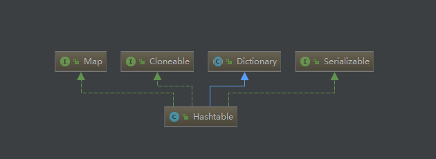

Hashtable是java早期出现的集合类，从类名不是大驼峰就可以看出出现时间比较早，并且jdk也不推荐在后面接着使用它，因为它的执行效率确实不高。不过我们还是简单来看看它的源码。Hashtable的绝大多数方法都有synchronized关键字，这也是为什么Hashtable是线程安全的原因。

```java
/**
 * 未指定初始化大小时，默认容量为11，负载因子为0.75
 */
public Hashtable() {
    this(11, 0.75f);
}

/**
 * 插入数据的方法
 */
public synchronized V put(K key, V value) {
    	//这里可以看到value不允许为null，下方key.hashCode也要求key不允许为null
        if (value == null) {
            throw new NullPointerException();
        }

        Entry<?,?> tab[] = table;
    	//Hashtable的hash值直接使用key的hashCode
        int hash = key.hashCode();
    	//通过hashCode和表长度取模的方式来计算数组下表，取模的方式效率是比较低的
        int index = (hash & 0x7FFFFFFF) % tab.length;
        @SuppressWarnings("unchecked")
        Entry<K,V> entry = (Entry<K,V>)tab[index];
    	//遍历该下标下的所有数据，找到就做替换
        for(; entry != null ; entry = entry.next) {
            if ((entry.hash == hash) && entry.key.equals(key)) {
                V old = entry.value;
                entry.value = value;
                return old;
            }
        }
        addEntry(hash, key, value, index);
        return null;
}

```

同样，Hashtable达到容量*负载因子的大小时，也会触发扩大数组长度的操作

```java
protected void rehash() {
        int oldCapacity = table.length;
        Entry<?,?>[] oldMap = table;

        //扩展后容量为原来的容量*2+1
        int newCapacity = (oldCapacity << 1) + 1;
        if (newCapacity - MAX_ARRAY_SIZE > 0) {
            if (oldCapacity == MAX_ARRAY_SIZE)
                return;
            newCapacity = MAX_ARRAY_SIZE;
        }
        Entry<?,?>[] newMap = new Entry<?,?>[newCapacity];

        modCount++;
        threshold = (int)Math.min(newCapacity * loadFactor, MAX_ARRAY_SIZE + 1);
        table = newMap;

    	//遍历每个节点，重新计算每个节点的索引并插入到新的数组中
        for (int i = oldCapacity ; i-- > 0 ;) {
            for (Entry<K,V> old = (Entry<K,V>)oldMap[i] ; old != null ; ) {
                Entry<K,V> e = old;
                old = old.next;

                int index = (e.hash & 0x7FFFFFFF) % newCapacity;
                e.next = (Entry<K,V>)newMap[index];
                newMap[index] = e;
            }
        }
}
```


### TreeMap

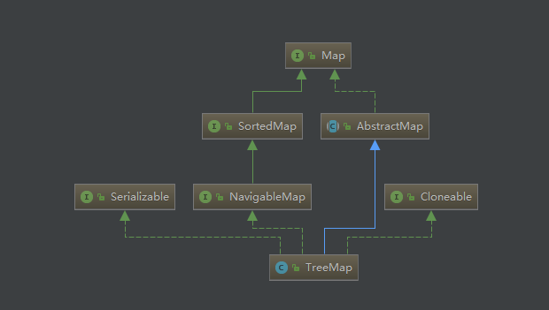

TreeMap 实现 SortedMap 接口，能够把它保存的记录根据键排序，默认是按键值的升序排序，
也可以指定排序的比较器，当用 Iterator 遍历 TreeMap 时，得到的记录是排过序的。
如果使用排序的映射，建议使用 TreeMap。

同样我们先来看它的构造方法，与HashMap的基本类似

```java
//在使用 TreeMap 时，key 必须实现 Comparable 接口或者在构造 TreeMap 传入自定义的Comparator，否则会在运行时抛出 java.lang.ClassCastException 类型的异常。
private final Comparator<? super K> comparator;
private transient Entry<K,V> root;

public TreeMap() {
        comparator = null;
}

public TreeMap(Comparator<? super K> comparator) {
        this.comparator = comparator;
}

public TreeMap(Map<? extends K, ? extends V> m) {
        comparator = null;
        putAll(m);
}

public TreeMap(SortedMap<K, ? extends V> m) {
        comparator = m.comparator();
        try {
            buildFromSorted(m.size(), m.entrySet().iterator(), null, null);
        } catch (java.io.IOException cannotHappen) {
        } catch (ClassNotFoundException cannotHappen) {
        }
}
```

来看TreeMap的put方法

```java
public V put(K key, V value) {
        Entry<K,V> t = root;
        if (t == null) {
            //这里调用一下compare比较自身是为了检查key是否有实现Comparable接口
            compare(key, key);
            //root节点为空的时候，插入数据将它变成root
            root = new Entry<>(key, value, null);
            size = 1;
            modCount++;
            return null;
        }
        int cmp;
        Entry<K,V> parent;
        // split comparator and comparable paths
        Comparator<? super K> cpr = comparator;
        if (cpr != null) {
            //comparator有指定的时候，比较插入节点和当前节点的key大小，若小就向当前节点左方继续遍历，若大就向右方遍历，若相等则认为找到了相同的key，将value替换即可
            do {
                parent = t;
                cmp = cpr.compare(key, t.key);
                if (cmp < 0)
                    t = t.left;
                else if (cmp > 0)
                    t = t.right;
                else
                    return t.setValue(value);
            } while (t != null);
        }
        else {
            //这里可以看到key不允许为空
            if (key == null)
                throw new NullPointerException();
            @SuppressWarnings("unchecked")
                Comparable<? super K> k = (Comparable<? super K>) key;
            //同样的遍历比较
            do {
                parent = t;
                cmp = k.compareTo(t.key);
                if (cmp < 0)
                    t = t.left;
                else if (cmp > 0)
                    t = t.right;
                else
                    return t.setValue(value);
            } while (t != null);
        }
    
    	//遍历完成后没有找到相同的值，这个时候以当前节点为父节点，在当前节点的左或右新增节点
        Entry<K,V> e = new Entry<>(key, value, parent);
        if (cmp < 0)
            parent.left = e;
        else
            parent.right = e;
    	//插入后可能会影响红黑树的平衡，需要进行一次自检和重构
        fixAfterInsertion(e);
        size++;
        modCount++;
        return null;
}
```

##### fixAfterInsertion

```java
private void fixAfterInsertion(Entry<K,V> x) {
    	//插入的节点设置为红色
        x.color = RED;

    	//如果插入节点的父节点为黑色，那满足红黑树的特性，不需要做重构
    	//但是如果父节点是红色，那么就存在一条路径有连续两个红色节点了，不满足红黑树特性
        while (x != null && x != root && x.parent.color == RED) {
            if (parentOf(x) == leftOf(parentOf(parentOf(x)))) {
                Entry<K,V> y = rightOf(parentOf(parentOf(x)));
                if (colorOf(y) == RED) {
                    setColor(parentOf(x), BLACK);
                    setColor(y, BLACK);
                    setColor(parentOf(parentOf(x)), RED);
                    x = parentOf(parentOf(x));
                } else {
                    if (x == rightOf(parentOf(x))) {
                        x = parentOf(x);
                        rotateLeft(x);
                    }
                    setColor(parentOf(x), BLACK);
                    setColor(parentOf(parentOf(x)), RED);
                    rotateRight(parentOf(parentOf(x)));
                }
            } else {
                Entry<K,V> y = leftOf(parentOf(parentOf(x)));
                if (colorOf(y) == RED) {
                    setColor(parentOf(x), BLACK);
                    setColor(y, BLACK);
                    setColor(parentOf(parentOf(x)), RED);
                    x = parentOf(parentOf(x));
                } else {
                    if (x == leftOf(parentOf(x))) {
                        x = parentOf(x);
                        rotateRight(x);
                    }
                    setColor(parentOf(x), BLACK);
                    setColor(parentOf(parentOf(x)), RED);
                    rotateLeft(parentOf(parentOf(x)));
                }
            }
        }
        root.color = BLACK;
}
```

TreeMap中对于数据的增删，都涉及到红黑树的结构变化，这一块内容比较多，我们放在其他的专题中进行详细讲解。


### LinkedHashMap

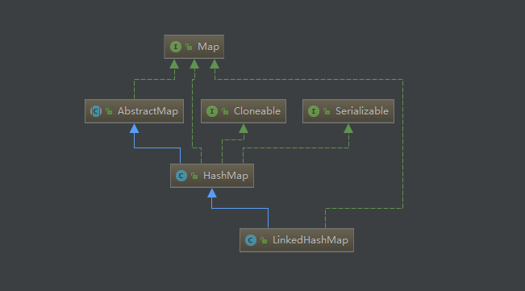

LinkedHashMap是HashMap的一个子类，保存了记录的插入顺序，在用 Iterator 遍历
LinkedHashMap 时，先得到的记录肯定是先插入的，也可以在构造时带参数，按照访问次序排序。

在LinkedHashMap中有这样一个布尔值

```java
final boolean accessOrder;
```

accessOrder在构造函数中默认都会配置为false，表示LinkedHashMap会默认以插入的顺序来做排序；而为true时，将以访问顺序来做排序。

LinkedHashMap内部原理与HashMap基本相似，关键点在于LinkedHashMap对Entry也做了修改，增加了before和after两个属性，那么这样所有节点除了在map的数组中存在，同样也组成了一个双向链表，可以用来保存顺序信息。

```java
static class Entry<K,V> extends HashMap.Node<K,V> {
        Entry<K,V> before, after;
        Entry(int hash, K key, V value, Node<K,V> next) {
            super(hash, key, value, next);
        }
}
```

这样一来有什么好处呢，一方面，map的遍历直接遍历这个双向链表即可，不用像HashMap一样需要遍历每个桶中的每个链表；另一方面，存放的节点数据也可以通过修改双向链表的指向来完成顺序的修改，时间复杂度很小。

关于LinkedHashMap的详细源码可以参考https://www.jianshu.com/p/8f4f58b4b8ab


### ConcurrentHashMap

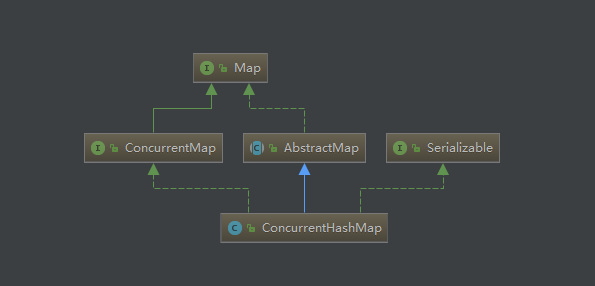

ConcurrentHashMap是对HashMap的优化，解决了多线程访问的问题，在jdk1.7和1.8中，ConcurrentHashMap的设计思路完全不同，我们先来看1.7中的实现方式。

#### JDK1.7版本


在jdk1.7中，ConcurrentHashMap将数据分为多个Segment，每个Segment指向一个数组和链表结构，因此也可以看成是多个HashMap的组合。而Segment继承自Reentrantlock，本质上ConcurrentHashMap就是在操作的时候对每个Segment分别加锁，使得最高并行数量可以达到Segment长度

```java
//默认的map初始化容量
static final int DEFAULT_INITIAL_CAPACITY = 16;
//这里的负载因子是对每个segment生效，而不是对整个segment数组生效，segment数组的大小一旦初始化完成，就不会改变
static final float DEFAULT_LOAD_FACTOR = 0.75f;
//默认的并行级别，对应就是Segment的个数
static final int DEFAULT_CONCURRENCY_LEVEL = 16;

public ConcurrentHashMap(int initialCapacity,
                         float loadFactor, int concurrencyLevel) {
    if (!(loadFactor > 0) || initialCapacity < 0 || concurrencyLevel <= 0)
        throw new IllegalArgumentException();
    if (concurrencyLevel > MAX_SEGMENTS)
        concurrencyLevel = MAX_SEGMENTS;
    // Find power-of-two sizes best matching arguments
    int sshift = 0;
    int ssize = 1;
    // 计算并行级别 ssize，因为要保持并行级别是 2 的 n 次方
    while (ssize < concurrencyLevel) {
        ++sshift;
        ssize <<= 1;
    }
    // 我们这里先不要那么烧脑，用默认值，concurrencyLevel 为 16，sshift 为 4
    // 那么计算出 segmentShift 为 28，segmentMask 为 15，后面会用到这两个值
    this.segmentShift = 32 - sshift;
    this.segmentMask = ssize - 1;

    if (initialCapacity > MAXIMUM_CAPACITY)
        initialCapacity = MAXIMUM_CAPACITY;

    // initialCapacity 是设置整个 map 初始的大小，
    // 这里根据 initialCapacity 计算 Segment 数组中每个位置可以分到的大小
    // 如 initialCapacity 为 64，那么每个 Segment 或称之为"槽"可以分到 4 个
    int c = initialCapacity / ssize;
    if (c * ssize < initialCapacity)
        ++c;
    // 默认 MIN_SEGMENT_TABLE_CAPACITY 是 2，这个值也是有讲究的，因为这样的话，对于具体的槽上，
    // 插入一个元素不至于扩容，插入第二个的时候才会扩容
    int cap = MIN_SEGMENT_TABLE_CAPACITY; 
    while (cap < c)
        cap <<= 1;

    // 创建 Segment 数组，
    // 并创建数组的第一个元素 segment[0]
    Segment<K,V> s0 =
        new Segment<K,V>(loadFactor, (int)(cap * loadFactor),
                         (HashEntry<K,V>[])new HashEntry[cap]);
    Segment<K,V>[] ss = (Segment<K,V>[])new Segment[ssize];
    // 这里是个native code，CAS操作往数组写入 segment[0]，关于CAS操作，将在其他专题中介绍
    UNSAFE.putOrderedObject(ss, SBASE, s0);
    this.segments = ss;
}
```

put操作

```java
public V put(K key, V value) {
    Segment<K,V> s;
    if (value == null)
        throw new NullPointerException();
    // 1. 计算 key 的 hash 值，这里的hash算法又是一个比较奇葩的算法，笔者暂时还没搞清该算法的原因
    int hash = hash(key);
    // 2. 根据 hash 值找到 Segment 数组中的位置 j
    //    hash 是 32 位，无符号右移 segmentShift(28) 位，剩下高 4 位，
    //    然后和 segmentMask(15) 做一次与操作，也就是说 j 是 hash 值的高 4 位，也就是槽的数组下标
    int j = (hash >>> segmentShift) & segmentMask;
    // 刚刚说了，初始化的时候初始化了 segment[0]，但是其他位置还是 null，
    // ensureSegment(j) 对 segment[j] 进行初始化
    if ((s = (Segment<K,V>)UNSAFE.getObject          // nonvolatile; recheck
         (segments, (j << SSHIFT) + SBASE)) == null) //  in ensureSegment
        s = ensureSegment(j);
    // 3. 插入新值到槽 s 中，这里的put操作于HashMap中的数组+链表结构的插入类似，不多赘述
    return s.put(key, hash, value, false);
}
```

ensureSegment操作

```java
private Segment<K,V> ensureSegment(int k) {
    final Segment<K,V>[] ss = this.segments;
    long u = (k << SSHIFT) + SBASE; // raw offset
    Segment<K,V> seg;
    if ((seg = (Segment<K,V>)UNSAFE.getObjectVolatile(ss, u)) == null) {
        // 这里看到为什么之前要初始化 segment[0] 了，
        // 使用当前 segment[0] 处的数组长度和负载因子来初始化 segment[k]
        // 为什么要用“当前”，因为 segment[0] 可能早就扩容过了
        Segment<K,V> proto = ss[0];
        int cap = proto.table.length;
        float lf = proto.loadFactor;
        int threshold = (int)(cap * lf);

        // 初始化 segment[k] 内部的数组
        HashEntry<K,V>[] tab = (HashEntry<K,V>[])new HashEntry[cap];
        if ((seg = (Segment<K,V>)UNSAFE.getObjectVolatile(ss, u))
            == null) { // 再次检查一遍该槽是否被其他线程初始化了。

            Segment<K,V> s = new Segment<K,V>(lf, threshold, tab);
            // 使用 while 循环，内部用 CAS，当前线程成功设值或其他线程成功设值后，退出
            while ((seg = (Segment<K,V>)UNSAFE.getObjectVolatile(ss, u))
                   == null) {
                if (UNSAFE.compareAndSwapObject(ss, u, null, seg = s))
                    break;
            }
        }
    }
    return seg;
}
```

上面segment的put操作我们略过了，确实也比较简单，但是其中有一个操作，在放入元素之前，会执行一步tryLock，如果执行失败，将进入scanAndLockForPut

```java
final V put(K key, int hash, V value, boolean onlyIfAbsent) {
    		//这里trylock尝试获取锁
            HashEntry<K,V> node = tryLock() ? null :
                scanAndLockForPut(key, hash, value);
            V oldValue;
            ...
}
```

scanAndLockForPut操作

```java
private HashEntry<K,V> scanAndLockForPut(K key, int hash, V value) {
    HashEntry<K,V> first = entryForHash(this, hash);
    HashEntry<K,V> e = first;
    HashEntry<K,V> node = null;
    int retries = -1; // negative while locating node

    // 循环获取锁
    while (!tryLock()) {
        HashEntry<K,V> f; // to recheck first below
        if (retries < 0) {
            if (e == null) {
                if (node == null) // speculatively create node
                    // 进到这里说明数组该位置的链表是空的，没有任何元素
                    // 当然，进到这里的另一个原因是 tryLock() 失败，所以该槽存在并发，不一定是该位置
                    node = new HashEntry<K,V>(hash, key, value, null);
                retries = 0;
            }
            else if (key.equals(e.key))
                retries = 0;
            else
                // 顺着链表往下走
                e = e.next;
        }
        // 重试次数如果超过 MAX_SCAN_RETRIES（单核1多核64），那么不抢了，进入到阻塞队列等待锁
        //    lock() 是阻塞方法，直到获取锁后返回
        else if (++retries > MAX_SCAN_RETRIES) {
            lock();
            break;
        }
        else if ((retries & 1) == 0 &&
                 // 这个时候是有大问题了，那就是有新的元素进到了链表，成为了新的表头
                 //     所以这边的策略是，相当于重新走一遍这个 scanAndLockForPut 方法
                 (f = entryForHash(this, hash)) != first) {
            e = first = f; // re-traverse if entry changed
            retries = -1;
        }
    }
    return node;
}
```

上面说到了，segment的大小在确定之后不能改变，那么我们要怎么进行扩容呢

```java
// 方法参数上的 node 是这次扩容后，需要添加到新的数组中的数据。
private void rehash(HashEntry<K,V> node) {
    HashEntry<K,V>[] oldTable = table;
    int oldCapacity = oldTable.length;
    // 2 倍
    int newCapacity = oldCapacity << 1;
    threshold = (int)(newCapacity * loadFactor);
    // 创建新数组
    HashEntry<K,V>[] newTable =
        (HashEntry<K,V>[]) new HashEntry[newCapacity];
    // 新的掩码，如从 16 扩容到 32，那么 sizeMask 为 31，对应二进制 ‘000...00011111’
    int sizeMask = newCapacity - 1;

    // 遍历原数组，老套路，将原数组位置 i 处的链表拆分到 新数组位置 i 和 i+oldCap 两个位置
    for (int i = 0; i < oldCapacity ; i++) {
        // e 是链表的第一个元素
        HashEntry<K,V> e = oldTable[i];
        if (e != null) {
            HashEntry<K,V> next = e.next;
            // 计算应该放置在新数组中的位置，
            // 假设原数组长度为 16，e 在 oldTable[3] 处，那么 idx 只可能是 3 或者是 3 + 16 = 19
            int idx = e.hash & sizeMask;
            if (next == null)   // 该位置处只有一个元素，那比较好办
                newTable[idx] = e;
            else { // Reuse consecutive sequence at same slot
                // e 是链表表头
                HashEntry<K,V> lastRun = e;
                // idx 是当前链表的头结点 e 的新位置
                int lastIdx = idx;

                // 下面这个 for 循环会找到一个 lastRun 节点，这个节点之后的所有元素是将要放到一起的
                for (HashEntry<K,V> last = next;
                     last != null;
                     last = last.next) {
                    int k = last.hash & sizeMask;
                    if (k != lastIdx) {
                        lastIdx = k;
                        lastRun = last;
                    }
                }
                // 将 lastRun 及其之后的所有节点组成的这个链表放到 lastIdx 这个位置
                newTable[lastIdx] = lastRun;
                // 下面的操作是处理 lastRun 之前的节点，
                //    这些节点可能分配在另一个链表中，也可能分配到上面的那个链表中
                for (HashEntry<K,V> p = e; p != lastRun; p = p.next) {
                    V v = p.value;
                    int h = p.hash;
                    int k = h & sizeMask;
                    HashEntry<K,V> n = newTable[k];
                    newTable[k] = new HashEntry<K,V>(h, p.key, v, n);
                }
            }
        }
    }
    // 将新来的 node 放到新数组中刚刚的 两个链表之一 的 头部
    int nodeIndex = node.hash & sizeMask; // add the new node
    node.setNext(newTable[nodeIndex]);
    newTable[nodeIndex] = node;
    table = newTable;
}
```

##### get过程

```java
public V get(Object key) {
    Segment<K,V> s; // manually integrate access methods to reduce overhead
    HashEntry<K,V>[] tab;
    // 1. hash 值
    int h = hash(key);
    long u = (((h >>> segmentShift) & segmentMask) << SSHIFT) + SBASE;
    // 2. 根据 hash 找到对应的 segment
    if ((s = (Segment<K,V>)UNSAFE.getObjectVolatile(segments, u)) != null &&
        (tab = s.table) != null) {
        // 3. 找到segment 内部数组相应位置的链表，遍历
        for (HashEntry<K,V> e = (HashEntry<K,V>) UNSAFE.getObjectVolatile
                 (tab, ((long)(((tab.length - 1) & h)) << TSHIFT) + TBASE);
             e != null; e = e.next) {
            K k;
            if ((k = e.key) == key || (e.hash == h && key.equals(k)))
                return e.value;
        }
    }
    return null;
}
```


#### JDK1.8版本


Java8的ConcurrentHashMap和Java8的HashMap结构基本类似

##### put操作

```java
public V put(K key, V value) {
    return putVal(key, value, false);
}
final V putVal(K key, V value, boolean onlyIfAbsent) {
    if (key == null || value == null) throw new NullPointerException();
    // 得到 hash 值
    int hash = spread(key.hashCode());
    // 用于记录相应链表的长度
    int binCount = 0;
    for (Node<K,V>[] tab = table;;) {
        Node<K,V> f; int n, i, fh;
        // 如果数组"空"，进行数组初始化
        if (tab == null || (n = tab.length) == 0)
            // 初始化数组，后面会详细介绍
            tab = initTable();

        // 找该 hash 值对应的数组下标，得到第一个节点 f
        else if ((f = tabAt(tab, i = (n - 1) & hash)) == null) {
            // 如果数组该位置为空，
            //用一次 CAS 操作将这个新值放入其中即可，这个 put 操作差不多就结束了，可以拉到最后面了
            //如果 CAS 失败，那就是有并发操作，进到下一个循环就好了
            if (casTabAt(tab, i, null,
                         new Node<K,V>(hash, key, value, null)))
                break;                   // no lock when adding to empty bin
        }
        // hash 居然可以等于 MOVED，这个需要到后面才能看明白，不过从名字上也能猜到，肯定是因为在扩容
        else if ((fh = f.hash) == MOVED)
            // 帮助数据迁移，这个等到看完数据迁移部分的介绍后，再理解这个就很简单了
            tab = helpTransfer(tab, f);

        else { // 到这里就是说，f 是该位置的头结点，而且不为空

            V oldVal = null;
            // 获取数组该位置的头结点的监视器锁
            synchronized (f) {
                if (tabAt(tab, i) == f) {
                    if (fh >= 0) { // 头结点的 hash 值大于 0，说明是链表
                        // 用于累加，记录链表的长度
                        binCount = 1;
                        // 遍历链表
                        for (Node<K,V> e = f;; ++binCount) {
                            K ek;
                            // 如果发现了"相等"的 key，判断是否要进行值覆盖，然后也就可以 break 了
                            if (e.hash == hash &&
                                ((ek = e.key) == key ||
                                 (ek != null && key.equals(ek)))) {
                                oldVal = e.val;
                                if (!onlyIfAbsent)
                                    e.val = value;
                                break;
                            }
                            // 到了链表的最末端，将这个新值放到链表的最后面
                            Node<K,V> pred = e;
                            if ((e = e.next) == null) {
                                pred.next = new Node<K,V>(hash, key,
                                                          value, null);
                                break;
                            }
                        }
                    }
                    else if (f instanceof TreeBin) { // 红黑树
                        Node<K,V> p;
                        binCount = 2;
                        // 调用红黑树的插值方法插入新节点
                        if ((p = ((TreeBin<K,V>)f).putTreeVal(hash, key,
                                                       value)) != null) {
                            oldVal = p.val;
                            if (!onlyIfAbsent)
                                p.val = value;
                        }
                    }
                }
            }
            // binCount != 0 说明上面在做链表操作
            if (binCount != 0) {
                // 判断是否要将链表转换为红黑树，临界值和 HashMap 一样，也是 8
                if (binCount >= TREEIFY_THRESHOLD)
                    // 这个方法和 HashMap 中稍微有一点点不同，那就是它不是一定会进行红黑树转换，
                    // 如果当前数组的长度小于 64，那么会选择进行数组扩容，而不是转换为红黑树
                    //    具体源码我们就不看了，扩容部分后面说
                    treeifyBin(tab, i);
                if (oldVal != null)
                    return oldVal;
                break;
            }
        }
    }
    // 
    addCount(1L, binCount);
    return null;
}
```

##### initTable

```java
private final Node<K,V>[] initTable() {
    Node<K,V>[] tab; int sc;
    while ((tab = table) == null || tab.length == 0) {
        // 初始化的"功劳"被其他线程"抢去"了
        if ((sc = sizeCtl) < 0)
            Thread.yield(); // lost initialization race; just spin
        // CAS 一下，将 sizeCtl 设置为 -1，代表抢到了锁
        else if (U.compareAndSwapInt(this, SIZECTL, sc, -1)) {
            try {
                if ((tab = table) == null || tab.length == 0) {
                    // DEFAULT_CAPACITY 默认初始容量是 16
                    int n = (sc > 0) ? sc : DEFAULT_CAPACITY;
                    // 初始化数组，长度为 16 或初始化时提供的长度
                    Node<K,V>[] nt = (Node<K,V>[])new Node<?,?>[n];
                    // 将这个数组赋值给 table，table 是 volatile 的
                    table = tab = nt;
                    // 如果 n 为 16 的话，那么这里 sc = 12
                    // 其实就是 0.75 * n
                    sc = n - (n >>> 2);
                }
            } finally {
                // 设置 sizeCtl 为 sc，我们就当是 12 吧
                sizeCtl = sc;
            }
            break;
        }
    }
    return tab;
}
```

