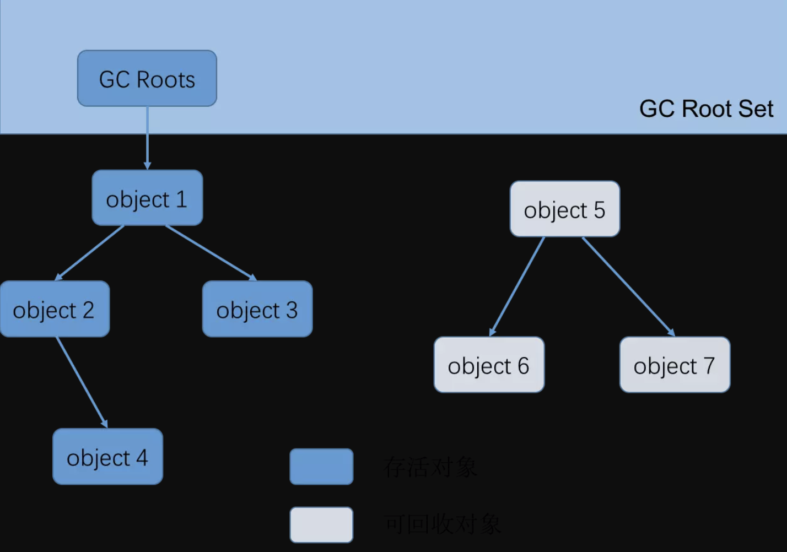

---

layout:     post
title:      JVM
subtitle:   JVM
date:       2019-09-17
author:     skaleto
catalog: true
tags:
    - jvm

---

# JVM原理解析

[TOC]


## 前言

作为一个程序员，Java语言用的不少了，但是对JVM的内部原理却停留在表面，一些知识点都是一知半解，碰上比较懂JVM的同行，探讨起来也只能随声附和，尴尬笑笑，毕竟自己对JVM的内部原理了解的也不是很多，并不能给出什么独特的见解。

这一个专栏将会围绕JVM的的方方面面，系统地对JVM的内部原理做深入学习。

## JVM发展史

从1996年初sun公司发布的jdk1.0开始，出现过很多优秀的虚拟机

### Sun Classic/Exact VM

Classic VM，它是世界上第一款商用的java虚拟机，比较原始，只能使用纯解释器来运行，如果需要JIT支持，需要外挂编译器，但是一旦外挂编译器，解释器就不再工作了，意味着编译器需要对每一个方法、每一行代码都进行编译，这种情况导致java语言的执行效率相比较传统的C和C++程序而言低得多。

为了解决classic VM的各种问题，提高运行效率，sun公司发布了Exact VM，它使用了准确式内存管理，即虚拟机知道内存中的某个位置的数据是什么类型，这样的好处是在GC的时候，能够准确知道哪些数据还有可能被使用。

Extract VM出现后不久，就被更加优秀的HotSpot VM所替代。

### Sun HotSpot VM

它是Sun JDK和OpenJDK中所自带的虚拟机，也是目前适用范围最广的java虚拟机。HotSpot中比较具有优势的就是它的热点探测技术，这也是它名字的由来。热点探测技术可以通过执行计数器找出最具有编译价值的代码，从而提高程序的编译效率和执行效率。

### Sun Mobile-Embedded VM/Meta-circular VM

这一类虚拟机是Sun公司面对移动市场和嵌入式市场发布的虚拟机产品

### BEA JRockit/IBM J9 VM

JRockit VM这是一款专门为服务器硬件和服务器端应用场景高度优化的虚拟机，牺牲了程序的启动速度。

### Azul VM/BEA Liquid VM

这一类是运行在特定硬件设备上的高性能虚拟机


## 简介

### 什么是JVM

JVM即java virtual machine，顾名思义，它是一个虚拟机，换句话说，它可以不受平台限制，在理论上的任意环境下都能够正常运行。事实上，java一直以来都有这样一句口号，叫做“一次编译，到处运行”，那么它到底是怎么做到这样的呢？

首先，我们手写的代码显然是比较符合人类思维方式的程序代码，它会在编译阶段转化成字节码文件，也就是把我们手写的.java文件转化为.class文件。这些字节码文件在不同的操作系统上依靠不同的java虚拟机进行解释，最后转化为不同平台的机器码，最终得到执行。

Java代码编译是由Java源码编译器来完成，流程图如下所示：


Java字节码的执行是由JVM执行引擎来完成，流程图如下所示：


### JVM运行时数据区域


##### 程序计数器

内存空间小，线程私有（可以看做是当前线程所执行的字节码的行号指示器）。字节码解释器工作是就是通过改变这个计数器的值来选取下一条需要执行指令的字节码指令，分支、循环、跳转、异常处理、线程恢复等基础功能都需要依赖计数器完成。

java虚拟机的多线程是通过线程轮流切换并分配处理器执行时间来实现的，也就是说，在任意时刻，一个处理器（或者说一个内核）都只会执行一条线程中的指令，为了让每个线程在切换之后能够保存当前执行的状态，就需要这个程序计数器来保存。因此从这里也可以看出，程序计数器是每个线程私有的。

如果线程正在执行一个 Java 方法，这个计数器记录的是正在执行的虚拟机字节码指令的地址；如果正在执行的是 Native 方法，这个计数器的值则为 (Undefined)。此内存区域是唯一一个在 Java 虚拟机规范中没有规定任何 OutOfMemoryError 情况的区域。


##### 虚拟机栈

也是线程私有，生命周期和线程一致。描述的是 Java 方法执行的内存模型：每个方法在执行时都会创建一个栈帧(Stack Frame)用于存储`局部变量表`、`操作数栈`、`动态链接`、`方法出口`等信息。每一个方法从调用直至执行结束，就对应着一个栈帧从虚拟机栈中入栈到出栈的过程。

局部变量表：存放了编译期可知的各种基本类型(boolean、byte、char、short、int、float、long、double)、对象引用(reference 类型)和 returnAddress 类型(指向了一条字节码指令的地址)


##### 本地方法栈

区别于 Java 虚拟机栈的是，Java 虚拟机栈为虚拟机执行 Java 方法(也就是字节码)服务，而本地方法栈则为虚拟机使用到的 Native 方法服务。


##### 方法区

属于线程共享内存区域，存储已被虚拟机加载的类信息、常量、静态变量、即时编译器编译后的代码等数据。Java虚拟机规范把方法区描述为堆的一个逻辑部分，但它有一个别名叫Non-heap，目的就是为了和普通的堆分开来。

很多人习惯把方法区称为永久代，但方法区并不等价于永久代。仅仅是因为HotSpot设计团队将GC分代收集扩展至方法区，或者说使用永久代来实现方法区。是为了方便垃圾收集器可以像管理堆一样来管理这一部分内存,而不必为方法区开发专门的内存管理器(永久带的内存回收的主要目标是针对常量池的回收和类型的卸载, 因此收益一般很小)。

像BEA JRockit、IBM J9等其他虚拟机，是不存在永久代的概念的，事实上，用永久代来实现方法区，确实存在一些不妥，比如永久代有内存限制(-XX:MaxPermSize)，容易出现内存溢出的情况。

运行时常量池，属于方法区的一部分，用于存放编译期生成的各种字面量和符号引用。所谓运行时常量池，即不一定只有预先定义在类中的常量才可以放在这里，在运行过程中也可以往常量池中放东西，例如string的intern方法。


##### 直接内存

并不是 JVM 运行时数据区的一部分, 但也会被频繁的使用: 在 JDK 1.4 引入的 NIO 提
供了基于 Channel 与 Buffer 的 IO 方式, 它可以使用 Native 函数库直接分配堆外内存, 然后使用DirectByteBuffer 对象作为这块内存的引用进行操作(详见: Java I/O 扩展), 这样就避免了在 Java堆和 Native 堆中来回复制数据, 因此在一些场景中可以显著提高性能。


##### 堆

对于绝大多数应用来说，这块区域是 JVM 所管理的内存中最大的一块。线程共享，主要是存放对象实例和数组。内部会划分出多个线程私有的分配缓冲区(Thread Local Allocation Buffer, TLAB)。可以位于物理上不连续的空间，但是逻辑上要连续。

现代 VM 采用分代收集算法, 因此 Java 堆从 GC 的角度还可以细分为: 新生代( Eden 区 、 From Survivor 区 和 To Survivor 区 )和老年代。


JDK1.7堆内存模型


##### 新生代

是用来存放新生的对象。一般占据堆的1/3空间。由于频繁创建对象，所以新生代会频繁触发
MinorGC 进行垃圾回收。新生代又分为 Eden 区、ServivorFrom、ServivorTo 三个区。在HotSpot VM中，Eden、ServivorFrom和ServivorTo的大小比例为8:1:1

##### Eden

Java新对象的出生地（如果新创建的对象占用内存很大，则直接分配到老
年代）。当Eden区内存不够的时候就会触发MinorGC，对新生代区进行
一次垃圾回收。

##### ServivorFrom

上一次 GC 的幸存者，作为这一次 GC 的被扫描者。

##### ServivorTo 

保留了一次 MinorGC 过程中的幸存者。在发生Minor GC时，Eden区和Survivalfrom区会把一些仍然存活的对象复制进Survival to区，并清除内存。Survival to区会把一些存活得足够旧的对象移至年老代。

```
MinorGC 采用复制算法。
1 ： eden 、 servicorFrom  复制到 ServicorTo，年龄+1
首先，把 Eden和 ServivorFrom区域中存活的对象复制到 ServicorTo区域（如果有对象的年
龄以及达到了老年的标准，则赋值到老年代区），同时把这些对象的年龄+1（如果 ServicorTo 不
够位置了就放到老年区）；
2 ： 清空 eden 、 servicorFrom
然后，清空 Eden 和 ServicorFrom 中的对象；
3 ： ServicorTo 和 ServicorFrom 互换
最后，ServicorTo 和 ServicorFrom 互换，原 ServicorTo 成为下一次 GC 时的 ServicorFrom
区。
```

上面这种分区方式实际使用的新生代空间为8+1即90%，剩下的10%用来为复制算法服务。


##### 老年代

主要存放应用程序中生命周期长的内存对象。
老年代的对象比较稳定，所以 MajorGC 不会频繁执行。在进行 MajorGC 前一般都先进行
了一次 MinorGC，使得有新生代的对象晋身入老年代，导致空间不够用时才触发。当无法找到足够大的连续空间分配给新创建的较大对象时也会提前触发一次 MajorGC 进行垃圾回收腾出空间。


MajorGC 采用标记清除算法：首先扫描一次所有老年代，标记出存活的对象，然后回收没
有标记的对象。MajorGC 的耗时比较长，因为要扫描再回收。MajorGC 会产生内存碎片，为了减少内存损耗，我们一般需要进行合并或者标记出来方便下次直接分配。当老年代也满了装不下的时候，就会抛出 OOM（Out of Memory）异常。


##### 永久代

指内存的永久保存区域，主要存放 Class 和 Meta（元数据）的信息,Class 在被加载的时候被
放入永久区域，它和和存放实例的区域不同,GC 不会在主程序运行期对永久区域进行清理。所以这也导致了永久代的区域会随着加载的 Class 的增多而胀满，最终抛出 OOM 异常。

#####  JAVA8 与元数据

JDK1.8堆内存模型


在Java8中，永久代已经被移除，被一个称为“元数据区”（元空间）的区域所取代。元空间
的本质和永久代类似，元空间与永久代之间最大的区别在于：元空间并不在虚拟机中，而是使用本地内存。因此，默认情况下，元空间的大小仅受本地内存限制。类的元数据放入 native memory, 字符串池和类的静态变量放入 java 堆中，这样可以加载多少类的元数据就不再由MaxPermSize 控制, 而由系统的实际可用空间来控制


数据区中的一部分是整个程序共有，其他部分被单独的线程控制。每一个Java虚拟机都包含方法区（method area）和堆（heap），他们都被整个程序共享。

当一个线程被创建时，会被分配只属于他自己的PC寄存器“pc register”（程序计数器）和Java虚拟机栈（Java stack）。当线程不掉用本地方法时，PC寄存器中保存线程执行的下一条指令。Java虚拟机栈保存了一个线程调用方法时的状态，包括本地变量、调用方法的 参数、返回值、处理的中间变量。
     Java虚拟机不使用寄存器保存计算的中间结果，而是用Java虚拟机栈在存放中间结果。这是的Java虚拟机的指令更紧凑，也更容易在一个没有寄存器的设备上实现Java虚拟机。 


## GC

#### 什么是GC，GC要做什么事

gc就是Garbage Collection垃圾回收，GC的目标就是把一些已经不需要再使用的或者已经死亡的对象或内存回收掉，以节省出内存空间给应用程序使用。

在上面的知识里面我们知道，Java虚拟机的数据区域中，虚拟机栈、本地方法栈以及程序计数器，需要为他们分配多少的内存基本已经在类结构确定下来就已知了，但是堆就不一样了，在程序运行的过程中，不同的分支和逻辑可能导致需要的内存大小也不一样，但是我们的内存空间是有限的，因此需要对堆中的数据进行清理，以及时释放空间。


#### 那么怎么才能确定一个对象已经死亡了呢？

##### 引用计数法

java中引用和对象是有关联的，如果要操作对象则必须用引用进行。很简单的一个办法就是通过引用计数来判断一个对象是否可以回收。即一个对象如果没有任何与之关联的引用，即他们的引用计数都为0，则说明对象不太可能在被用到，那么这个对象就是可回收对象。

但是，引用计数法无法解决循环引用的问题：

```java
/**
*testGC（）方法执行后，objA和objB会不会被GC呢？
*@author zzm
*/
public class ReferenceCountingGC{
public Object instance=null；
private static final int _1MB=1024*1024；
/**
*这个成员属性的唯一意义就是占点内存，以便能在GC日志中看清楚是否被回收过
*/
private byte[] bigSize=new byte[2*_1MB]；
  
public static void testGC（）{
ReferenceCountingGC objA=new ReferenceCountingGC（）；
ReferenceCountingGC objB=new ReferenceCountingGC（）；
objA.instance=objB；
objB.instance=objA；
objA=null；
objB=null；
//假设在这行发生GC,objA和objB是否能被回收？
System.gc（）；
}
}
```

在上图中可以看到，假如我们把对象A和对象B全都置为null，但是在java堆中仍然存在着两个互相引用，那么他们永远无法被回收。


##### 可达性分析法

为了解决引用计数法的循环引用问题，java使用了可达性分析的方法。

> 通过一系列的 ‘GC Roots’ 的对象作为起始点，从这些节点出发所走过的路径称为引用链。当一个对象到 GC Roots 没有任何引用链相连的时候说明对象不可达。



可作为 GC Roots 的对象：

- 虚拟机栈(栈帧中的本地变量表)中引用的对象
- 方法区中类静态属性引用的对象
- 方法区中常量引用的对象
- 本地方法栈中 JNI(即一般说的 Native 方法) 引用的对象

但是，不可达对象不等价于可回收对象，不可达对象变为可回收对象至少要经过两次标记过程，两次标记后仍然是可回收对象，则将面临回收。

即使在可达性分析算法中不可达的对象，也并非是“非死不可”的，这时候它们暂时出于“缓刑”阶段，一个对象的真正死亡至少要经历两次标记过程：如果对象在进行中可达性分析后发现没有与 GC Roots 相连接的引用链，那他将会被第一次标记并且进行一次筛选，筛选条件是此对象是否有必要执行 finalize() 方法。当对象没有覆盖 finalize() 方法，或者 finalize() 方法已经被虚拟机调用过，虚拟机将这两种情况都视为“没有必要执行”。

如果这个对象被判定为有必要执行 finalize() 方法，那么这个对象竟会放置在一个叫做 F-Queue 的队列中，并在稍后由一个由虚拟机自动建立的、低优先级的 Finalizer 线程去执行它。这里所谓的“执行”是指虚拟机会出发这个方法，并不承诺或等待他运行结束。finalize() 方法是对象逃脱死亡命运的最后一次机会，稍后 GC 将对 F-Queue 中的对象进行第二次小规模的标记，如果对象要在 finalize() 中成功拯救自己 —— 只要重新与引用链上的任何一个对象简历关联即可。

但是！

任何对象的finalize方法都只会被虚拟机调用一次，这意味着只能通过这种方法避免一次该对象被回收的过程，并不能避免第二次。同时，由于finalize运行代价高昂，不确定性大，例如内部的队列假如被一个执行特别耗时的方法占用着，这将导致队列后面的对象都不能及时得到回收，非常影响性能，因此，一般情况下，不推荐使用finalize方法来拯救一个对象。


##### java的四种引用

上面说到了引用，那么什么是引用？从狭义上来解释，假如A数据块中存放的是B数据块的内存起始地址，那么A数据块其实就可以看作是对B的一种引用。

- 强引用

类似于 Object obj = new Object(); 创建的，只要强引用在就不回收。

- 软引用

SoftReference 类实现软引用。在系统要发生内存溢出异常之前，将会把这些对象列进回收范围之中进行二次回收。软引用通常用在内存敏感的程序中。

- 弱引用

WeakReference 类实现弱引用。对象只能生存到下一次垃圾收集之前。在垃圾收集器工作时，无论内存是否足够都会回收掉只被弱引用关联的对象。

- 虚引用

PhantomReference 类实现虚引用。它不能单独使用，必须和引用队列联合使用，无法通过虚引用获取一个对象的实例，为一个对象设置虚引用关联的唯一目的就是能在这个对象被收集器回收时收到一个系统通知。


##### 标记清除算法

最基础的垃圾回收算法，分为两个阶段，标注和清除。标记阶段标记处所有需要回收的对象，清除阶段回收被标记对象所占用的空间。


从图中可以看出，该算法最大的问题是内存碎片化严重，后续可能发生大对象不能找到可利用的空间


##### 复制算法

为了解决 Mark-Sweep 算法内存碎片化的缺陷而被提出的算法。按内存容量将内存划分为等大小的两块。每次只使用其中一块，当这一块内存满后将尚存活的对象复制到另一块上去，把已使用的内存清掉.


这种算法虽然实现简单，内存效率高，不易产生碎片，但是最大的问题是可用内存被压缩到了原本的一半。且存活对象增多的话，Copying 算法的效率会大大降低。但是一般情况下我们也可以根据需要来确定划分区域的大小配比，不一定是一半一半，例如HotSpot中新生代的划分做法。


##### 标记整理算法

标记阶段和 Mark-Sweep 算法相同，标记后不是清理对象，而是将存活对象移向内存的一端。然后清除端边界外的对象。


##### 分代收集算法

是目前大部分JVM所采用的方法，他的核心思想是根据对象存活的不同生命周期将内存划分为不同的域，一般将GC堆划分为老生代和新生代。老生代的特点是每次垃圾回收只有少量的对象需要被回收，新生代的特点是每次垃圾回收都有大量垃圾需要被回收

- 新生代与复制算法，目前大部分 JVM 的 GC 对于新生代都采取 Copying 算法，因为新生代中每次垃圾回收都要回收大部分对象，即要复制的操作比较少，但通常并不是按照 1：1 来划分新生代。一般将新生代划分为一块较大的 Eden 空间和两个较小的 Survivor 空间(From Space, To Space)，每次使用Eden 空间和其中的一块 Survivor 空间，当进行回收时，将该两块空间中还存活的对象复制到另一块 Survivor 空间中。
- 老年代与标记复制算法，而老年代因为每次只回收少量对象，因而采用 Mark-Compact 算法。
  1.  JAVA 虚拟机提到过的处于方法区的永生代(Permanet Generation)，它用来存储 class 类，常量，方法描述等。对永生代的回收主要包括废弃常量和无用的类。
  2.  对象的内存分配主要在新生代的 Eden Space 和 Survivor Space 的 From Space(Survivor 目前存放对象的那一块)，少数情况会直接分配到老生代。
  3.  当新生代的 Eden Space 和 From Space 空间不足时就会发生一次 GC，进行 GC 后，Eden Space 和 From Space 区的存活对象会被挪到 To Space，然后将 Eden Space 和 From Space 进行清理。
  4.  如果 To Space 无法足够存储某个对象，则将这个对象存储到老生代。
  5.  在进行 GC 后，使用的便是 Eden Space 和 To Space 了，如此反复循环。
  6.  当对象在 Survivor 区躲过一次 GC 后，其年龄就会+1。默认情况下年龄到达 15 的对象会被移到老生代中。


##### 分区收集算法

分区算法将整个堆空间划分为连续不同的小区间，每个区间独立使用，独立回收，这样的话可以控制一次回收多少个小区间，根据目标停顿间隔，每次合理回收若干个小区间，而不是整个堆，减少一次GC产生的停顿


上面说到，在进行真正的GC时，各个线程需要停下来，但是并不是在程序运行的任何阶段都可以停下来的，JVM内部有一个安全点的机制，即线程需要跑到指定的安全点才能停下来，常见的安全点有方法调用，循环跳转，异常跳转等。那么如何让所有的线程都在安全点停下来呢，有抢先式中断和主动式中断。抢先式中断即先把所有线程都停了，如果发现有线程不在安全点，则回复线程，让它跑到安全点再中断（这种方案显然不是特别合理，因此目前几乎没有虚拟机会这么干）；第二种方式是主动式中断，即不直接操作线程，而是设置一个标志，让各线程在运行时主动去轮训这个标志，检查是否需要中断。

但是呢，安全点并不能解决某些不在运行状态的线程，因此就有了安全区的概念。


### GC垃圾收集器

堆内存被划分为新生代和年老代两部分，新生代主要使用复制和标记-清除垃圾回收；

年老代主要使用标记-整理垃圾回收算法，因此 java 虚拟中针对新生代和年老代分别提供了多种不同的垃圾收集器，JDK1.6 中 Sun HotSpot 虚拟机的垃圾收集器如下。


#### Serial收集器（单线程、复制算法）


Serial是一个单线程的收集器，它只会使用一个CPU或一个线程去进行垃圾收集，并且在进行收集的过程中，必须暂停其他所有的工作线程，直到垃圾收集结束（stop the world）。

虽然从上面的描述来看Serial垃圾收集器很“垃圾”，但是不可否认的是，由于它是单线程收集器，那么对于限定单CPU的环境下，它没有线程交互的开销，可以获得最高的单线程垃圾收集效率。因此，Serail是java虚拟机在client模式下默认的新生代垃圾收集器


#### ParNew收集器（Serial+多线程）

ParNew收集器是Serial收集器的多线程版本，也使用复制算法，除了在运行过程中可以开启多个线程外，其他部分和Serial收集器完全一样，并且它在工作的过程中也要暂停其他的工作线程。

ParNew默认开启与CPU数目相同的线程数，通过-XX:ParallelGCThreads来设置垃圾收集器的线程数。因此，ParNew是java虚拟机在Server模式下默认的新生代垃圾收集器。


#### Parallel Scavenge收集器（多线程复制算法，高效）

也是一个新生代收集器，同时也使用了复制算法，也支持多线程。它的目的是达到一个可控制的吞吐量（Throughput = 运行用户代码的时间/(运行用户代码的时间+垃圾收集的时间)）。在这种收集器下，虚拟机会根据当前系统的运行情况收集性能监控信息，动态调整停顿时间，这就是GC的自适应调整策略。默认值是99%，即允许最大1%的垃圾收集时间。


#### Serial Old收集器（单线程标记整理算法）

Serial Old顾名思义可以理解为Serial收集器的老年代版本，也是单线程的，它使用标记整理算法。

在Server模式下，主要有两个用途：

1.在jdk1.5版本前与新生代Parallel Scavenge搭配使用

2.作为老年代中使用CMS收集器的后备垃圾收集方案


#### Parallel Old收集器（多线程标记整理算法）

是Parallel Scavenge的老年代版本，在jdk1.6才开始提供，同样也是出于吞吐量的考虑，如果系统需要较高的吞吐量，可以考虑使用Parallel Scavenge和Parallel Old搭配使用。


#### CMS收集器（多线程标记清除算法）

Concurrent Mark Sweep是一种以获取最短回收停顿时间为目标的收集器，基于标记清除算法实现。CMS的工作机制分为下面四个步骤：

1. 初始标记：标记GC Roots能直接关联到的对象，仍然需要暂停所有的工作线程。
2. 并发标记：进行GC Roots Tracing，和用户线程一起工作，不需要暂停线程
3. 重新标记：修正并发标记期间，由于用户程序的运行导致某些标记发生的变动部分，这里也需要暂停工作线程
4. 并发清除：清除GC Roots不可达的对象，和用户线程一起工作

在上面四个步骤中，耗时最长的是并发标记和并发清除过程，因此从整体上来看CMS的内存回收大部分时间都是和用户线程并发执行的。

缺点：对CPU资源敏感（因为会占用一部分线程/CPU资源），无法收集浮动垃圾（在标记过程结束后产生的垃圾，需要等到下一次GC的时候再清理，因此需要预留一部分的空间），标记-清除算法将带来一些空间碎片。


#### G1收集器

关于G1收集器的知识，也可以参考https://blog.csdn.net/coderlius/article/details/79272773这篇文章，写得十分详细

G1收集器（Garbage-First）是目前垃圾收集器的最前沿成果，它有两个优势：

- 基于标记-整理算法，不产生内存碎片
- 可以非常精确地控制停顿时间，在不牺牲吞吐量的情况下，实现低停顿垃圾回收。

G1收集器通过将堆内存划分为大小固定的几个独立区域，并跟踪这些区域的垃圾收集进度，同时在后台维护一个优先级列表，每次根据所允许的收集时间，有限回收垃圾最多的区域，确保G1收集器可以再有限时间内获得最高的垃圾收集效率。

G1收集器器的设计⽬目标是取代CMS收集器器，它同CMS相⽐比，在以下⽅方⾯面表现的更更出⾊色:

- G1是⼀一个有整理理内存过程的垃圾收集器器，不不会产⽣生很多内存碎⽚片。
- G1的Stop The World(STW)更更可控，G1在停顿时间上添加了了预测机制，⽤用户可以指定期望停顿时间。

##### Region

与传统分代方式不同的是，G1的各代存储地址是不连续的，每一代都使⽤用了了n个不连续的⼤小相同的Region，每个Region占有一块 连续的虚拟内存地址。在物理上不需要连续，带来了额外的好处: 有的分区内垃圾对象特别多，有的分区内垃圾对象很少，G1会优先回收垃圾对象特别多的分区，这样可以花费较少的时间来回收这些分区的垃圾。


其中分为了四种不同的标记，E标记类比为新生代的Eden区，S标记类比为新生代的Survivor区，O标记类比为老年代，而其中的H用来表示这些Region中存放的是一些比较大的对象(Humongous Object，对象的大小≥Region/2)，如果一个分区大小仍然不够巨大对象存放的，那么这些巨大对象会存放在若干个连续的分区中.

Region的大小是可以指定的，通过-XX:G1HeapRegionSize 设定，取值范围从1M到32M，且是2的指数。如果不设定，那么G1会根据Heap⼤小⾃动决定。

```c++
// 最⼩小值 1M
#define MIN_REGION_SIZE ( 1024 * 1024 )
// 最⼤大值 32M
#define MAX_REGION_SIZE ( 32 * 1024 * 1024 )
#define TARGET_REGION_NUMBER 2048
void HeapRegion::setup_heap_region_size(size_t initial_heap_size, size_t max_heap_size) {
uintx region_size = G1HeapRegionSize;
// 使⽤用默认值
if (FLAG_IS_DEFAULT(G1HeapRegionSize)) {
    size_t average_heap_size = (initial_heap_size + max_heap_size) / 2;
    region_size = MAX2(average_heap_size / TARGET_REGION_NUMBER,
                       (uintx) MIN_REGION_SIZE);
}
int region_size_log = log2_long((jlong) region_size); // 保证region⼤大⼩小是2的幂
region_size = ((uintx)1 << region_size_log);
  if (region_size < MIN_REGION_SIZE) {
    region_size = MIN_REGION_SIZE;
  } else if (region_size > MAX_REGION_SIZE) {
    region_size = MAX_REGION_SIZE;
} }
```

##### Remembered Set

从设计上来看，G1的Region结构看似很完美，但是，每个Region一定是单独存在的么，肯定不是，每个region中的对象或多或少肯定会和其他region中的对象有引用关系，那么一旦出现这种情况怎么办呢，总不能把整个区域都扫描一遍做一次GC吧。

GC的每个region都有一个对应的Remembered Set（简称RSet），虚拟机发现程序在对一个引用类型做写操作时，会产生一个write barrier暂时中断写操作，检查引用类型是否处在不同的region中，如果是，就通过CardTable把引用信息记录到被引用对象所在Region的RSet中。那么在扫描的时候，加上扫描RSet中的信息，就可以把相关联的所有引用对象全部扫描到。

即RSet中记录的是其他引用我这个region中对象的信息（points-into，谁引用了我）

##### Card Table

Card Table是⼀种points-out(我引用了谁的对象)的结构，是将每个region按照一定的大小（一般为512字节）分成若干个Card，这些Card组合成Card Table。

RSet是在Card Table的基础上实现的：每个Region会记录下别的Region指向⾃⼰的指针，并标记这些指针分别在哪些Card的范围内。 RSet其实是一个Hash Table，Key是别的Region的起始地址，Value是一个集合，⾥面的元素是Card Table的Index。


 在上图中，每个region分成了若干个card，蓝色箭头表示我引用了谁的信息，存放在每个card中，红色箭头表示谁引用了我的信息，存放在RSet中。


##### 对象漏标

由于存在并发标记阶段，很有可能在标记阶段不断有新的引用被修改，那么每个对象就很有可能被误标或漏标。为了解决漏标的问题，G1把对象分成三种颜色。

- 黑色:⾃身以及可达对象都已经被标记
- 灰色:⾃身被标记，可达对象还未标记
- ⽩色:还未被标记

漏标的情况只会发生在白色对象中，且满⾜以下任意⼀个条件:

- 并发标记时，应⽤线程给一个⿊色对象的引⽤类型字段赋值了该⽩色对象
- 并发标记时，应⽤线程删除所有灰色对象到该⽩色对象的引⽤

来看这样一个例子，模拟从根节点开始扫描的过程：

1. 首先，根节点被置为黑色，并扫描他们的子节点，此时子节点被置为灰色


2. 随后，继续从灰色节点往下扫描，将已经扫描了子节点的节点设为黑色


3. 遍历完成所有可达对象后，应该都会变成黑色，而不可达的对象则还是白色


4. 但是当扫描过程中对对象的引用发生变化，会怎么样呢，例如下图已经扫描完A，并即将开始扫描C的时候，将C的引用从B改为A，那么B就会变成黑色，而C此时却是一个白色的对象，认为是需要被回收的，但这显然是有问题的。


那么怎么解决上面的问题呢，我们可以看到，发生这种情况的条件对应了A中的引用发生了新增，而B中的引用发生了删除，因此可以对这两种情况有两种解决办法，一种是在发生新增时记录一下，一种是发生删除时记录一下。

- 在CMS中，对新增时做了处理，称为Incremental Update write barrier，具体方式为在写屏障（write barrier）里当发现一个白色对象将被引用到一个黑色对象中时，将这个白色对象变为灰色。

- 在G1中，对删除时做了处理，称为STAB（snapshot at the beginning）

  - 在开始标记的时候生成一个快照图标记存活对象
  - 在并发标记的时候所有被改变的对象入队（在write barrier里把所有旧的引用所指向的对象都变成非白的）

  但是STAB可以看到有一个缺点就是可能存在游离的垃圾，因为它在一开始把所有能遍历到的对象都标记了，这样假如有的对象在运行过程中引用被删除了，它还是会被遍历一遍


##### Young GC

Young GC主要是对Eden区进行GC，它在Eden空间耗尽时会被触发。在这种情况下，Eden空间的数据移动到Survivor空间中，如果Survivor空间不够，Eden空间的部分数据会直接晋升到年老代空间。Survivor区的数据移动到新的Survivor区中，也有部分数据晋升到老年代空间中。最终Eden空间的数据为空，GC停止工作。


在这个过程中，上面提到的RSet信息就被用到了，G1会遍历RSet中的记录，进而去扫描年轻代指向年老代的区域。


##### Mixed GC

Mix GC不仅进行正常的新生代垃圾收集，同时也回收部分后台扫描线程标记的老年代分区，它分为两个步骤：

1. 全局并发标记（global concurrent marking）
2. 拷贝存活对象（evacuation）

在进行Mix GC之前，会先进行global concurrent marking（全局并发标记），在G1 GC中，它主要是为Mixed GC提供标记服务的，并不是一次GC过程的一个必须环节。global concurrent marking的执行过程分为五个步骤：

- 初始标记（initial mark，STW）（第一次暂停所以应用线程）
  在此阶段，G1 GC 对根进行标记。该阶段与常规的 (STW) 年轻代垃圾回收密切相关。
- 根区域扫描（root region scan）
  G1 GC 在初始标记的存活区扫描对老年代的引用，并标记被引用的对象。该阶段与应用程序（非 STW）同时运行，并且只有完成该阶段后，才能开始下一次 STW 年轻代垃圾回收。
- 并发标记（Concurrent Marking）
  G1 GC 在整个堆中查找可访问的（存活的）对象。该阶段与应用程序同时运行，可以被 STW 年轻代垃圾回收中断
- 最终标记（Remark，STW）（第二次暂停所以应用线程）
  该阶段是 STW 回收，帮助完成标记周期。G1 GC 清空 SATB 缓冲区，跟踪未被访问的存活对象，并执行引用处理。
- 清除垃圾（Cleanup，STW）（第三次暂停所以应用线程）
  在这个最后阶段，G1 GC 执行统计和 RSet 净化的 STW 操作。在统计期间，G1 GC 会识别完全空闲的区域和可供进行混合垃圾回收的区域。清理阶段在将空白区域重置并返回到空闲列表时为部分并发。


Mixed GC的触发时机不像youngGC一样比较明显，它由一些参数触发。

| 参数                                 | 说明                                                         | 默 认 值 |
| ------------------------------------ | ------------------------------------------------------------ | -------- |
| -XX:G1HeapWastePercent               | 该值表示愿意浪费的堆百分比。当可回收的垃圾占⽐⼤于该值时，则会触发Mixed GC。 | 10       |
| -XX:G1MixedGCLiveThresholdPercent    | 该值表示如果一个分区中的存活对象⽐例超过n，就不会被当作垃圾分区。 | 65       |
| -XX:G1MixedGCCountTarget             | ⼀次并发标记周期后，最多执行Mixed GC的 次数。                | 8        |
| - XX:G1OldCSetRegionThresholdPercent | ⼀次Mixed GC期间可被回收的最大的⽼年代的⽐例上限(选入CSet的最多old generation region数量) | 10       |


##### G1 Full GC

G1收集器同CMS收集器一样，在某些情况下，G1触发了Full GC，这时G1会退化使用Serial收集器来完成垃圾的清理工作，它仅仅使用单线程来完成GC工作，GC暂停时间将达到秒级别的。整个应用处于假死状态，不能处理任何请求，我们的程序当然不希望看到这些。有的时候你会在垃圾回收日志中观察到Full GC，这些日志是一个信号，表明我们需要进一步调优（方式很多，甚至很可能要分配更多的堆空间）才能提升应用程序的性能。主要有4种情况会触发这类的Full GC，如下：

**并发模式失效**

G1启动标记周期，但在Mix GC之前，老年代就被填满，这时候G1会放弃标记周期。这种情形下，需要增加堆大小，或者调整周期（例如增加线程数-XX:ConcGCThreads等）


解决办法：发生这种失败意味着堆的大小应该增加了，或者G1收集器的后台处理应该更早开始，或者需要调整周期，让它运行得更快（如，增加后台处理的线程数）。


**晋升失败**

（to-space exhausted或者to-space overflow）

G1收集器完成了标记阶段，开始启动混合式垃圾回收，清理老年代的分区，不过，老年代空间在垃圾回收释放出足够内存之前就会被耗尽。（G1在进行GC的时候没有足够的内存供存活对象或晋升对象使用），由此触发了Full GC。

下面日志中（可以在日志中看到(to-space exhausted)或者（to-space overflow）），反应的现象是混合式GC之后紧接着一次Full GC。


这种失败通常意味着混合式收集需要更迅速的完成垃圾收集：每次新生代垃圾收集需要处理更多老年代的分区。

解决这种问题的方式是：

1. 增加 -XX:G1ReservePercent 选项的值（并相应增加总的堆大小），为“目标空间”增加预留内存量。
2. 通过减少 -XX:InitiatingHeapOccupancyPercent 提前启动标记周期。
3. 也可以通过增加 -XX:ConcGCThreads 选项的值来增加并行标记线程的数目。


**疏散失败**

（to-space exhausted或者to-space overflow）

进行新生代垃圾收集是，Survivor空间和老年代中没有足够的空间容纳所有的幸存对象。这种情形在GC日志中通常是：


这条日志表明堆已经几乎完全用尽或者碎片化了。G1收集器会尝试修复这一失败，但可以预期，结果会更加恶化：G1收集器会转而使用Full GC。

解决这种问题的方式是：

1. 增加 -XX:G1ReservePercent 选项的值（并相应增加总的堆大小），为“目标空间”增加预留内存量。
2. 通过减少 -XX:InitiatingHeapOccupancyPercent 提前启动标记周期。
3. 也可以通过增加 -XX:ConcGCThreads 选项的值来增加并行标记线程的数目。


**巨型对象分配失败**

当巨型对象找不到合适的空间进行分配时，就会启动Full GC，来释放空间。这种情况下，应该避免分配大量的巨型对象，增加内存或者增大-XX:G1HeapRegionSize，使巨型对象不再是巨型对象。


##### G1垃圾收集器调优

1、G1垃圾收集器调优的主要目标是避免发生并发模式失败或者疏散失败，一旦发生这些失败就会导致Full GC。避免Full GC的技巧也适用于频繁发生的新生代垃圾收集，这些垃圾收集需要等待扫描根分区完成才能进行。

2、其次，调优可以是过程中的停顿时间最小化。

下面列出能够避免发生Full GC的方法：

- 通过增加总的堆空间大小或者调整老年代、新生代之间的比例来增加老年代空间的大小。
- 增加后台线程的数目（假设我们有足够的CPU资源运行这些线程）。
- 以更高的频率进行G1的后台垃圾收集活动。
- 在混合式垃圾收集周期中完成更多的垃圾收集工作。


使用G1垃圾收集器时，XX:MaxGCPauseMillis标志有一个默认值：200毫秒（和throughput收集器有所不同）。如果G1收集器发生时空停顿（stop-the-world）的时长超过该值，G1收集器就会尝试各种方式进行弥补--如调整新生代与老年代的比率，调整堆大小，更早地启动后台处理，改变晋升阈值，或者是在混合式垃圾收集周期中处理更多或者更少的老年代分区。

通常的取舍就是发生在这里：如果减少参数值，为了达到停顿时间的目标，新生代的大小会相应减少，不过新生代垃圾收集的频率会更加频繁。除此之外，为了达到停顿时间的目标，混合式GC收集老年代分区数也会减少，而这会增大并发模式失败发生的机会。


##### 常见调优参数

-XX:MaxGCPauseMillis=N,（默认200毫秒，与throughput收集器有所不同）

前面介绍过使用GC的最基本的参数：

> -XX:+UseG1GC -Xmx32g -XX:MaxGCPauseMillis=200

前面2个参数都好理解，后面这个MaxGCPauseMillis参数该怎么配置呢？这个参数从字面的意思上看，就是允许的GC最大的暂停时间。G1尽量确保每次GC暂停的时间都在设置的MaxGCPauseMillis范围内。 那G1是如何做到最大暂停时间的呢？这涉及到另一个概念，CSet(collection set)。它的意思是在一次垃圾收集器中被收集的区域集合。

- Young GC：选定所有新生代里的region。通过控制新生代的region个数来控制young GC的开销。
- Mixed GC：选定所有新生代里的region，外加根据global concurrent marking统计得出收集收益高的若干老年代region。在用户指定的开销目标范围内尽可能选择收益高的老年代region。

在理解了这些后，我们再设置最大暂停时间就好办了。 首先，我们能容忍的最大暂停时间是有一个限度的，我们需要在这个限度范围内设置。但是应该设置的值是多少呢？我们需要在吞吐量跟MaxGCPauseMillis之间做一个平衡。如果MaxGCPauseMillis


-XX:G1HeapRegionSize=n

设置的 G1 区域的大小。值是 2 的幂，范围是 1 MB 到 32 MB 之间。目标是根据最小的 Java 堆大小划分出约 2048 个区域。


-XX:ParallelGCThreads=n（调整G1垃圾收集的后台线程数）

设置 STW 工作线程数的值。将 n 的值设置为逻辑处理器的数量。n 的值与逻辑处理器的数量相同，最多为 8。如果逻辑处理器不止八个，则将 n 的值设置为逻辑处理器数的 5/8 左右。这适用于大多数情况，除非是较大的 SPARC 系统，其中 n 的值可以是逻辑处理器数的 5/16 左右。


-XX:ConcGCThreads=n（调整G1垃圾收集的后台线程数）

设置并行标记的线程数。将 n 设置为并行垃圾回收线程数 (ParallelGCThreads) 的 1/4 左右。


-XX:InitiatingHeapOccupancyPercent=45（调整G1垃圾收集运行频率）

设置触发标记周期的 Java 堆占用率阈值。默认占用率是整个 Java 堆的 45%。

该值设置太高：会陷入Full GC泥潭之中，因为并发阶段没有足够的时间在剩下的堆空间被填满之前完成垃圾收集。

如果该值设置太小：应用程序又会以超过实际需要的节奏进行大量的后台处理。

避免使用以下参数：

避免使用 -Xmn 选项或 -XX:NewRatio 等其他相关选项显式设置年轻代大小。固定年轻代的大小会覆盖暂停时间目标。


-XX:G1MixedGCLiveThresholdPercent=65

为混合垃圾回收周期中要包括的旧区域设置占用率阈值。默认占用率为 65%。这是一个实验性的标志。有关示例，请参见“[如何解锁实验性虚拟机标志](http://www.oracle.com/technetwork/cn/articles/java/g1gc-1984535-zhs.html#Unlock)”。此设置取代了 `-XX:G1OldCSetRegionLiveThresholdPercent` 设置。Java HotSpot VM build 23 中没有此设置。


-XX:G1MixedGCCountTarget=8

设置标记周期完成后，对存活数据上限为 `G1MixedGCLIveThresholdPercent` 的旧区域执行混合垃圾回收的目标次数。默认值是 8 次混合垃圾回收。混合回收的目标是要控制在此目标次数以内。Java HotSpot VM build 23 中没有此设置。


-XX:G1OldCSetRegionThresholdPercent=10

设置混合垃圾回收期间要回收的最大旧区域数。默认值是 Java 堆的 10%。Java HotSpot VM build 23 中没有此设置。


-XX:G1ReservePercent=10

设置作为空闲空间的预留内存百分比，以降低目标空间溢出的风险。默认值是 10%。增加或减少百分比时，请确保对总的 Java 堆调整相同的量。Java HotSpot VM build 23 中没有此设置。


-XX:G1HeapWastePercent=10

设置您愿意浪费的堆百分比。如果可回收百分比小于堆废物百分比，Java HotSpot VM 不会启动混合垃圾回收周期。默认值是 10%。Java HotSpot VM build 23 中没有此设置。

 

### JVM的内存分配策略

- 对象有限在Eden区创建

- 大对象直接进入老年代

  对于Serial和ParNew两款垃圾收集器来说，存在参数-XX：PretenureSizeThreshold可以用来设置对象大小的阈值，大于这个阈值的对象将直接放到老年代中

- 长期存活的对象进入老年代

  对象在minor GC中存货过一次之后，它的年龄数就会+1，通过-XX：MaxTenuringThreshold这个参数可以指定年龄阈值，超过这个阈值的年龄的对象将被放到老年代中

- 动态对象年龄判定

  并不是一定要等到年龄到达某个阈值，对象才会被移到老年代。如果在survivor区中，相同年龄的对象大小综合大于survivor大小的一半，那么大于等于这个年龄的对象就可以被放到老年代中

- 空间分配担保

  在发生Minor GC之前，虚拟机会先检查老年代最大可用的连续空间是否大于新生代所有对象总空间，如果这个条件成立，那么Minor GC可以确保是安全的。如果不成立，则虚拟机会查看HandlePromotionFailure设置值是否允许担保失败。如果允许，那么会继续检查老年代最大可用的连续空间是否大于历次晋升到老年代对象的平均大小，如果大于，将尝试着进行一次Minor GC，尽管这次Minor GC是有风险的；如果小于，或者HandlePromotionFailure设置不允许冒险，那这时也要改为进行一次Full GC。

  冒险是指这种担保是基于之前晋升老年代的对象大小平均值而言，如果说短时间内突然有一个很大的对象产生，那么显然是会大于平均值的，仍然有可能发生担保失败。


## 虚拟机性能监控与故障处理

jdk目录中自带一些非常实用的常见工具

### jps

功能和linux下的ps命令类似：可以列出正在运行的虚拟机进程，并显示虚拟机执行主类（Main Class,main（）函数所在的类）名称以及这些进程的本地虚拟机唯一ID

### jstat

它可以显示本地或者远程[1]虚拟机进程中的类装载、内存、垃圾收集、JIT编译等运行数据

### jmap

用于生成堆转储快照（一般称为heapdump或dump文件）；不过也可以通过命令行参数来设置当发生crash的时候生成dump

### jhat

用于分析jmap生成的堆转储快照，但是作为一个命令行工具，它比较简陋

### jstack

用于生成虚拟机当前的线程快照，线程快照就是当前虚拟机内每一条线程正在执行的方法堆栈的集合，生成线程快照的主要目的是定位线程出现长时间停顿的原因，如线程间死锁、死循环、请求外部资源导致的长时间等待等都是导致线程长时间停顿的常见原因

### jconsole

略

### visualVM

略