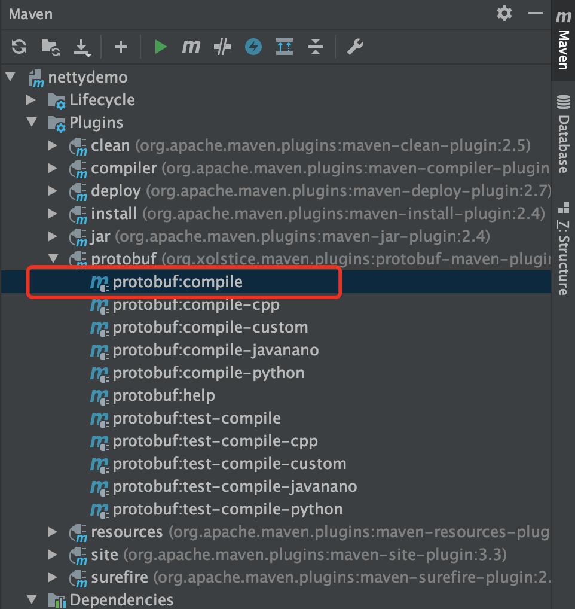

---

layout:     post
title:      NIO之Netty
subtitle:   NIO之Netty
date:       2019-10-09
author:     skaleto
catalog: true
tags:
    - nio,netty

---

# 

[TOC]


## IO多路复用中select和epoll的底层原理

*前提：每个socket中可以看做拥有一个等待队列，用来存放所有监听它的工作进程

### select


1. 将进程从CPU工作队列中移除，进入阻塞状态
2. 将进程加入到它监听的所有socket的等待队列中
3. 某个socket接收到数据
4. 中断程序把进程从所有的socket等待队列中移除，并把进程重新加入CPU工作队列，进入就绪状态
5. 进程遍历所有socket的状态，找到可以读取数据的socket，并完成读取的操作
6. 操作完成后，再重复第一步

缺点：

- 需要重复执行将进程加入socket等待队列，以及从队列中移除的操作，并且需要遍历所有的fd，找到可以接受数据的fd，比较耗性能
- 处于效率的考虑，底层限制了一个select最多监控1024个socket

### poll

与select的原理差不多，但向内核传递的不是所有的fd，而是一个pollfd数组，因此去除了1024个socket的限制

### epoll


select和poll效率本质上都不是特别高，直到Linux2.6才出现了由内核直接支持的实现方法，那就是epoll，epoll分为三个步骤：epoll_create、epoll_ctl、epoll_wait，epoll_create会创建一个eventpoll对象，eventpoll中有两个重要的成员，分别是等待队列和就绪队列，等待队列用于存放正在等待的进程，就绪队列存放当前有数据的socket引用

1. 创建eventpoll对象，将eventpoll对象加入所有socket的等待队列
2. 进程调用epoll_wait后，假如就绪队列为空，epoll将这个进程加入eventpoll对象的等待队列中，并使进程阻塞；如果就绪队列不为空，则立即返回
3. 当有一个socket有数据返回时，中断程序将该socket加入到eventpoll对象的就绪队列中，并把eventpoll中等待的进程唤醒
4. 进程唤醒后直接从就绪队列中获取socket读取数据
5. 操作完成后，再重复第二步，但不需要执行第一步，因为eventpoll对象始终在所有监听的socket中

特点：

- 每个socket的等待队列不会发生频繁的加入移除操作，只会被加入一次eventpoll对象
- 由于存在就绪队列，每个进程在被唤醒后不需要遍历所有的socket，只需要去就绪队列中遍历就可以

数据结构：

- 上图中每个eventpoll维护了一个监视队列，监视需要关心的socket，这些socket fd可能会有频繁的搜索，同时也要保证一定程序的插入删除性能，因此内部使用了一个红黑树来存储
- eventpoll中的就绪队列存放了就绪的socket引用，需要比较高效的插入和删除性能，因此内部使用了一个双向链表来存储


## Reactor模型

```
反应器模式(Reactor)和观察者模式的联系和区别：
都是当一个主体发生变化时，所有依属体都得到通知
观察者模式与单个时间源关联，而反应器模式与多个事件源关联
```

https://www.cnblogs.com/crazymakercircle/p/9904544.html

实际上的Reactor模式，是基于Java NIO的，在他的基础上，抽象出来两个组件——Reactor和Handler两个组件：

（1）Reactor：负责响应IO事件，当检测到一个新的事件，将其发送给相应的Handler去处理；新的事件包含连接建立就绪、读就绪、写就绪等。

（2）Handler:将自身（handler）与事件绑定，负责事件的处理，完成channel的读入，完成处理业务逻辑后，负责将结果写出channel。


### 单线程的Reactor模型


### 多线程的Reactor模型

单线程模式Reactor的缺点：

1、 当其中某个 handler 阻塞时， 会导致其他所有的 client 的 handler 都得不到执行， 并且更严重的是， handler 的阻塞也会导致整个服务不能接收新的 client 请求(因为 acceptor 也被阻塞了)。 因为有这么多的缺陷， 因此单线程Reactor 模型用的比较少。这种单线程模型不能充分利用多核资源，所以实际使用的不多。

2、因此，单线程模型仅仅适用于handler 中业务处理组件能快速完成的场景。


在线程Reactor模式基础上，做如下改进：

（1）将Handler处理器的执行放入线程池，多线程进行业务处理。

（2）而对于Reactor而言，可以仍为单个线程。如果服务器为多核的CPU，为充分利用系统资源，可以将Reactor拆分为两个线程。


mainReactor负责监听连接，accept连接给subReactor处理，为什么要单独分一个Reactor来处理监听呢？因为像TCP这样需要经过3次握手才能建立连接，这个建立连接的过程也是要耗时间和资源的，单独分一个Reactor来处理，可以提高性能。


#### Reactor的优缺点

##### 优点

1）响应快，不必为单个同步时间所阻塞，虽然Reactor本身依然是同步的；

2）编程相对简单，可以最大程度的避免复杂的多线程及同步问题，并且避免了多线程/进程的切换开销；

3）可扩展性，可以方便的通过增加Reactor实例个数来充分利用CPU资源；

4）可复用性，reactor框架本身与具体事件处理逻辑无关，具有很高的复用性；

##### 缺点

1）相比传统的简单模型，Reactor增加了一定的复杂性，因而有一定的门槛，并且不易于调试。

2）Reactor模式需要底层的Synchronous Event Demultiplexer支持，比如Java中的Selector支持，操作系统的select系统调用支持，如果要自己实现Synchronous Event Demultiplexer可能不会有那么高效。

3） Reactor模式在IO读写数据时还是在同一个线程中实现的，即使使用多个Reactor机制的情况下，那些共享一个Reactor的Channel如果出现一个长时间的数据读写，会影响这个Reactor中其他Channel的相应时间，比如在大文件传输时，IO操作就会影响其他Client的相应时间，因而对这种操作，使用传统的Thread-Per-Connection或许是一个更好的选择，或则此时使用改进版的Reactor模式如Proactor模式。


##### Reactor模式的组成部分


Reactor模式可以被分为三大步骤：注册、轮询、分发


## Netty

### 简介和优点

Netty的目标之一，是要使开发可以做到快速和轻松，支持TCP/UDP、FTP、SMTP、HTTP等多种协议；目标之二是要做到高性能、高可扩展性

Netty提供异步的、事件驱动的网络应用程序框架和工具，相比JDK原生NIO，Netty提供了相对十分简单易用的API，非常适合网络编程。Netty是完全基于NIO实现的，所以Netty是异步的。

作为一个异步NIO框架，Netty的所有IO操作都是异步非阻塞的，通过Future-Listener机制，用户可以方便的主动获取或者通过通知机制获得IO操作结果。

Netty的优点可以总结如下

1、API使用简单，开发门槛低；

2、功能强大，预置了多种编解码功能，支持多种主流协议；

3、定制能力强，可以通过ChannelHandler对通信框架进行灵活地扩展；

4、性能高，通过与其他业界主流的NIO框架对比，Netty的综合性能最优；

5、成熟、稳定，Netty修复了已经发现的所有JDK NIO BUG，业务开发人员不需要再为NIO的BUG而烦恼；

6、社区活跃，版本迭代周期短，发现的BUG可以被及时修复，同时，更多的新功能会加入；


Netty中的Channel系列类型，对应于经典Reactor模型中的client， 封装了用户的通讯连接。

Netty中的EventLoop系列类型，对应于经典Reactor模型中的Reactor，完成Channel的注册、轮询、分发。

Netty中的Handler系列类型，对应于经典Reactor模型中的Handler，不过Netty中的Handler设计得更加的高级和巧妙，使用了Pipeline模式。


### Netty中的Channel通道组件

Netty中对常见的各种协议都有对应的阻塞或非阻塞的通道组件与之对应

NioSocketChannel： 代表异步的客户端 TCP Socket 连接.

NioServerSocketChannel： 异步的服务器端 TCP Socket 连接.

NioDatagramChannel： 异步的 UDP 连接

NioSctpChannel： 异步的客户端 Sctp 连接.

NioSctpServerChannel： 异步的 Sctp 服务器端连接.

OioSocketChannel： 同步的客户端 TCP Socket 连接.

OioServerSocketChannel： 同步的服务器端 TCP Socket 连接.

OioDatagramChannel： 同步的 UDP 连接

OioSctpChannel： 同步的 Sctp 服务器端连接.

OioSctpServerChannel： 同步的客户端 TCP Socket 连接.


### NioEventLoop

我们知道在Reactor模式中，存在一个反应器的角色，用来进行不断的轮询和查询事件，并将事件进行分发，在Netty中反应器有多个实现，对应于NioSocketChannel的反应器就是NioEventLoop（因为TCP协议下的网络通信是最为常见的，所以拿他举例）

#### 主要结构

NioEventLoop对应于reactor模式下的Reactor组件，在reactor模式下，我们首先将channel注册到selector上，并attach一个对象，用来处理连接事件，那么在netty中是如何的呢？

下图是NioEventLoop的继承关系和部分代码


```java
public final class NioEventLoop extends SingleThreadEventLoop {
    //继承了netty自己实现的一个线程池
    ...
    /**
     * The NIO {@link Selector}.
     * 这里有两个selector成员变量，与我们自己实现的Reactor类似
     */
    private Selector selector;
    private Selector unwrappedSelector;
    private SelectedSelectionKeySet selectedKeys;
    ...
}
```


#### Reactor三部曲之注册

Channel向EventLoop注册的过程，是在启动时进行的。注册的入口代码，在启动类AbstractBootstrap.initAndRegister 方法中。

注册入口代码如下：

```java
    final ChannelFuture initAndRegister() {
        Channel channel = null;
        try {
            //TODO 此处反射调用了channel的无参构造方法
            channel = channelFactory.newChannel();
            //不同channel有不同的初始化方法
            init(channel);
        } catch (Throwable t) {
            ...
        }

        ChannelFuture regFuture = config().group().register(channel);
        if (regFuture.cause() != null) {
            if (channel.isRegistered()) {
                channel.close();
            } else {
                channel.unsafe().closeForcibly();
            }
        }

        return regFuture;
    }
```


注册阶段的主要代码在AbstractChannel中

```java
public abstract class AbstractChannel extends DefaultAttributeMap implements Channel {
    //...
    protected abstract class AbstractUnsafe implements Unsafe {
        //...

        @Override
        public final void register(EventLoop eventLoop, final ChannelPromise promise) {
            //...
            //传入的eventLoop根据不同的调用者有不同的实现，使用传入的eventLoop来进行下面的工作
            AbstractChannel.this.eventLoop = eventLoop;

            if (eventLoop.inEventLoop()) {
                register0(promise);
            } else {
                try {
                    //因为eventloop继承自线程池，所以这个地方调用线程池的execute方法开启一个线程
                    eventLoop.execute(new Runnable() {
                        @Override
                        public void run() {
                            register0(promise);
                        }
                    });
                } catch (Throwable t) {
                    //...
                }
            }
        }

        private void register0(ChannelPromise promise) {
            try {
                //...
                boolean firstRegistration = neverRegistered;
                //真正注册的地方
                doRegister();
                neverRegistered = false;
                registered = true;

                pipeline.invokeHandlerAddedIfNeeded();

                safeSetSuccess(promise);
                pipeline.fireChannelRegistered();

                if (isActive()) {
                    if (firstRegistration) {
                        pipeline.fireChannelActive();
                    } else if (config().isAutoRead()) {
                        beginRead();
                    }
                }
            } catch (Throwable t) {
                //...
            }
        }
             
}
```

```java
public abstract class AbstractNioChannel extends AbstractChannel {
	@Override
    protected void doRegister() throws Exception {
        boolean selected = false;
        
        //死循环，要么注册成功，要么抛出异常
        for (;;) {
            try {
                //获得在构造函数中初始化的nio channel并注册到selector上
                //这里的register在注册的时候带上的attachment是this，也就是AbstractNioChannel本身
                selectionKey = javaChannel().register(eventLoop().unwrappedSelector(), 0, this);
                return;
            } catch (CancelledKeyException e) {
                if (!selected) {
                    //假如捕获到cancelled异常，此时这个key可能还存在，因为没有人去调用过select方法，所以这里强制去select一次
                    eventLoop().selectNow();
                    selected = true;
                } else {
                    throw e;
                }
            }
        }
    }
    
    //javaChannel方法返回一个java nio的SelectableChannel，可以看到netty的底层就是用的java nio
    protected SelectableChannel javaChannel() {
        return ch;
    }
}
```

从上面的过程中我们可以理出这样一个过程，在初始化的时候，首先传入一个eventloop，在这个eventloop中开启了一个线程去进行注册的操作，在eventloop中获得了一个java nio底层的channel，并将它注册到eventloop内部的一个selector上，从而将channel与eventloop关联上了


#### Reactor三部曲之轮询


上面从源码中看到，NioEventLoop继承自一个自定义的单线程线程池，那么这个线程池中的线程在什么时候启动呢？

在上面的AbstractChannel的register中，注册操作中有一步调用execute，对应执行SingleThreadExecutor中的execute方法

```java
            if (eventLoop.inEventLoop()) {
                register0(promise);
            } else {
                try {
                    //这个地方调用线程池的execute方法开启一个线程
                    eventLoop.execute(new Runnable() {
                        @Override
                        public void run() {
                            register0(promise);
                        }
                    });
                } catch (Throwable t) {
                    //...
                }
            }  
```

上面只是开启一个线程池，具体轮询的逻辑在NioEventLoop#run()中

```java
protected void run(){
        for (;;) {
            try {
                try {
                    //这里有一个策略模式
                    switch (selectStrategy.calculateStrategy(selectNowSupplier, hasTasks())) {
                    case SelectStrategy.CONTINUE:
                        continue;
                    case SelectStrategy.BUSY_WAIT:
                    case SelectStrategy.SELECT:
                        select(wakenUp.getAndSet(false));
                        if (wakenUp.get()) {
                            selector.wakeup();
                        }
                    default:
                    }
                } catch (IOException e) {
                    //...
                }

                //这里会根据io比例来设置任务执行的超时时间
                final int ioRatio = this.ioRatio;
                if (ioRatio == 100) {
                    try {
                        //处理被选中的key
                        processSelectedKeys();
                    } finally {
                        //执行任务
                        runAllTasks();
                    }
                } else {
                    final long ioStartTime = System.nanoTime();
                    try {
                        processSelectedKeys();
                    } finally {
                        final long ioTime = System.nanoTime() - ioStartTime;
                        runAllTasks(ioTime * (100 - ioRatio) / ioRatio);
                    }
                }
            } catch (Throwable t) {
            }
        }
}
```

```java
private void processSelectedKeys() {
        if (selectedKeys != null) {
            processSelectedKeysOptimized();
        } else {
            processSelectedKeysPlain(selector.selectedKeys());
        }
}
    
private void processSelectedKeysOptimized() {
    	//为每个事件调用processSelectedKey来处理
        for (int i = 0; i < selectedKeys.size; ++i) {
            final SelectionKey k = selectedKeys.keys[i];
            selectedKeys.keys[i] = null;
            //注意看到这里拿到的k.attachment就是上面在注册时候放进去的AbstractNioChannel对象
            final Object a = k.attachment();
            //检查是否为AbstractNioChannel的实例
            if (a instanceof AbstractNioChannel) {
                //处理这个key的事件
                processSelectedKey(k, (AbstractNioChannel) a);
            } else {
                @SuppressWarnings("unchecked")
                NioTask<SelectableChannel> task = (NioTask<SelectableChannel>) a;
                processSelectedKey(k, task);
            }

        }
}
```

```java
private void processSelectedKey(SelectionKey k, AbstractNioChannel ch) {
    	//NioUnsafe是AbstractNioChannel的一个内部类，负责用来对底层的channel做处理，例如连接、读、写等
        final AbstractNioChannel.NioUnsafe unsafe = ch.unsafe();
        if (!k.isValid()) {
            //...
        }

        try {
            int readyOps = k.readyOps();
            //连接就绪事件
            if ((readyOps & SelectionKey.OP_CONNECT) != 0) {
                
                int ops = k.interestOps();
                ops &= ~SelectionKey.OP_CONNECT;
                k.interestOps(ops);

                unsafe.finishConnect();
            }

            //写就绪事件
            if ((readyOps & SelectionKey.OP_WRITE) != 0) {
                ch.unsafe().forceFlush();
            }
            
            //读就绪事件
            if ((readyOps & (SelectionKey.OP_READ | SelectionKey.OP_ACCEPT)) != 0 || readyOps == 0) {
                unsafe.read();
            }
        } catch (CancelledKeyException ignored) {
            unsafe.close(unsafe.voidPromise());
        }
}
```

processSelectedKey 中处理了三个事件, 分别是:

OP_READ, 可读事件, 即 Channel 中收到了新数据可供上层读取.

OP_WRITE, 可写事件, 即上层可以向 Channel 写入数据.

OP_CONNECT, 连接建立事件, 即 TCP 连接已经建立, Channel 处于 active 状态.


#### Reactor三部曲之分发

在AbstractNioByteChannel.NioByteUnsafe.read()负责将读到的数据分发给对应的handler

```java
public final void read() {
		//...
    ByteBuf byteBuf = null;
    boolean close = false;
    try {
        do {
          	//分配byteBuf
            byteBuf = allocHandle.allocate(allocator);
          	//读取数据
            allocHandle.lastBytesRead(doReadBytes(byteBuf));
            if (allocHandle.lastBytesRead() <= 0) {
                byteBuf.release();
              	//...
                break;
            }
            allocHandle.incMessagesRead(1);
            readPending = false;
          	//通过pipeline发送给需要执行的handler（pipeline在后面介绍）
            pipeline.fireChannelRead(byteBuf);
            byteBuf = null;
        } while (allocHandle.continueReading());
        allocHandle.readComplete();
        pipeline.fireChannelReadComplete();
      	//...
    } catch (Throwable t) {
    } finally {
    }
}
```


### Handler


Netty的ChannelHandler，主要分为两种，ChannelInboundHandler和ChannelOutboundHandler，对应入站和出站的两种操作（入站，指从Java NIO Channel传递数据到Netty Channel中，出站则反之），这两个Handler是两个接口，有各自的默认实现ChannelInboundHandlerAdapter和ChannelOutboundHandlerAdapter


### PipeLine

上面在说到netty中的分发时，我们看到有一个方法调用pipeline.fireChannelRead(byteBuf);

反应器Reactor和Channel之间是一对多的关系，但是Channel和Handler之间是多对多的关系，在Netty中，一个通道有一个PipeLine用来管理所有的Handler，称为ChannelPipeline，其中通过一个双向链表实现了一个数据结构，每个Handler作为双向链表的节点，数据在管道内从头向尾（入站事件）或从尾向头（出站事件）流动

一次事件假如是入站事件，那么它将只能在Inbound类型的Handler上流转，反之出站事件只能在Outbound类型的Handler上流转


### Netty Bootstrap

Netty提供了一个Bootstrap类来让开发者快速将Netty需要的各个组件组装起来，完成Netty的初始化。对于客户端和服务器端，分别有Bootstrap和ServerBootstrap两种


#### 父子通道

以socket为例，在服务端会有一个连接监听类型的socket负责监听和与成千上万个传输数据类型的socket建立连接，而Netty中NioServerSocketChannel底层就是封装了一种连接监听类型的socket，而NioSocketChannel则是封装了另一种，换而言之，两者之间一个是接受，一个是传输，称为父子通道。

#### EventLoopGroup线程组

前面在介绍Reactor模式的多线程场景下，一般会有一个subReactor专门用来做连接的监听和接受，另一个subReactore用来专门做IO事件的处理。Netty中有两个线程组，分别进行上面的两种操作


#### Bootstrap的启动流程

##### Step1 创建reactor线程组

```java
//boss线程组，负责连接监听和建立，一般设置为1
EventLoopGroup bossLoopGroup=new NioEventLoopGroup(1);
//worker线程组，负责进行IO事件和Handler的处理，线程数未制定时，默认初始化的线程数量并不是0，而是CPU处理器个数的两倍
EventLoopGroup workerLoopGroup=new NioEventLoopGroup();

ServerBootstrap bootstrap=new ServerBootstrap();
//将两个线程组放入bootstrap中
bootstrap.group(bossLoopGroup,workerLoopGroup);
```

这个地方也不是一定要创建两个线程组，当只用一个线程组的时候，Netty会认为这个线程组既可以用来做boss的功能也可以做worker的工作，但这样的话，监听和接受连接的线程可能被进行耗时IO操作的工作线程所阻塞，导致性能降低

```java
public ServerBootstrap group(EventLoopGroup group) {
    //单线程组的方法，其实是把这个线程组既当做boss线程也当做worker线程
    return group(group, group);
}

public ServerBootstrap group(EventLoopGroup parentGroup, EventLoopGroup childGroup) {
    super.group(parentGroup);
  	//...
    this.childGroup = childGroup;
    return this;
}
```

##### Step2 设置通道IO类型

将通道类型设置为Nio类型

```java
bootstrap.channel(NioServerSocketChannel.class);
```

```java
public B channel(Class<? extends C> channelClass) {
    return channelFactory(new ReflectiveChannelFactory<C>(
            ObjectUtil.checkNotNull(channelClass, "channelClass")
    ));
}

public B channelFactory(io.netty.channel.ChannelFactory<? extends C> channelFactory) {
    return channelFactory((ChannelFactory<C>) channelFactory);
}
```

##### Step3 设置监听端口

```java
bootstrap.localAddress(9999);
```

##### Step4 设置通道的配置选项

这里的option配置的是父通道的选项，如果要配置子通道的选项，需要用childOption

```java
bootstrap.option(ChannelOption.SO_KEEPALIVE,true);
bootstrap.option(ChannelOption.ALLOCATOR, PooledByteBufAllocator.DEFAULT);
```

ChannelOption有如下几种：

- SO_KEEPALIVE，TCP参数，用来配置TCP协议的心跳机制，netty中默认关闭。开启的时候，TCP会主动检测空闲连接的有效性，默认心跳间隔是7200s
- SO_RCVBUF,SO_SNDBUF，TCP参数，用来配置TCP内核中接收区和发送区的缓冲区大小
- TCP_NODELAY，TCP参数，默认True，表示立即发送数据，这样可以提高实时性（设置为False的情况主要用于Nagle算法，即算法会将多个小的数据包合并成一个大包，从而减少发送数据包的数量）
- TCP_CORK，该选项与NODELAY相反，是需要等到发送的数据量最大的时候，一次性发送数据，适用于文件传输。
- SO_REUSEADDR，TCP参数，默认false，设为true时启用地址复用
- SO_LINGER，TCP参数，表示关闭socket的延迟时间，默认-1，即socket.close立即返回，但底层会将缓冲区数据全部发送出去（但不一定保证完全发送完）；0表示方法立即返回但放弃发送缓冲区；其他数值表示阻塞知道延迟时间或数据发送完毕
- SO_BACKLOG，TCP参数，表示服务器端接收连接的队列长度，如果队列已满，客户端的连接将被拒绝。此长度在Windows中为200，在其他操作系统中为128
- SO_BROADCAST，TCP参数，设置为广播模式
- ALLOCATOR，在Netty4.x版本中，重用缓冲区

##### Step5 装配子通道的Pipeline流水线

每一个通道的子通道都有一条ChannelPipeline与之对应，底层实现是一个双向链表

```java
//这里是为子通道装配流水线的操作
bootstrap.childHandler(new ChannelInitializer<SocketChannel>() {
    //有连接到达的时候会创建一个通道的子通道
    protected void initChannel(SocketChannel ch) throws Exception {
        //流水线管理子通道中的Handler业务处理器
        //向子通道流水线添加一个Handler业务处理器
        ch.pipeline().addLast(new NettyDiscardHandler());
    }
});
```

这里的childHandler仅仅是为子通道装配流水线的方法，如果需要为父通道装配定制的handler，可以调用bootstrap.handler()方法。（但是父通道往往只用来做连接的监听和创建，一般不需要额外配置）

##### Step6 绑定并监听端口

```java
//这里的bind是一个sync方法，阻塞直到bind方法完成
ChannelFuture channelFuture=bootstrap.bind().sync();
```

我们前面了解到Netty的所有事件都是异步的，都会返回一个ChannelFuture

至此，一个Netty服务器就启动完成了！


有了开启自然也有关闭，那么我们怎么配置服务器的关闭呢

```java
//阻塞直到通道关闭
ChannelFuture close = channelFuture.channel().closeFuture();
close.sync();
//分别将工作线程和boss线程关闭
workerLoopGroup.shutdownGracefully();
bossLoopGroup.shutdownGracefully();
```


### 详解Channel通道

在Netty中，通道是核心之一，负责与对端进行网络通信，写入数据到对端，也可以从对端读取数据

```java
protected AbstractChannel(Channel parent) {
    this.parent = parent;
    id = newId();
  	//unsafe中封装了java底层的socket操作，作为连接netty和java底层nio的桥梁（可以看做是完成实际IO操作的一个组件）
    unsafe = newUnsafe();
  	//每个channel都会对应一个pipeline
    pipeline = newChannelPipeline();
}
```

#### EmbeddedChannel嵌入式通道

Netty提供了一个EmbeddedChannel组件用来模拟入站和出站的操作，底层进行实际的传输，可以用来进行单元测试，有以下的几个方法可以使用：

- writeInbound，模拟入站事件，模拟通道接收到数据，将被入站处理器处理
- readInbound
- writeOutbound，模拟出站事件，将被出站处理器处理
- readOutbound
- finish


### 详解Handler业务处理器

Handler处理器主要负责的是将来自通道的数据包解码、进行业务处理、结果数据包的编码、写入通道

#### ChannelInboundHandler

此Handler负责进行数据包的解码和业务处理，有下面几个方法：

- channelRegistered，当通道注册完毕时，Netty中通过fireChannelRegistered发布注册事件
- channelActive，当通道激活时，Netty中通过fireChannelActive发布通道激活事件
- channelRead，当通道中有数据可读时，Netty中通过fireChannelRead发布通道可读事件
- channelReadComplete，通道缓冲区读取完毕事件
- channelInactive，通道连接被断开或不可用事件
- exceptionCaught，发生异常事件

#### ChannelOutboundHandler

出站操作是通过上层Netty通道去操作底层Java IO通道，此Handler负责进行结果数据包的编码和写入通道的操作

- bind，完成底层java IO通道的IP地址绑定
- connect
- write
- flush
- read
- disConnect
- close

#### ChannelInitializer通道初始化处理器

每一个channel都会绑定一个pipeline，而pipeline中依次存放了Handler，那么如何把Handler放入pipeline中呢，再来看看相关的代码。

```java
//这里是为子通道装配流水线的操作
bootstrap.childHandler(new ChannelInitializer<SocketChannel>() {
    //有连接到达的时候会创建一个通道的子通道
    protected void initChannel(SocketChannel ch) throws Exception {
        //流水线管理子通道中的Handler业务处理器
        //向子通道流水线添加一个Handler业务处理器
        ch.pipeline().addLast(new NettyDiscardHandler());
    }
});
```

addLast的入参为ChannelHandler的实现类，在Netty中有一个ChannelInboundHandlerAdapter，可以通过集成这个Adapter来编写自己的实现类


### 详解Pipeline流水线

Pipeline使用了一种设计模式：责任链模式

在上面的内容中，我们了解到，Netty每个channel都有一个pipeline，而pipeline底层是一个双向链表的结构，按顺序加入到pipeline中的入站处理器，将在入站时从头开始向后执行，而依次加入的出站处理器，将在出站时从后开始向前执行，并且入站只会触发入站处理器，相反出站只会触发出站处理器。


从上图中可以看到，存放在pipeline中的不直接是handler对象，而是包装着它的一个ChannelHandlerContext

#### handler处理器热插拔

ChannelPipeline接口提供了一系列方法可以支持用户向其中增加和删除handler处理器


有一个特殊的处理器，ChannelInitializer，没错事实上他也是放在pipeline中执行的，当他完成初始化后，会将自身从pipeline中删去，以保证一条pipeline只会初始化一次


### ByteBuf缓冲区

java NIO中提供了ByteBuf用来操作缓冲区，而Netty中也有一个ByteBuf用来代替NIO，相比较而言，Netty的ByteBuf有如下几个优点：

- Pooling，池化，在Netty4.x版本开始，支持通过一个Buffer对象池用来存放哪些可能会被频繁创建和使用的缓存对象，从而提高资源利用率。Pooled(误，不存在Pooled这个类)和Unpooled两个静态类可以用来创建池化和非池化的ByteBuf
- 复合缓冲类型，支持零复制
- 不需要调用flip方法区切换读写模式，ByteBuf使用writerIndex和readerIndex来管理写入和读取的索引
- 扩展性好
- 可以自定义缓冲区类型
- 读取和写入索引分开
- 方法的链式调用
- 可以进行引用计数，方便重复使用


ByteBuf内部是一个字节数组，逻辑上来说可以分为废弃、可读、可写、可扩容部分

readerIndex用来指示可以读的初始位置，writerIndex用来指示可以写的初始位置，而capacity包括了废弃、可读和可写的部分，当容量不够时会触发扩容，最大扩容大小为maxCapacity


创建ByteBuf的方式可以使用PoolByteBufAllocator和UnpooledByteBufAllocator，在Netty4.0中，默认的Allocator分配器是UnpooledByteBufAllocator，而在Netty4.1中，由于池化技术的越来越成熟，默认的Allocator分配器则是PooledByteBufAllcator，创建方式有如下几种：

```java
//创建buffer的最快方法，内部与UnpooledByteBufAllocator.DEFAULT.heapBuffer()一致
ByteBuf buf = Unpooled.buffer();
//创建一个初始容量10，最大扩容容量100的buffer
ByteBuf buf2= ByteBufAllocator.DEFAULT.buffer(10,100);
//创建默认初始容量为256，最大扩容容量为Integer.MAX_VALUE的buffer
ByteBuf buf3=ByteBufAllocator.DEFAULT.buffer();
//创建基于java堆结构的非池化buffer
ByteBuf buf4= UnpooledByteBufAllocator.DEFAULT.heapBuffer();
//创建基于操作系统直接内存的池化buffer
ByteBuf buf5= PooledByteBufAllocator.DEFAULT.directBuffer();
```


#### 引用计数

在JVM的GC算法中，有一种引用计数法，即标记对象当前有多少引用存在，用来判断对象是否需要被GC回收，而Netty中也使用了引用计数法用来检查Buffer是否需要被回收，buffer有retain和release两个方法分别用来进行计数+1和-1的操作，简而言之，理论上来说，retain和release需要成对使用（而且JVM中有循环引用的问题，Netty中怎么解决？）

当引用计数为0时，Netty会对ByteBuf进行回收，分为如下两种情况：

- 池化的ByteBuf，将被放入可以重新分配的ByteBuf池子等待下一次分配
- 非池化的ByteBuf，如果是堆结构Buffer（存放在JVM的堆中，但在socket IO时，需要一次内存复制操作将数据从JVM拷贝至外部内存）将被JVM回收，如果是Direct类型结构的Buffer（存放在外部内存中，对于socket等IO操作有很好的性能）将调用本地方法释放外部内存


#### ByteBuf缓冲区的类型

上面说到ByteBuf有存放在JVM堆中，也有存放在外部直接内存中的buffer，下面是各种buffer类型的对比

| 类型            | 说明                                                         | 优点                                                         | 缺点                                                         |
| --------------- | ------------------------------------------------------------ | ------------------------------------------------------------ | ------------------------------------------------------------ |
| Heap ByteBuf    | 存储在JVM的堆区，底层结构为Java数组                          | 在不使用池化的情况下，可以提供快速的分配和释放               | 由于存放在堆区，因此在底层IO传输时需要将数据从堆拷贝至直接缓冲区，再写入通道；并且受到堆大小的限制 |
| Direct ByteBuf  | 存储在操作系统的物理内存中，创建和销毁代价十分高昂，因此尽量分配在池中，提高buffer的利用率 | 存放在直接内存里，在底层IO传输时不需要额外的拷贝；并且不受堆大小的限制 | 需要使用native方法来分配和释放空间；并且数据需要在java中处理时，还需要将数据拷贝至堆上 |
| CompositeBuffer | 多个缓冲区的组合表示，即可以将多个不同类型的Buffer组合起来（例如HTTP请求中的Head与Body分开放在两个Buffer中处理，在传输的时候将Buffer组合起来传输） | 方便一次操作多个缓冲区实例                                   |                                                              |


#### ByteBuf的自动释放

ByteBuf在一个流程中被创建并处理后，必然会有一个地方将申请到的Buffer释放掉，那么它是在哪里释放的呢，在我们写的demo中，并没有直接编写buffer释放的代码，那么它会不会出问题呢？

答案是不会，在上面关于Pipeline的图中，我们看到，在双向链表的头部和尾部，有一个Head和Tail，事实上，在一个Pipeline被创建后，将在前后默认加上头和尾的处理器，他们是一个HeadHandler和TailHandler。TailHandler中包含了释放入站Buffer的操作，而HeadHandler中包含了释放出站Buffer的操作。


#### ByteBuf浅层复制

从入站或出站处理器中得到的数据，不一定是我们完全需要的，或者我们只需要其中的某些部分，那么可以使用ByteBuf的浅层复制。

- slice()，slice(int index, int length)，slice操作只是将原ByteBuf中的可读的部分做一次浅复制（浅复制是指并不是真正的复制一份数据），并且slice得到的ByteBuf不可写入
- duplicate()，duplicate操作则是将原ByteBuf的所有部分做一次浅复制

由于浅复制不是真正的复制数据，因此当源ByteBuf release后，如果引用计数为0了，那么对应它的浅复制也不能访问了


### Netty Decoder与Encoder

在Netty中，我们从通道中取出的ByteBuf是二进制数据，我们需要将其解码成Java的POJO对象，同样的在写入通道的时候，也要将POJO对象编码为ByteBuf二进制数据，而Netty已经提供了对应的解码和编码器。

#### ByteToMessageDecoder

ByteToMessageDecoder是一个抽象类，继承自ChannelInboundHandlerAdapter，也就是说，这个解码器也是一个入站处理器，具体的解码过程需要由子类来实现。

```java
protected void decode(ChannelHandlerContext ctx, ByteBuf in, List<Object> out) throws Exception {}
```

可以看到，需要实现的decode方法输入是ByteBuf，输出是List<Object>，通过ByteBuf提供的方法，我们可以自己实现从in中读取对应数量的字节，转换为字符串、数字等其他类型，再将之放入out数组中的操作。

但是在实际情况下，假如需要传输的数据量比较大，不可避免的我们需要将数据拆开分成多次发送，但是发送端发出去的包会在传输过程中进行多次的拆分和组装，最终可能出现发送端发出了四个包，而接收端只接收到了三个包的情况。（例如发送端依次发出AA,BB,CC,DD四个字符串，但是传输过程中被组装成了AAB,BCC,DD这样三个包，最终如果按照接收到的包来解析的话，得到的结果会与发送端大不相同）

为了解决这种问题，可以使用Netty提供的ReplayingDecoder。

```java
public abstract class ReplayingDecoder<S> extends ByteToMessageDecoder {
    private final ReplayingDecoderByteBuf replayable = new ReplayingDecoderByteBuf();
  	//保存当前处理状态的泛型state
    private S state;
  	//读断点指针，当可读数据不够时，ReplayingDecoder会把读指针的值还原到之前checkpoint的位置
    private int checkpoint = -1;
    
    protected ReplayingDecoder() {
        this(null);
    }
  
    protected ReplayingDecoder(S initialState) {
        state = initialState;
    }
}
```

我们可以使用ReplayingDecoder来实现字符串的分包解码器，事实上，不同的解码器都是要跟着具体的协议走的，对于字符串来说，一般会使用Header-Content协议，即在ByteBuf字节流中，先存放的4个字节用来表示紧跟着它的字符串长度，随后的字节是具体的字符串，以此不断向后叠加。

```java
public class MyStringDecoder extends ReplayingDecoder<MyStringDecoder.Status> {

    enum Status {
        READ_LENGTH,
        GET_STR
    }

    private int length;

    public MyStringDecoder() {
        super(Status.READ_LENGTH);
    }

    protected void decode(ChannelHandlerContext ctx, ByteBuf in, List<Object> out) throws Exception {
        switch (state()) {
            case READ_LENGTH:
                length = in.readInt();
                checkpoint(Status.GET_STR);
                break;
            case GET_STR:
                byte[] bytes = new byte[length];
                in.readBytes(bytes);
                out.add(new String(bytes, "UTF-8"));
                checkpoint(Status.READ_LENGTH);
                break;
            default:
                break;
        }
    }
}
```

但在实际应用中，不建议使用ReplayingDecoder，一个原因是并不是所有的ByteBuf都支持ReplayingDecoder，另一个原因在于checkpoint，当时数据不够时，会抛出异常，并会将读指针还原到原来的位置，在网络情况比较糟糕的情况下，可能出现一个数据包被解析多次，但是都没有解析成功的情况，对于CPU来说是比较大的消耗。

因此，更加建议的是直接继承ByteToMessageDecoder，并且对于不同的情况自己来实现数据不够时的处理逻辑，减少异常和指针的频繁移动。

#### MessageToMessageDecoder

前面介绍的Decoder针对的是ByteBuf数据转换为POJO对象的过程，那么假如需要从POJO对象转换为POJO对象，可以使用MessageToMessageDecoder，不同的是，它需要接收一个泛型I，来判断需要处理的POJO对象是哪种，实际用法和前面的也比较类似。

```java
public abstract class MessageToMessageDecoder<I> extends ChannelInboundHandlerAdapter {}
```

#### Netty内置的Decoder

##### FixedLengthFrameDecoder--固定长度数据包解码器

这个解码器会将数据拆分成一个个固定长度的数据包，然后发往下一个入站处理器

##### LineBasedFrameDecoder--行分割数据包解码器

这个解码器会将数据按照换行符“\n”或"\r\n"拆分成数据包，然后发往下一个入站处理器

##### DelimiterBasedFrameDecoder--自定义分隔符数据包解码器

##### LengthFieldBasedFrameDecoder--自定义长度数据包解码器

这个是用的比较多的一个解码器，如果是普通的Header-Content协议，也比较建议使用这个来实现，支持很多参数用来对协议进行不同程度的定制

```java
public class LengthFieldBasedFrameDecoder extends ByteToMessageDecoder {
    public LengthFieldBasedFrameDecoder(
            int maxFrameLength, int lengthFieldOffset, int lengthFieldLength,
            int lengthAdjustment, int initialBytesToStrip, boolean failFast) {
        this(
                ByteOrder.BIG_ENDIAN, maxFrameLength, lengthFieldOffset, lengthFieldLength,
                lengthAdjustment, initialBytesToStrip, failFast);
    }
}
```

- maxFrameLength，一个数据包的最大长度
- lengthFieldOffset，标识数据长度字段的偏移量（在整个数据包字节数组的下标值）
- lengthFieldLength，标识数据长度的字段所占的字节数，一般会有4表示int或2表示short
- lengthAdjustment，长度校正值=内容字段偏移量-长度字段偏移量-长度字段字节数，换句话说可以理解为长度校正值就是在长度字段和实际Content中间部分数据的长度，在传输协议比较复杂的情况下，可以在这段数据中写入协议版本号、时间戳等等信息
- initialBytesToStrip，在有效数据字段Content前的一些字节（可能包含长度字段、矫正字段等），可以通过这个值来设置是否保留这些数据
- failFast，快速失败，默认为true，在读取的数据长度刚刚要超过maxFrameLength时，立刻抛出异常；假如为false，则会等整个数据包完全读取完毕后再抛出异常


#### MessageToByteEncoder

编码器和解码器事实上很像，不同点在于编码器是出站处理器，需要子类实现encode方法，将泛型类型的POJO对象转换成字节数据并写入ByteBuf中

```java
protected abstract void encode(ChannelHandlerContext ctx, I msg, ByteBuf out) throws Exception;
```

#### MessageToMessageEncoder

同样的，编码器也支持POJO对象转换成POJO对象，以支持开发者进行自定义的处理


#### ByteToMessageCodec编解码器

在上面的例子中，我们将解码器和编码器分开成两个类，相应的，它们也需要分别被加入到Pipeline中，那么是不是可以把解码和编码放在一个类中，一次放入Pipeline呢，答案就是使用ByteToMessageCodec，并且需要在子类中同时实现encode和decode方法。

```java
public abstract class ByteToMessageCodec<I> extends ChannelDuplexHandler {
    protected abstract void encode(ChannelHandlerContext ctx, I msg, ByteBuf out) throws Exception;
    protected abstract void decode(ChannelHandlerContext ctx, ByteBuf in, List<Object> out) throws Exception;
}
```

```java
//ChannelDuplexHandler继承了入站基类，并实现了出站接口，使得它放到pipeline中时既可以做入站处理，也可以做出站处理
public class ChannelDuplexHandler extends ChannelInboundHandlerAdapter implements ChannelOutboundHandler
```


#### CombinedChannelDuplexHandler

Codec编解码器将编码和解码的操作强制放在同一个类中，对于只需要编码或解码单边操作的流水线上，使用codec不太合适，使用CombinedChannelDuplexHandler可以把编码器和解码器组合起来使用，但是不需要吧编码和解码逻辑放在同一个类中，既可以组合使用，也可以单独使用

```java
public class CombinedChannelDuplexHandler<I extends ChannelInboundHandler, O extends ChannelOutboundHandler>
        extends ChannelDuplexHandler {
    //构造函数同时接收入站和出站处理器将两个处理器组合起来
		public CombinedChannelDuplexHandler(I inboundHandler, O outboundHandler) {
            //这里可以看到，它可以同时接收入站和出站的解码器，组合在一起使用，同时两个解码器也可以分别使用，不用挤在一个类里
    }
}
```


### JSON和ProtoBuf序列化

上面在介绍编码解码器的时候，我们将java POJO对象转换成字节流后，通过网络协议发送到对端，对端接收到字节流后反序列化成POJO对象，这种过程叫做序列化和反序列化。

可选择的序列化编码方式有：

- JSON，结构化字符串，可读性较强，但性能稍差，对于性能要求不是太高的服务器程序可以使用JSON
- 基于XML，与JSON类似的结构化字符串，同样的可读性较强，但性能较差
- Java内置的编码和序列化机制，可移植性较差，性能也稍差
- 开源序列化/反序列化框架，例如Apache Avro，Apache Thrift，性能与ProtoBuf比较接近

无论是JSON还是ProtoBuf，序列化协议需要解决数据包的半包和粘包的问题。

**半包**

接收端将一个发送端发来的包拆成了多个破碎的包并解析

**粘包**

接收端将多个发送端发来的包合并成了一个包并解析

半包和粘包的问题产生于底层，当我们将数据写入ByteBuf中时，我们写入的可能是完整的数据，但是数据在TCP协议层可能会被拆分组合成多个TCP包并发送给对端，在对端进行读取时，由于TCP底层存在缓冲区，当缓冲区读满时，协议会将底层缓冲区数据复制到程序缓冲区。因此，假如当前TCP底层缓冲区只够存放3个TCP包，而我们的一个数据包事实上拆分成了5个TCP包，那么前3个TCP包在写入缓冲后，就被复制到了程序缓冲区并被读取到，解析后的数据自然就不完整了；而粘包的原因则反之，缓冲区剩余空间较大，以至于多个数据包的TCP包被写到了一起，解析后自然就多余了。

如何解决半包和粘包的问题呢？

答案就是上面讲到的解码器，例如使用Netty内置的LengthFieldBasedFrameDecoder来将读取到的ByteBuf在应用层进行二次组装，这个过程叫做分包，或者叫做拆包。

#### JSON

Java处理JSON数据有三个比较流行的开源类库：

- FastJson，阿里高性能JSON库，性能最强，速度最快，但是在转换引用类型时可能出现问题

- Gson，google开源，功能齐全

  Gson一般和FastJson结合使用，Gson用于POJO->JSON，FastJson用于JSON->POJO

- Jackson，依赖jar包比较少，比较易用，性能也不错，但是在处理一些复杂数据结构，例如复杂POJO，复杂集合Map等转换后不是标准的JSON格式，或会出现一些问题

那么使用JSON来进行客户端服务端通信时，需要按照下面的步骤完成

**客户端**

1. 将POJO对象序列化成JSON字符串
2. 将JSON字符串编码成二进制字节数据
3. 将JSON字节数据使用LengthFieldPrepender(int lengthFieldLength)编码成Head-Content结构的数据包

**服务端**

1. 使用LengthFieldBasedFrameDecoder将数据包分包成对应大小的字节数据包
2. 将字节数据包转换成POJO对象

#### ProtoBuf

ProtoBuf和JSON比较类似，不同点在于JSON是文本格式，数据具有可读性，而ProtoBuf是二进制格式，数据不可读，但是正是因为如此，ProtoBuf转换成字节数据后，体积比JSON和XML等要小，更加适合网络传输，特别是在一些对于性能要求特别严格的情况下，使用ProtoBuf更加合适。

在java中实现一个ProtoBuf主要包含下面三个部分

- 生成一个.proto文件，用来标识协议的消息结构

  ```protobuf
  //[开始头部声明]
  //声明协议版本
  syntax = "proto3";
  package proto;
  //[结束头部声明]
  
  //[开始java选项配置]
  //生成的POJO类和Builder类的代码路径包名
  option java_package = "proto";
  //生成的POJO类名
  option java_outer_classname = "MsgProtos";
  //[结束java选项配置]
  
  //[开始消息定义]
  //消息结构体，以message开头，每个字段使用“类型 名称 = 序号”表示，序号代表了最终序列化后该字段的排序
  message Msg {
  	uint32 id = 1;
  	string content = 2;
  }
  //[结束消息定义]
  ```

- 生成POJO和Builder，POJO即我们最终需要的java对象，Builder为建造者，用来辅助protobuf协议的实现

  - 生成方式1，使用命令行，protoc.exe --java_out=./src/main/java/ ./Msg.proto

  - 生成方式2，使用Maven插件

    ```
        <build>
            <plugins>
                <plugin>
                    <groupId>org.xolstice.maven.plugins</groupId>
                    <artifactId>protobuf-maven-plugin</artifactId>
                    <version>0.5.0</version>
                    <extensions>true</extensions>
                    <configuration>
                        <!--.proto消息结构体文件的路径-->
                        <protoSourceRoot>${project.basedir}</protoSourceRoot>
                        <!--生成的POJO类和Builder类的目标路径-->
                        <outputDirectory>${project.build.sourceDirectory}</outputDirectory>
                        <clearOutputDirectory>false</clearOutputDirectory>
                        <!--临时目录-->
                        <temporaryProtoFileDirectory>${project.build.directory}/protoc-temp</temporaryProtoFileDirectory>
                        <!--Java代码生成工具的可执行文件路径-->
                        <protocExecutable>/usr/local/bin/protoc</protocExecutable>
                    </configuration>
                    <executions>
                        <execution>
                            <goals>
                                <goal>compile</goal>
                                <goal>test-compile</goal>
                            </goals>
                        </execution>
                    </executions>
                </plugin>
            </plugins>
        </build>
    ```

    上面的可执行文件需要从网上下载，或者自己编译，笔者推荐下面的方式，以mac为例

    ```bash
    #安装protobuf
    brew install protobuf
    #建议事先使用vim ~/.bash_profile，写入export HOMEBREW_NO_AUTO_UPDATE=true用来禁止brew的自动更新，否则国内的网络一般都会卡在brew update这里
    #查看安装完成的protoc位置，一般在/usr/local/bin/protoc
    which protoc
    ```

    配置完成后点击maven插件的protobuf:compile，即可在配置的目录中看到生成的文件

    

- 使用生成的POJO和Builder

  ```java
  public class ProtoTest {
      public static MsgProtos.Msg buildMsg() {
        	//MsgProtos是编译生成的类，其中包含了Msg内部类和Builder
          MsgProtos.Msg.Builder builder = MsgProtos.Msg.newBuilder();
          builder.setId(1);
          builder.setContent("this is 1");
          MsgProtos.Msg msg = builder.build();
          return msg;
      }
  }
  ```

随后，我们就可以操作这个POJO对象，直接进行序列化和反序列化操作了

```java
MsgProtos.Msg msg = buildMsg();
//序列化成字节数组
byte[] data = msg.toByteArray();
//序列化成字节数据流
msg.writeTo(new ByteArrayOutputStream());
//以Head-Content的方式序列化成字节数据流
msg.writeDelimitedTo(new ByteArrayOutputStream());
//从字节数组反序列化
MsgProtos.Msg.parseFrom(data);
//从字节数据流反序列化
MsgProtos.Msg.parseFrom(inputstream);
//从字节数据流以Head-Content方式反序列化
MsgProtos.Msg.parseDelimitedFrom(inputstream);
```


#### Netty内置的protobuf编解码器

##### 编码器

ProtobufVarint32LengthFieldPrepender，和前面说过的用于实现Head-Content模式的编码器类似，只不过传统的Head-Content编码器采用固定长度的大小来存放长度信息，一般是一个int，占4个字节，但是varint32会根据实际数据的大小来改变使用的字节数，长度越大数据越大，这种方式可以最大限度地减少通信过程中的传输量

##### 解码器

ProtobufVarint32FrameDecoder，与编码器相对应的解析出可变长度的数据包


#### Protobuf协议语法

##### proto头部声明

- syntax版本号，必须注明语法版本，默认版本是proto2
- package，通过包名来避免message名字的冲突，并以这个包名来指定生成的POJO包名
- option
  - option java_package用来表示生成类所在的包名，默认以package为准
  - option java_multiple_files用来表示生成方式是将多个生成类放在一个Java类中，还是单独存放在外部类中

##### proto消息结构体与消息字段

以message开头，大括号中包含多个消息字段，消息字段格式为”限定修饰符 数据类型 字段名称 = 分配标识号“

- 限定修饰符
  - repeated，标识该字段可以包含0~N个元素值，类似List
  - singular，标识该字段可以包含0~1个元素值，是默认修饰符
  - reserved，预留将来可能使用的字段名和字段标识号
- 数据类型
  - double，Float，int32，uint32，uint64...Bool，String，Bytes等等
- 字段名称，与java变量命名方式比较类似，但protobuf中比较建议使用下划线分割
- 分配标识号，取值范围为1~2^32，用来在消息的二进制格式中标识其位置，其中[1,15]中的标识号时间和空间效率最高，因为只占用1个字节，而16占用两个字节

##### 嵌套消息

类似Java中POJO嵌套POJO的操作


## 基于Netty的单体IM系统的开发实践

### 自定义Protobuf编解码器

Netty虽然内置了ProtobufVarint32LengthFieldPrepender和ProtobufVarint32FrameDecoder两个针对于Protobuf可变长度消息的编解码器，但是实际应用中，一般不会将消息设计为纯粹的【数据长度】【实际数据】这样的结构，可能在长度前会有一些版本号、魔数等数据，用于兼容客户端的不同版本，或是对消息是否符合协议进行快速判断。因此我们需要自定义实现Protobuf的编解码器。


### IM系统中Protobuf消息格式的设计

一般来说，网络通信中消息一般分为三类：

- 请求消息
- 应答消息
- 命令消息

在消息设计中有如下几个原则：

- 消息类型使用enum定义，包含了系统中的所有消息类型
- 使用message结构体为每种消息定义协议
- response消息加上成功标记和应答序号，成功标记用来标识response是否成功；应答序号用于在一个请求对应多个响应的情况下，接收端根据应答序号将多个响应组合起来
- 编解码从定顶层消息开始，即外层消息将所有消息类型全部封装在一起


### IM的登陆过程


