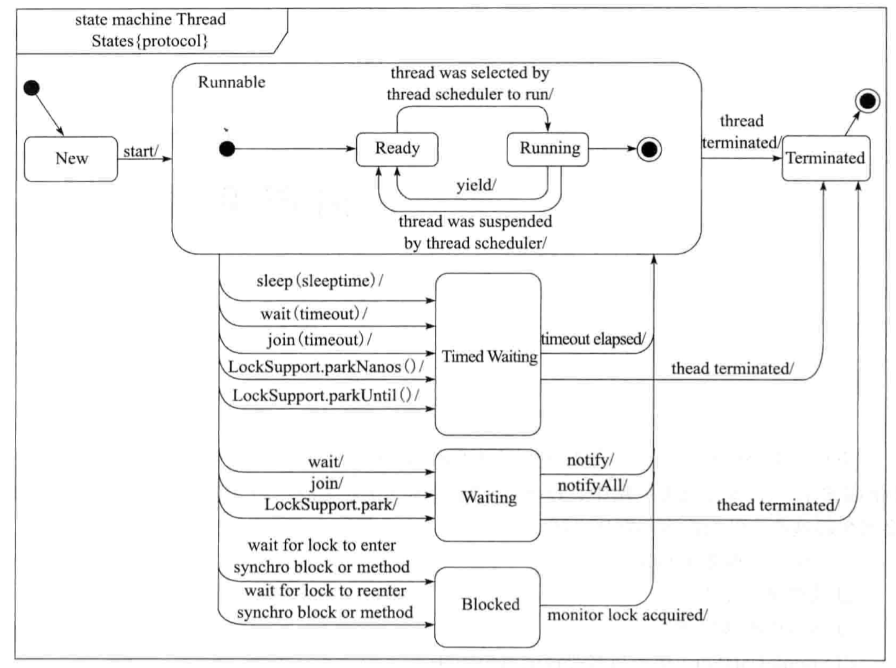

---

layout:     post
title:      java多线程
subtitle:   java多线程
date:       2019-10-11
author:     skaleto
catalog: true
tags:
    - java，多线程

---

# Java多线程

[TOC]

##### 线程的状态

- NEW，刚创建的线程
- RUNNABLE，正在运行的线程
- BLOCKED，进入了同步区域，正在等待某个锁释放的线程
- WAITING，等待其他线程给他发送继续指令的状态的线程
- TIMED_WAITING，等待其他线程给他发送继续指令，并且这个等待有超时时间的线程
- TERMINATED，终止的线程

##### 停止线程

1. run方法执行完成后自动退出
2. Thread.run()，不要用
3. Thread.interrupt()，只是将线程中的isInterrupted标志置为true，需要业务侧自行处理

##### interrupted()

检查当前线程的中断状态并且把中断标记置为false（也就是说连续两次interrupted方法的调用，第二次一定是false）

##### isInterrupted()

检查当前线程的中断状态，但不重置中断标记

##### 暂停线程

suspend()用来暂停，resume()用来继续，但是他们存在严重的问题

1. 独占，例如在一个线程中间的某个同步方法执行了suspend，那么任何其他线程都无法进入这个同步方法，因为上一个线程还在占用这个同步方法，并且还没有退出。或者说在一个线程中执行了println方法（println源代码中有一个同步块），也将使得后面的方法没有办法使用这个同步块内的代码。
2. 不同步，很明显，和中断一样，有可能会导致暂停前后的数据不一致

##### Thread.yield()

使当前线程从执行状态（运行状态）变为可执行态（就绪状态）。cpu会从众多的可执行态里选择，也就是说，当前也就是刚刚的那个线程还是有可能会被再次执行到的，并不是说一定会执行其他线程而该线程在下一次中不会执行到了。

##### 线程的优先级

setPriority(int p)，p为1~10的int型

有三种预定义的优先级，MIN:1，NORM:5，MAX:10

线程的优先级具有继承性，A启动了B的线程，那么B线程的优先级始终和A一致，即使过程中有改变

优先级只影响每个线程得到的CPU资源，不影响执行顺序

##### 守护线程

当进程中不存在非守护线程时，守护线程自动销毁。垃圾回收线程就是一种守护线程。

##### synchronized

是对象锁，也就是说在线程A获得某个对象的某个方法的锁时，线程B不能访问这个方法，同时，B也不能访问这个对象的其他同步方法，但是非同步方法可以访问。

##### synchronized锁重入

当一个线程得到某个对象的对象锁时，再次请求此对象锁时时可以再次得到该对象的锁的。也就是说线程A获得对象的锁之后，在某个同步方法中调用同一个类中的其他同步方法，是永远可以得到锁的。这个现象在继承关系的类中也同样适用，子类获得的锁永远可以重入父类的同步锁。

但是，父类的同步方法如果在子类中被重写为非同步方法，那么调用子类的这个方法时是不具有同步性质的。

##### synchronized代码块

synchronized方法是对整个类的对象加锁，在一些比较耗时的场景下，其实是没必要对整个对象加锁的，所以就有了同步代码块。

同样的，在线程A获得某个同步代码块的锁之后，其他线程也只能访问这个对象中的非同步代码块。

事实上synchronized方法和synchronized(this){代码块}锁的都是当前对象，意味着当前对象的所有具有相同对象监视器的方法和代码都需要同步执行，但假如使用synchronized(非this对象){代码块}来执行，那么这个锁具有不同的对象监视器，可以和锁其他对象的方法异步执行。

##### synchronized锁静态方法或synchronized(A.class)

这两种方式都是直接对Class加锁，意味着会对该Class的所有实例对象生效，并且和非静态方法的锁不是同一个，可以异步调用。

##### String常量池的问题

假如我们在一个String a=“A"上加锁，那么所有请求字符串”A“的线程都会认为是请求同一把锁，也就是说，两个相同的字符串，对应的是同一个常量对象。

##### 多线程死锁

两个或两个以上的线程互相持有对方所需要的资源

jdk自带工具jstack可以判断是否有死锁出现

##### 内部类和静态内部类

内部类和静态内部类也同样适用，本质区别还是在于锁的是哪个对象

##### 锁对象的改变

以字符串常量为例，假如以”123“作为锁的对象，并且在锁的代码块中将该字符串赋值为了”456“，那么其他线程可在该代码块还没执行完成的时候就获得”123“的锁，因为此时的锁对象已经发生了变化。

##### 公共堆栈和私有堆栈

在启动线程时，变量的值是存在于公共堆栈及线程的私有堆栈中。在JVM被设置为-server 模式时为了线程运行的效率，线程一直在私有堆栈中取变量的值，即使有其他线程将变量的值进行了修改，更新的却是公共堆栈中的变量值，私有堆栈中的值不会变，这就导致线程运行存在问题。内存关系如图：

##### volatile作用

使用volatile 关键字，可以强制的从公共内存中读取值。使用volatile关键字增加了实例变量在多个线程之间的可见性。volatile解决的是变量在多个线程之间的可见性，而synchronized解决的是多个线程之间访问资源的同步性。

##### volatile非原子的特性

下面以一个count++为例子来说明

1. read和load阶段，从主存赋值变量到当前工作内存
2. use和assign阶段，执行代码改变count变量
3. store和write阶段，用工作内存数据刷新主存对应变量的值

可以发现的是，当线程将count从主存读取到工作内存，但如果此时count发生变化，工作内存中的值不会跟着更新，也就会造成不一致的问题。

##### 原子类

AtomicInteger、AtomicBoolean等，可以在没有锁的情况下做到线程安全；但是多个Atomic操作之间也不能保证是线程安全的，毕竟是不同的代码。

##### synchronized的可见性

JMM关于synchronized的两条规定：

1. 线程解锁前，必须把共享变量的最新值刷新到主内存中
2. 线程加锁前，将清空工作内存中共享变量的值，从而使用共享变量时需要从主内存中重新读取最新的值（注意：加锁与解锁需要时同一把锁）

##### synchronized和volatile的比较

1. volatile不需要加锁，比synchronized更加轻量级，不会阻塞线程
2. 从内存可见性讲，volatile读相当于加锁，volatile写相当于解锁
3. synchronized既能保证可见性，又能保证原子性，而volatile只能保证可见性，无法保证原子性

##### 线程间通信

##### wait()

wait方法将当前线程置入“预执行队列”，在调用wait方法前，线程需要获得该对象的对象级别锁，也就是说只能在同步方法或同步代码块中调用。notify也一样。

notify执行后，扔需要等notify锁在代码块的同步锁被释放，wait的线程才能开始执行；并且，如果同时有多个线程在wait，那么线程规划器会随机选出一个wait的线程继续执行，当这个线程执行完成后，其他仍在wait的线程也不会继续执行，除非此时再发出一个notify或notifyAll消息。也就是说wait方法会释放当前的对象锁，而notify方法不会释放对象锁。

##### 生产者、消费者模式

基于wait，notify机制可以实现生产者消费者模型，即两者关注一个锁对象，但处理方式不同，详见代码

//TODO 

##### 通过管道进行线程间通信

PipedInputStream/PipedOutputStream

PipedReader/PipedWriter

##### join()

join方法是使所属线程对象X正常执行run方法，而使当前线程无限期阻塞，等待线程X销毁后再继续执行当前线程后面的代码。

##### join(long)和sleep(long)

join方法内部使用wait方法来实现，所以join方法有释放锁的特点，而sleep则不释放锁。

##### ThreadLocal

使每个线程可以设置自己的变量属性，即使多个线程向同一个ThreadLocal中放入各自的变量，每个线程也只能从ThreadLocal中取出自己线程的东西

##### InheritableThreadLocal

InheritableThreadLocal使子线程可以获得或改变父线程ThreadLocal中的变量

##### ReentrantLock

用法不多赘述，lock与unlock搭配使用

使用ReentrantLock同样也可能出现死锁的情况，需要在编码是格外注意。

##### Condition

ReentrantLock可以生成多个Condition，分配给不同的线程，通过condition可以单独对某一个线程进行通知操作，而不像synchronized一样是由jvm来决定唤醒的是哪一个线程。

Condition.await()和Condition.signal()类似于Object的wait()和notify()

##### ReentrantLock的公平锁与非公平锁

公平锁：获取锁的顺序按照线程加锁的顺序来获取，FIFO

非公平锁：在某个线程释放锁的时候，当前线程可以和位于等待队列顶端的线程竞争这个锁，竞争成功则获得锁，竞争失败则加入到等待队列末尾。如果线程已经在等待队列中了，那么它只能按照队列中的顺序来获得锁。

##### tryLock()

加入当前的lock没有被另一个线程占用着，那么就获得该锁定，否则不获得也不阻塞。

##### ReentrantReadWriteLock

ReentrantLock是完全互斥排它锁，但是效率比较低下；ReentrantReadWriteLock是读写锁

##### 读写锁

共享锁：读操作相关

排它锁：写操作相关

多个读锁之间不互斥，读锁和写锁互斥，写锁和写锁互斥

##### Timer

Timer#schedule可以执行多个task，但是会将多个task放入队列中，也就是说不管后面的task设置的开始时间如何，都会受到在它之前放入队列的task的影响。

Timer#schedule和scheduleAtFixedRate两个方法的作用基本相同，只是前者不具有追赶性，后者具有。也就是说，加入设定的开始任务时间已经早于当前时间，那么前者会将这段时间内的任务自动不执行，而后者仍然会一次性执行。

##### 线程异常的处理

Thread#setUncaughtExceptionHandler来对异常情况进行处理

