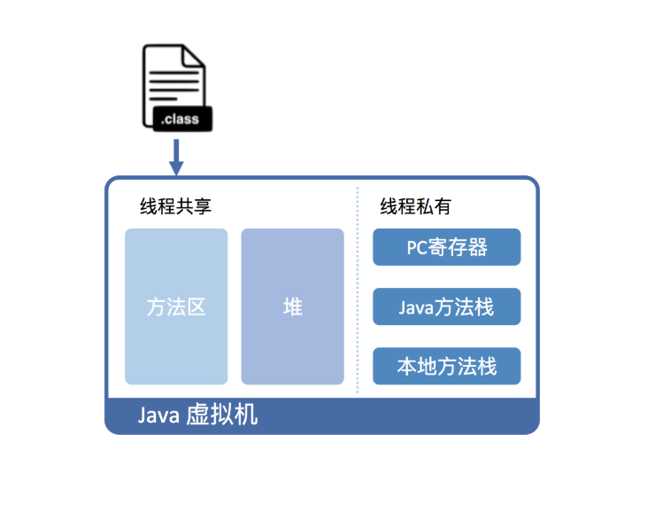
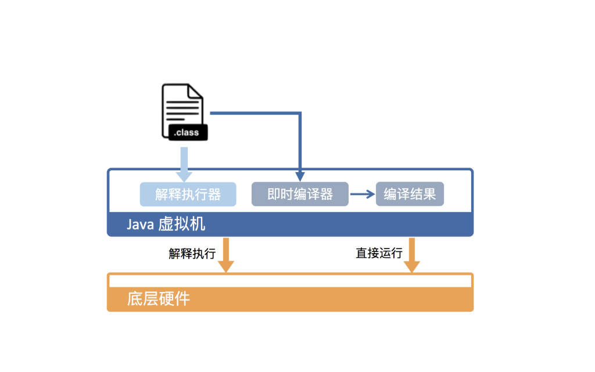

---

layout:     post
title:      深入拆解java虚拟机
subtitle:   深入拆解java虚拟机
date:       2019-10-11
author:     skaleto
catalog: true
tags:
    - java，虚拟机
---

# 深入拆解Java虚拟机




Java 虚拟机需要将字节码翻译成机器码。在 HotSpot 里面，上述翻译过程有两种形式：第一种是解释执行，即逐条将字节码翻译成机器码并执行；第二种是即时编译（Just-In-Time compilation，JIT），即将一个方法中包含的所有字节码编译成机器码后再执行。前者的优势在于无需等待编译，而后者的优势在于实际运行速度更快。HotSpot 默认采用混合模式，综合了解释执行和即时编译两者的优点。它会先解释执行字节码，而后将其中反复执行的热点代码，以方法为单位进行即时编译。

即时编译建立在程序符合二八定律的假设上，也就是百分之二十的代码占据了百分之八十的计算资源。对于占据大部分的不常用的代码，我们无需耗费时间将其编译成机器码，而是采取解释执行的方式运行；另一方面，对于仅占据小部分的热点代码，我们则可以将其编译成机器码，以达到理想的运行速度。




## Java基本类型

java虚拟机每调用一个方法，就会在java方法栈上创建一个栈帧，以解释栈帧为例，有两个主要的组成部分，分别是局部变量表和字节码的操作数栈，局部变量表的容量以 Variable Slot（变量槽）为最小单位，如果是32位HotSpot，每个变量槽都可以存储 32 位长度的内存空间；如果是64位HotSpot，每个变量槽则可以存储64位长度的空间。

基本类型数据以及引用和 returnAddress（返回地址）占用一个变量槽，即4个字节，long 和 double 需要两个槽。但是这仅仅是他们在栈中的表现，当基本数据类型存放在堆中时，他们占用的就是实际需要的大小，例如byte占用一个字节，short占用两个字节等等。

之所以这么搞，是因为变长数组不好控制，因此选择牺牲一些空间，使得可以方便地通过数组下标来访问。

那么，要如何保证存入的数值是合法的呢？当我们将一个 int 类型的值，存储到这些类型的字段或数组时，相当于做了一次隐式的掩码操作。举例来说，当我们把 0xFFFFFFFF（-1）存储到一个声明为 char 类型的字段里时，由于该字段仅占两字节，所以高两位的字节便会被截取掉，最终存入“\uFFFF”。

特别的，对于boolean来说，它虽然占用1字节，但是HotSpot在存储时，会只取最低位存入boolean字段中，举个例子，如果我们使用字节码工具，绕开了编译器的检查，将boolean的值置为了2，那么实际存储的时候，只会取
2=》10的最低位0作为boolean的值，实际对应false，而加入置为3，则会取最低位1作为boolean的值，实际对应true。

那么，原本存储在堆上的数据，如何加载到栈上进行处理呢？我们需要将堆中的 boolean、byte、char 以及 short 加载到操作数栈上，而后将栈上的值当成 int 类型来运算。

对于 boolean、char 这两个无符号类型来说，加载伴随着零扩展。举个例子，char 的大小为两个字节。在加载时 char 的值会被复制到 int 类型的低二字节，而高二字节则会用 0 来填充。

对于 byte、short 这两个类型来说，加载伴随着符号扩展。举个例子，short 的大小为两个字节。在加载时 short 的值同样会被复制到 int 类型的低二字节。如果该 short 值为非负数，即最高位为 0，那么该 int 类型的值的高二字节会用 0 来填充，否则用 1 来填充。


## Java类加载

Java类的加载有三大步骤：加载、链接、初始化。

### 加载

加载，是指查找字节流，并且据此创建类的过程。前面提到，对于数组类来说，它并没有对应的字节流，而是由 Java 虚拟机直接生成的。对于其他的类来说，Java 虚拟机则需要借助类加载器来完成查找字节流的过程。

### 链接

链接，是指将创建成的类合并至 Java 虚拟机中，使之能够执行的过程。它可分为验证、准备以及解析三个阶段。

#### 验证

确保被加载类能够满足 Java 虚拟机的约束条件

#### 准备

为被加载类的静态字段分配内存

#### 解析

在 class 文件被加载至 Java 虚拟机之前，这个类无法知道其他类及其方法、字段所对应的具体地址，甚至不知道自己方法、字段的地址。因此，每当需要引用这些成员时，Java 编译器会生成一个符号引用。在运行阶段，这个符号引用一般都能够无歧义地定位到具体目标上。

解析阶段的目的，正是将这些符号引用解析成为实际引用。如果符号引用指向一个未被加载的类，或者未被加载类的字段或方法，那么解析将触发这个类的加载（但未必触发这个类的链接以及初始化。）

### 初始化

在 Java 代码中，如果要初始化一个静态字段，我们可以在声明时直接赋值，也可以在静态代码块中对其赋值。如果直接赋值的静态字段被 final 所修饰，并且它的类型是基本类型或字符串时，那么该字段便会被 Java 编译器标记成常量值（ConstantValue），其初始化直接由 Java 虚拟机完成。除此之外的直接赋值操作，以及所有静态代码块中的代码，则会被 Java 编译器置于同一方法中，并把它命名为 < clinit >。类加载的最后一步是初始化，便是为标记为常量值的字段赋值，以及执行 < clinit > 方法的过程。Java 虚拟机会通过加锁来确保类的 < clinit > 方法仅被执行一次。

JVM 规范枚举了下述多种触发情况：

- 当虚拟机启动时，初始化用户指定的主类；
- 当遇到用以新建目标类实例的 new 指令时，初始化 new 指令的目标类；
- 当遇到调用静态方法的指令时，初始化该静态方法所在的类；
- 当遇到访问静态字段的指令时，初始化该静态字段所在的类；
- 子类的初始化会触发父类的初始化；
- 如果一个接口定义了 default 方法，那么直接实现或者间接实现该接口的类的初始化，会触发该接口的初始化；
- 使用反射 API 对某个类进行反射调用时，初始化这个类；
- 当初次调用 MethodHandle 实例时，初始化该 MethodHandle 指向的方法所在的类。


## 重载和重写

在 Java 程序里，如果同一个类中出现多个名字相同，并且参数类型相同的方法，那么它无法通过编译。也就是说，在正常情况下，如果我们想要在同一个类中定义名字相同的方法，那么它们的参数类型必须不同。这些方法之间的关系，我们称之为重载。

Java 编译器会根据所传入参数的声明类型（注意与实际类型区分）来选取重载方法。选取的过程共分为三个阶段：

- 在不考虑对基本类型自动装拆箱（auto-boxing，auto-unboxing），以及可变长参数的情况下选取重载方法；
- 如果在第 1 个阶段中没有找到适配的方法，那么在允许自动装拆箱，但不允许可变长参数的情况下选取重载方法；
- 如果在第 2 个阶段中没有找到适配的方法，那么在允许自动装拆箱以及可变长参数的情况下选取重载方法。

由于这种策略会导致在使用可变长参数的情况下，程序可能无法找到正确的重载方法，因此不建议在重载方法中使用可变长参数。


## JVM的静态绑定和动态绑定

Java虚拟机是如何识别方法的呢？关键在于类名、方法名和方法描述符，方法描述符由方法的参数类型和返回类型所构成。

Java 虚拟机中的静态绑定指的是在解析时便能够直接识别目标方法的情况，而动态绑定则指的是需要在运行过程中根据调用者的动态类型来识别目标方法的情况。

Java 字节码中与调用相关的指令共有五种：invokestatic、invokespecial、invokevirtual、invokeinterface、invokedynamic

```
invokestatic，调用static方法
invokespecial，只能调用<init>方法、private方法、super.method()。因为这三类方法的调用对象在编译时就可以确定。
invokevirtual，调用实例方法
invokeinterface，调用接口方法
invokedynamic，调用动态方法，如lambda表达式
```

对于 invokestatic 以及 invokespecial 而言，Java 虚拟机能够直接识别具体的目标方法。

对于 invokevirtual 以及 invokeinterface 而言，在绝大部分情况下，虚拟机需要在执行过程中，根据调用者的动态类型，来确定具体的目标方法。

```java
class Merchant {
    public Number actionPrice(double price) {
        return null;
    }
}

class NaiveMerchant extends Merchant {
    //重写了Merchant中的actionPrice方法，但是返回类型不一样
    @Override
    public Double actionPrice(double price) {
        return null;
    }
}
```

Java语言中，对于方法重写的要求：

1. 方法名相同
2. 入参个数和类型相同
3. 返回值类型与父类返回值类型相同，或者是父类方法返回值类型的子类。如例子中Double是Number的子类

Java虚拟机对于重写的要求:
1. 方法名相同
2. 入参个数和类型相同
3. 返回值类型相同

由于JVM规范中的重写与Java语言层面的重写语义不一致，为了保持重写语义的一致，JVM通过桥接的方式实现Java语言层面的重写。编译器插入的桥接方法可翻译为如下，使用这种方式让虚拟机也能够按照规范完成重写方法的调用

```java
public Number actionPrice(double price) {
     return this.actionPrice(price);
}
```


## 方法表

上面说到，对于invokestatic 以及 invokespecial而言，Java 虚拟机能够直接识别具体的目标方法。对于 invokevirtual 以及 invokeinterface 而言，在绝大部分情况下，虚拟机需要在执行过程中，根据调用者的动态类型，来确定具体的目标方法。

那么如何确定具体的目标方法呢？答案就是在类加载的链接准备阶段，虚拟机除了为静态字段分配内存之外，还会构造与该类相关联的方法表。

方法表本质上是一个数组，每个数组元素指向一个当前类及其祖先类中非私有的实例方法。这些方法可能是具体的、可执行的方法，也可能是没有相应字节码的抽象方法。

方法表满足两个特质：

- 子类方法表中包含父类方法表中的所有方法；
- 子类方法在方法表中的索引值，与它所重写的父类方法的索引值相同。

```java
public class Animal {

    public boolean isExtinct() {
        return false;
    }
    public long livingTime() {
        return Long.MAX_VALUE;
    }
    @Override
    public String toString(){
        return "animal";
    }

    class Cat extends Animal {
        @Override
        public boolean isExtinct() {
            return false;
        }
        public long livingTime() {
            return Long.MAX_VALUE;
        }
        @Override
        public String toString() {
            return "cat";
        }
    }

    class Dinosaur extends Animal {
        @Override
        public boolean isExtinct() {
            return true;
        }
        @Override
        public String toString() {
            return "dinosaur";
        }
    }
}
```

对于上述继承关系的类，虚拟机生成的方法表如下：

|              | Index | Method       |
| ------------ | ----- | ------------ |
| **Animal**   | 0     | toString()   |
|              | 1     | isExtinct()  |
|              | 2     | livingTime() |
| **Cat**      | 0     | toString()   |
|              | 1     | isExtinct()  |
| **Dinosaur** | 0     | toString()   |
|              | 1     | isExtinct()  |
|              | 2     | livingTime() |

方法调用指令中的符号引用会在执行之前解析成实际引用。

对于静态绑定的方法调用而言，实际引用将指向具体的目标方法。

对于动态绑定的方法调用而言，实际引用则是方法表的索引值（实际上并不仅是索引值）。

在执行过程中，Java 虚拟机将获取调用者的实际类型，并在该实际类型的虚方法表中，根据索引值获得目标方法。这个过程便是动态绑定。

使用了方法表的动态绑定与静态绑定相比，仅仅多出几个内存解引用操作：访问栈上的调用者，读取调用者的动态类型，读取该类型的方法表，读取方法表中某个索引值所对应的目标方法。

## 内联缓存

Java 虚拟机中的即时编译器会使用内联缓存来加速动态绑定。Java 虚拟机所采用的单态内联缓存将纪录调用者的动态类型，以及它所对应的目标方法。当碰到新的调用者时，如果其动态类型与缓存中的类型匹配，则直接调用缓存的目标方法。否则，Java 虚拟机将该内联缓存劣化为超多态内联缓存，在今后的执行过程中直接使用方法表进行动态绑定。

- 单态（monomorphic）指的是仅有一种状态的情况。
- 多态（polymorphic）指的是有限数量种状态的情况。
- 二态（bimorphic）是多态的其中一种。
- 超多态（megamorphic）指的是更多种状态的情况。通常我们用一个具体数值来区分多态和超多态。


## JAVA虚拟机的异常处理

**异常的组成：**Exception、Error

**非受检异常：**RuntimeException、Error

**受检异常：**其他类型的异常

### 异常实例的构造

Java虚拟机会逐一访问当前线程的 Java 栈帧，并且记录下各种调试信息，包括栈帧所指向方法的名字，方法所在的类名、文件名，以及在代码中的第几行触发该异常。从而生成该异常的栈轨迹（stack trace），因此异常实例的构造非常消耗性能。

### 如何捕获异常的

在编译生成的字节码中，每个方法都附带一个异常表。异常表中的每一个条目代表一个异常处理器，并且由 from 指针、to 指针、target 指针以及所捕获的异常类型构成。这些指针的值是字节码索引（bytecode index，bci），用以定位字节码。

```java
    public static void main(String[] args) {
        try {
            mayThrowException();
        } catch (Exception e) {
            e.printStackTrace();
        }
    }

    // 对应的Java字节码
    public static void main(java.lang.String[]);
        Code:
                0:invokestatic mayThrowException:()V
                3:goto 11
                6:astore_1
                7:aload_1
                8:invokevirtual java.lang.Exception.printStackTrace
                11:return
        Exception table:
                from to target type
                0    3  6      Class java/lang/Exception // 异常表条目
```

来看上面的方法和对应的字节码，该方法在编译后会生成一个异常表（Exception table），其中的from~to标识了该异常处理监视的代码行，target表示了该异常处理的逻辑，type标识了该异常的类型。

当程序触发异常时，Java 虚拟机会从上至下遍历异常表中的所有条目。

当触发异常的字节码的索引值在某个异常表条目的监控范围内，Java 虚拟机会判断所抛出的异常和该条目想要捕获的异常是否匹配。如果匹配，Java 虚拟机会将控制流转移至该条目 target 指针指向的字节码。

如果遍历完所有异常表条目，Java 虚拟机仍未匹配到异常处理器，那么它会弹出当前方法对应的 Java 栈帧，并且在调用者（caller）中重复上述操作。在最坏情况下，Java 虚拟机需要遍历当前线程 Java 栈上所有方法的异常表。

### finally块的实现逻辑

我们都知道可以使用finally块来规避在代码运行中出现异常而正常的任务没有处理完的情况，那么finally块具体是怎么实现的呢？


finally块就是在try块、catch块的正常执行路径后面加上了finally块的逻辑。并且，会在最后再次加上一个finally块逻辑，用来监控 try 代码块以及 catch 代码块，它将捕获 try 代码块触发的、未被 catch 代码块捕获的异常，以及 catch 代码块触发的异常。


## JAVA是如何实现反射的

```java
TestReflect reflect = new TestReflect();

Method method = TestReflect.class.getMethod("test");
method.invoke(reflect);

    @CallerSensitive
    public Object invoke(Object obj, Object... args)
        throws IllegalAccessException, IllegalArgumentException,
           InvocationTargetException{
        //...
        //交给MethodAccessor接口的实现类来完成
        MethodAccessor ma = methodAccessor;
        if (ma == null) {
            ma = acquireMethodAccessor();
        }
        return ma.invoke(obj, args);
    }
```

MethodAccessor接口有两个实现类，一个叫DelegatingMethodAccessorImpl，一个叫MethodAccessorImpl，前者是一个代理类，后者是真正实现invoke的本地方法调用。

### 反射的动态实现

Java的反射机制除了本地实现，还有一种动态生成字节码的实现，这种动态实现方式无须经过Java->c++->java的切换，它的运行效率要比本地实现快上20倍。但是由于字节码的生成十分耗时，如果代码中仅调用一次也使用动态生成的方式，那么其实是得不偿失的。

考虑到许多反射调用并不会特别频繁，Java 虚拟机设置了一个阈值 15

（可以通过 -Dsun.reflect.inflationThreshold= 来调整），当某个反射调用的调用次数在 15 之下时，采用本地实现；当达到 15 时，便开始动态生成字节码，并将委派实现的委派对象切换至动态实现，这个过程我们称之为 Inflation。

### 反射inflation的关闭

-Dsun.reflect.noInflation=true，参数设置为true后，虚拟机会在反射调用的一开始就直接生成动态实现，而不会使用委派实现或本地实现。

### 反射的性能消耗

Class.getMethod会遍历该类的公有方法，如果公有方法中没有，还将遍历它的父类，因此操作是相对比较耗时的。

此外，在反射调用中，存在性能瓶颈的有三个地方：

1. 由于invoke方法的第二个参数是一个变长的Object，编译器会生成一个Object数组，并将传入的参数一一放进去

2. 如果传入的参数是基本数据类型，但是由于invoke接收的是Object，编译器会对基本数据类型进行自动装箱，以int为例，假如数值范围为[-128,127]，那么会直接使用缓存中的Integer，但是如果超过了这个范围，编译器就得在编译时进行生成。

   这个问题可以通过JVM参数-Djava.lang.Integer.IntegerCache.high=某个数值来提高缓存的数据量来解决

3. 方法内联（编译器在编译一个方法时，将某个方法调用的目标方法也纳入编译范围内，并用其返回值替代原方法调用这么个过程），如果方法没有被内联，那么在反射调用的时候性能消耗也比较大


## JVM是怎么实现invokedynamic的

invokedynamic的基石是方法句柄。

### 方法句柄

方法句柄MethodHandle是一个强类型的，能够被直接执行的引用。该引用可以指向常规的静态方法或者实例方法，也可以指向构造器或者字段。当指向字段时，方法句柄实则指向包含字段访问字节码的虚构方法，语义上等价于目标字段的 getter 或者 setter 方法（但不是说目标字段如果真的存在getter或setter方法，方法句柄就指向他了，因为无法保证getter或setter方法的实现是正确的）。

方法句柄的类型（MethodType）是由所指向方法的参数类型以及返回类型组成的。它是用来确认方法句柄是否适配的唯一关键。当使用方法句柄时，我们其实并不关心方法句柄所指向方法的类名或者方法名。

### 方法句柄的创建

```java
public class TestReflect {

    public static void test() {

    }

    public static MethodHandles.Lookup getLookup() {
        return MethodHandles.lookup();
    }

    public static void main(String[] args) throws NoSuchMethodException, InvocationTargetException, IllegalAccessException {

        MethodHandles.Lookup lookup = TestReflect.getLookup();
        Method method = TestReflect.class.getMethod("test");
        lookup.unreflect(method);

        lookup.findStatic(TestReflect.class, "test", MethodType.methodType(void.class));
    }
}
```

方法句柄的访问权限不取决于方法句柄的创建位置，而是取决于 Lookup 对象的创建位置，比如上例中创建方法句柄的位置在TestReflect类中，那么该方法句柄的访问权限和TestReflect所具有的权限相同。

### 方法句柄的操作

#### invokeExact

严格匹配参数类型

```java
public final native @PolymorphicSignature Object invokeExact(Object... args)
```

invokeExact方法的注解@PolymorphicSignature（签名多态性）会使用传入参数的类型来生成方法描述符，例如传入String，则生成String。

#### invoke

```java
 public final native @PolymorphicSignature Object invoke(Object... args) throws Throwable;
```

invoke会调用MethodHandle.asType方法，生成一个适配器方法句柄，对传入参数进行适配，再调用原方法句柄。

#### 增删改

改即上面说到的invoke中会调用的MethodHandle.asType，删操作会调用MethodHandles.dropArguments，从而将一部分参数舍弃后调用另一个方法的句柄。

增操作会往传入的参数中插入额外的参数，再调用另一个方法句柄，它对应的 API 是 MethodHandle.bindTo 方法。在java 8的lambda表达式就是用这种方式实现的。

同时，增操作可以用来实现方法的柯里化（把接受多个参数的函数变换成接受一个单一参数的函数，并且返回接受余下的参数而且返回结果的新函数的技术。）

```
举个例子，有一个指向 f(x, y) 的方法句柄，我们可以通过将 x 绑定为 4，生成另一个方法句柄 g(y) = f(4, y)。在执行过程中，每当调用 g(y) 的方法句柄，它会在参数列表最前面插入一个 4，再调用指向 f(x, y) 的方法句柄。
```

### 方法句柄的实现

invokeExact操作会对参数的类型进行校验，并在不匹配的情况下抛出异常，那么势必在调用真实的方法之前，invokeExact还做了一些其他的操作（这部分操作正常情况下不会出现在调用栈里，增加虚拟机参数-XX:+ShowHiddenFrames可以打出）。实际上，Java 虚拟机会对 invokeExact 调用做特殊处理，调用至一个共享的、与方法句柄类型相关的特殊适配器中，这个适配器是一个 LambdaForm。

在这个适配器中，它会调用 Invokers.checkExactType 方法来检查参数类型，然后调用 Invokers.checkCustomized 方法。后者会在方法句柄的执行次数超过一个阈值时进行优化（对应参数 -Djava.lang.invoke.MethodHandle.CUSTOMIZE_THRESHOLD，默认值为 127）。

最后，它会调用方法句柄的 invokeBasic 方法。Java 虚拟机同样会对 invokeBasic 调用做特殊处理，这会将调用至方法句柄本身所持有的适配器中。


### 方法句柄VS反射VS代理

从访问控制层面来讲，

- 反射需要调用setAccesible()，可能会受到安全管理器的禁止警告；
- 代理有些情况下通过内部类实现，但是内部类只能访问受限的函数或字段；
- 方法句柄则在上下文中对所有方法都有完整的访问权限，并且不会受到安全管理器的限制，这是方法句柄的优势之一。

从执行速度层面来讲，

- 反射的性能会受到参数方法、类型的自动装箱和拆箱、方法内联的影响，相对来讲反射算是执行较慢的了（当然并没有和方法句柄通过执行具体操作示例作对比，可能在不同的JVM配置情况下执行情况不一样，比如解释器模式或编译模式下等）；
- 通过代理的方式因调用JAVA函数实现，速度与其它调用函数的速度是一样的，相对较快；
- 而方法句柄可能不会有代理方式那样的执行速度快，但同样会受到JVM等不同的配置导致速度不同，但从JVM设计者的角度来说，应该是力求达到像调用函数一样快的速度，目前可能是达不到的。

从类的开销层面来讲，

- 代理通常声明多个类，需要占用方法区，
- 方法句柄并不需要像代理一样有多个类的开销，不需要方法区的开销。


### 方法句柄和反射的比较

- Reflection和MethodHandle机制本质上都是在模拟方法调用，但是Reflection是在模拟Java代码层次的方法调用，而MethodHandle是在模拟字节码层次的方法调用 
- Reflection中的Method对象远比MethodHandle机制中的MethodHandle对象所包含的信息要多。前者是方法在Java一端的全面映像，包含了方法的签名、描述符以及方法属性表中各种属性的Java端表示方式，还包含有执行权限等的运行期信息。而后者仅仅包含着与执行该方法相关的信息。通俗的话说，Reflection是重量级，而MethodHandle是轻量级
- 由于MethodHandle是对字节码的方法指令调用的模拟，那理论上虚拟机在这方面做的各种优化（如方法内联），在MethodHandle上也应当可以采用类似思路去支持（但目前实现还不完善）。而通过反射去调用方法则不行
- Reflection API的设计目标是只为Java语言服务的，而MethodHandle则设计为可服务于所有Java虚拟机之上的语言，其中也包括了Java语言


## invokedynamic指令

invokedynamic允许应用程序自己来决定链接至哪一个方法中，它是java7中引入的一条新指令，用以支持动态语言的方法调用，它将调用点（CallSite）抽象成一个 Java 类，并且将原本由 Java 虚拟机控制的方法调用以及方法链接暴露给了应用程序。在运行过程中，每一条 invokedynamic 指令将捆绑一个调用点，并且会调用该调用点所链接的方法句柄。

在第一次执行 invokedynamic 指令时，Java 虚拟机会调用该指令所对应的启动方法（BootStrap Method），来生成前面提到的调用点，并且将之绑定至该 invokedynamic 指令中。在之后的运行过程中，Java 虚拟机则会直接调用绑定的调用点所链接的方法句柄。

### Lambda表达式

单纯介绍invokedynamic非常枯燥无味，我们举个🌰。在java8中，lambda表达式就是借助invokedynamic来实现的。具体来说，Java 编译器利用 invokedynamic 指令来生成实现了函数式接口的适配器。这里的函数式接口指的是仅包括一个非 default 接口方法的接口，一般通过 @FunctionalInterface 注解。不过就算是没有使用该注解，Java 编译器也会将符合条件的接口辨认为函数式接口。

```java
int x = ..
IntStream.of(1, 2, 3).map(i -> i * 2).map(i -> i * x);
```

在上面的lambda表达式中，映射方法 map 所接收的参数是 IntUnaryOperator（这是一个函数式接口）。也就是说，在运行过程中我们需要将 i->i2 和 i->ix 这两个 Lambda 表达式转化成 IntUnaryOperator 的实例。这个转化过程便是由 invokedynamic 来实现的。

在编译过程中，Java 编译器会对 Lambda 表达式进行解语法糖（desugar），生成一个方法来保存 Lambda 表达式的内容。该方法的参数列表不仅包含原本 Lambda 表达式的参数，还包含它所捕获的变量。

如果该 Lambda 表达式没有捕获其他变量，那么可以认为它是上下文无关的。因此，invokedynamic启动方法将新建一个适配器类的实例，并且生成一个特殊的方法句柄，始终返回该实例。

如果该 Lambda 表达式捕获了其他变量，那么每次执行该 invokedynamic 指令，我们都要更新这些捕获了的变量，以防止它们发生了变化，具体来说，在每次执行 invokedynamic 指令时，所调用的方法句柄都需要新建一个适配器类实例。

那么上面提到的这种每次新建一个实例的情况，是否会带来性能问题呢？答案是一般不会，因为编译器的逃逸分析会将这一步做优化，来避免新建实例的操作。


## Java对象的内存布局

在java中，对象的创建有多种方式，比如new、反射、Object.clone、反序列化、Unsafe.allocateInstance等，其中，new和反射会调用构造方法去创建对象，clone和反序列化则是直接复制一份数据，而Unsafe中的方法则没有初始化实例字段。

在调用构造方法时，假如存在父类，则会先调用父类的构造器（不管是显式还是隐式的方式），通过 new 指令新建出来的对象，它的内存其实涵盖了所有父类中的实例字段。也就是说，虽然子类无法访问父类的私有实例字段，或者子类的实例字段隐藏了父类的同名实例字段，但是子类的实例还是会为这些父类实例字段分配内存的。

### 压缩指针

java虚拟机中，每个java对象都有一个对象头，由标记字段和类型指针所构成。其中，标记字段用以存储 Java 虚拟机有关该对象的运行数据，如哈希码、GC 信息以及锁信息，而类型指针则指向该对象的类。

在 64 位的 Java 虚拟机中，对象头的标记字段占 64 位，而类型指针又占了 64 位。也就是说，每一个 Java 对象在内存中的额外开销就是 16 个字节。以 Integer 类为例，它仅有一个 int 类型的私有字段，占 4 个字节。因此，每一个 Integer 对象的额外内存开销至少是 400%。这也是为什么 Java 要引入基本类型的原因之一。

为了尽量较少对象的内存使用量，64 位 Java 虚拟机引入了压缩指针的概念，将堆中原本 64 位的 Java 对象指针压缩成 32 位的。这样一来，对象头中的类型指针也会被压缩成 32 位，使得对象头的大小从 16 字节降至 12 字节。

压缩指针的原理很简单，相当于把原本0-64范围内的数据压缩到0-32的范围，那么当你取到0-32范围内的数值时，只需要乘以2即可。

### 内存对齐

当然，实现这个需要一个前提，就是内存中的对象都需要从偶数位开始算起，默认情况下，Java 虚拟机堆中对象的起始地址需要对齐至 8 的倍数。如果一个对象用不到 8N 个字节，那么空白的那部分空间就浪费掉了。这些浪费掉的空间我们称之为对象间的填充（padding）。

内存对齐不仅发生在对象之间，也发生在对象的字段之间，比如说，Java 虚拟机要求 long 字段、double 字段，以及非压缩指针状态下的引用字段地址为 8 的倍数。

字段内存对齐的其中一个原因，是让字段只出现在同一 CPU 的缓存行中。如果字段不是对齐的，那么就有可能出现跨缓存行的字段。也就是说，该字段的读取可能需要替换两个缓存行，而该字段的存储也会同时污染两个缓存行。这两种情况对程序的执行效率而言都是不利的。

### 字段重排列

字段重排列有两个规则：

1. 如果一个字段占据 C 个字节，那么该字段的偏移量需要对齐至 NC。
2. 子类所继承字段的偏移量，需要与父类对应字段的偏移量保持一致。对于使用了压缩指针的 64 位虚拟机，子类第一个字段需要对齐至 4N；而对于关闭了压缩指针的 64 位虚拟机，子类第一个字段则需要对齐至 8N。

```java
class A {
  long l;
  int i；
}

class B extends A {
  long l;
  int i;
}
```

上述这段代码经过编译后，各个字段的偏移量如下：

开启压缩指针时：

```java
# 启用压缩指针时，B类的字段分布
B object internals:
 OFFSET  SIZE   TYPE DESCRIPTION
      0     4        (object header)
      4     4        (object header)
      8     4        (object header)
     12     4    int A.i                                       0
     16     8   long A.l                                       0
     24     8   long B.l                                       0
     32     4    int B.i                                       0
     36     4        (loss due to the next object alignment)
```

关闭压缩指针时：

```java
# 关闭压缩指针时，B类的字段分布
B object internals:
 OFFSET  SIZE   TYPE DESCRIPTION
      0     4        (object header)
      4     4        (object header)
      8     4        (object header)
     12     4        (object header)
     16     8   long A.l
     24     4    int A.i
     28     4        (alignment/padding gap)                  
     32     8   long B.l   //可以看到，B类中从父类继承过来的字段l偏移量为32，而不是28，空出来了4个字节
     40     4    int B.i
     44     4        (loss due to the next object alignment)
```

### @Contended

java8中新引入的用来解决字段虚共享的注解。

虚共享是怎么回事呢？假设两个线程分别访问同一对象中不同的 volatile 字段，逻辑上它们并没有共享内容，因此不需要同步。然而，如果这两个字段恰好在同一个缓存行中，那么对这些字段的写操作会导致缓存行的写回，也就造成了实质上的共享。

Java 虚拟机会让不同的 @Contended 字段处于独立的缓存行中，因此你会看到大量的空间被浪费掉。


### 即时编译

通常而言，代码会先被 Java 虚拟机解释执行，之后反复执行的热点代码则会被**即时编译**成为机器码，直接运行在底层硬件之上。

#### 分层编译模式

HotSpot虚拟机包含多个及时编译器C1,C2,Graal

```
Graal是一个实验性质的即时编译器，可以通过参数-XX:+UnlockExperimentalVMOptions -XX:+UseJVMCICompiler 启用，并且替换 C2
```

在 Java 7 以前，我们需要根据程序的特性选择对应的即时编译器。

对于执行时间较短的，或者对启动性能有要求的程序，我们采用编译效率较快的 C1，对应参数 -client。

对于执行时间较长的，或者对峰值性能有要求的程序，我们采用生成代码执行效率较快的 C2，对应参数 -server。

Java 7 引入了分层编译（对应参数 -XX:+TieredCompilation）的概念，综合了 C1 的启动性能优势和 C2 的峰值性能优势，分层编译将java虚拟机的执行状态分为5个层级

```
1.解释执行；
2.执行不带 profiling 的 C1 代码；【终止状态】
3.执行仅带方法调用次数以及循环回边执行次数 profiling 的 C1 代码；
4.执行带所有 profiling 的 C1 代码；
5.执行 C2 代码。【终止状态】
```

通常情况下，C2 代码的执行效率要比 C1 代码的高出 30% 以上。然而，对于 C1 代码的三种状态，按执行效率从高至低则是 1 层 > 2 层 > 3 层。

```
profiling：指在程序执行过程中，收集能够反映程序执行状态的数据，这些手机的数据称之为程序的profile
```


1、4层为终止状态，即当方法被终止状态编译后，如果编译的代码没有失效，那么它不会再被虚拟机编译。

Java 8 默认开启了分层编译。不管是开启还是关闭分层编译，原本用来选择即时编译器的参数 -client 和 -server 都是无效的。当关闭分层编译的情况下，Java 虚拟机将直接采用 C2。

如果你希望只是用 C1，那么你可以在打开分层编译的情况下使用参数 -XX:TieredStopAtLevel=1。在这种情况下，Java 虚拟机会在解释执行之后直接由 1 层的 C1 进行编译。

#### 即时编译的触发

java虚拟机根据方法的调用次数和循环回边的执行次数来触发即时编译，

```
循环回边：可以简单理解为往回跳转的指令，例如最常见的循环代码，指令在执行到循环体末尾时会跳转到循环体开始位置。
在解释执行时，每当运行一次该指令，Java 虚拟机便会将该方法的循环回边计数器加 1。
```

即时编译的触发并不需要非常精确的数值，只要该数值足够大，就能说明对应的方法包含热点代码。

具体来说，在不启用分层编译的情况下，当方法的调用次数和循环回边的次数的和，超过由参数 -XX:CompileThreshold 指定的阈值时（使用 C1 时，该值为 1500；使用 C2 时，该值为 10000），便会触发即时编译。

当启用分层编译时，Java 虚拟机将不再采用由参数 -XX:CompileThreshold 指定的阈值，而是使用另一套阈值系统，阈值的大小动态调整。所谓的动态调整其实并不复杂：在比较阈值时，Java 虚拟机会将阈值与某个系数 s 相乘。该系数与当前待编译的方法数目成正相关，与编译线程的数目成负相关。

```
系数的计算方法为：s = queue_size_X / (TierXLoadFeedback * compiler_count_X) + 1
其中X是执行层次，可取3或者4；
queue_size_X是执行层次为X的待编译方法的数目；
TierXLoadFeedback是预设好的参数，其中Tier3LoadFeedback为5，Tier4LoadFeedback为3；
compiler_count_X是层次X的编译线程数目。
```

在 64 位 Java 虚拟机中，默认情况下编译线程的总数目是根据处理器数量来调整的（对应参数 -XX:+CICompilerCountPerCPU，默认为 true；当通过参数 -XX:+CICompilerCount=N 强制设定总编译线程数目时，CICompilerCountPerCPU 将被设置为 false）。

Java 虚拟机会将这些编译线程按照 1:2 的比例分配给 C1 和 C2（至少各为 1 个）。举个例子，对于一个四核机器来说，总的编译线程数目为 3，其中包含一个 C1 编译线程和两个 C2 编译线程。

```
对于四核及以上的机器，总的编译线程的数目为：n = log2(N) * log2(log2(N)) * 3 / 2其中N为CPU核心数目。
```

当启用分层编译时，即时编译具体的触发条件如下：

```
当方法调用次数大于由参数-XX:TierXInvocationThreshold指定的阈值乘以系数，或者当方法调用次数大于由参数-XX:TierXMINInvocationThreshold指定的阈值乘以系数，并且方法调用次数和循环回边次数之和大于由参数-XX:TierXCompileThreshold指定的阈值乘以系数时，便会触发X层即时编译。
触发条件为：i > TierXInvocationThreshold * s || (i > TierXMinInvocationThreshold * s && i + b > TierXCompileThreshold * s)

i 为调用次数，b 为循环回边次数
```


#### OSR编译

除了以方法为单位的即时编译之外，Java 虚拟机还存在着另一种以循环为单位的即时编译，叫做 On-Stack-Replacement（OSR）编译。循环回边计数器便是用来触发这种类型的编译的。

OSR 实际上是一种技术，它指的是在程序执行过程中，动态地替换掉 Java 方法栈桢，从而使得程序能够在非方法入口处进行解释执行和编译后的代码之间的切换。事实上，去优化（deoptimization）采用的技术也可以称之为 OSR。

在不启用分层编译的情况下，触发 OSR 编译的阈值是由参数 -XX:CompileThreshold 指定的阈值的倍数：

```
(OnStackReplacePercentage - InterpreterProfilePercentage)/100
其中-XX:InterpreterProfilePercentage的默认值为33，当使用C1时-XX:OnStackReplacePercentage为933，当使用C2时为140。
也就是说，默认情况下，C1 的 OSR 编译的阈值为 13500，而 C2 的为 10700。
```

在启用分层编译的情况下，触发 OSR 编译的阈值则是由参数 -XX:TierXBackEdgeThreshold 指定的阈值乘以系数。


#### Profiling

分层编译中的0层，2层和3层，都会进行profiling，其中，最为基础的便是方法的调用次数以及循环回边的执行次数。它们被用于触发即时编译。

0 层和 3 层还会收集用于 4 层 C2 编译的数据，比如说分支跳转字节码的分支 profile（branch profile），包括跳转次数和不跳转次数，以及非私有实例方法调用指令、强制类型转换 checkcast 指令、类型测试 instanceof 指令，和引用类型的数组存储 aastore 指令的类型 profile（receiver type profile）。

分支profile和类型profile的性能开销较大，这也是使得3层C1比2层C1性能低30%的原因。

在解释执行中，一般不会进行profile的收集，但当触发C1编译时，虚拟机认为有可能也会触发C2编译（例如等待C1编译的方法太多时），因此会在C1中进行收集，C2 可以根据收集得到的数据进行猜测，从而作出优化。

##### 基于分支profile的优化

假设下面这种情况的分支代码


当f始终为true时，两侧的false分支事实上不会走到


这种情况下C2将分支直接“剪枝”缩短为如下的流程。


在真实情况中，一般不会出现f始终为true的情况，C2还会根据分支 profile，计算每一条程序执行路径的概率，以便某些编译器优化优先处理概率较高的路径。


##### 基于类型profile的优化


在 Java 虚拟机中，instanceof 测试并不简单。如果 instanceof 的目标类型是 final 类型，那么 Java 虚拟机仅需比较测试对象的动态类型是否为该 final 类型。如果目标类型不是 final 类型，比如说我们例子中的 Exception，那么 Java 虚拟机需要从测试对象的动态类型开始，依次测试该类，该类的父类、祖先类，该类所直接实现或者间接实现的接口是否与目标类型一致。

不过，在我们的例子中，instanceof 指令的类型 profile 仅包含 Integer。根据这个信息，即时编译器可以假设，在接下来的执行过程中，所输入的 Object 对象仍为 Integer 实例。因此，生成的代码将测试所输入的对象的动态类型是否为 Integer。如果是的话，则继续执行接下来的代码。（该优化源自 Graal，采用 C2 可能无法复现。）

和基于分支 profile 的优化一样，基于类型 profile 的优化同样也是作出假设，从而精简控制流以及数据流。这两者的核心都是假设。

对于分支 profile，即时编译器假设的是仅执行某一分支；

对于类型 profile，即时编译器假设的是对象的动态类型仅为类型 profile 中的那几个。


##### 去优化

如果假设失败了怎么办？

Java 虚拟机给出的解决方案便是去优化，即从执行即时编译生成的机器码切换回解释执行。

在生成的机器码中，即时编译器将在假设失败的位置上插入一个陷阱（trap）。该陷阱实际上是一条 call 指令，调用至 Java 虚拟机里专门负责去优化的方法。

去优化的过程相当复杂。由于即时编译器采用了许多优化方式，其生成的代码和原本的字节码的差异非常之大。在去优化的过程中，需要将当前机器码的执行状态转换至某一字节码之前的执行状态，并从该字节码开始执行。这便要求即时编译器在编译过程中记录好这两种执行状态的映射。

```
如果去优化的原因与优化无关，即使重新编译也不会改变生成的机器码，那么生成的机器码可以在调用去优化方法时传入 Action_None，表示保留这一份机器码，在下一次调用该方法时重新进入这一份机器码。
如果去优化的原因与静态分析的结果有关，例如类层次分析，那么生成的机器码可以在调用去优化方法时传入 Action_Recompile，表示不保留这一份机器码，但是可以不经过重新 profile，直接重新编译。
如果去优化的原因与基于 profile 的激进优化有关，那么生成的机器码需要在调用去优化方法时传入 Action_Reinterpret，表示不保留这一份机器码，而且需要重新收集程序的 profile。
```


## Java字节码

Java 方法的栈桢分为操作数栈和局部变量区

### 操作数栈

每当为 Java 方法分配栈桢时，Java 虚拟机往往需要开辟一块额外的空间作为操作数栈，来存放计算的操作数以及返回结果。


以上图为例，当计算1+2时，会触发加法指令iadd，他会将操作数2和1先后弹出，计算得到3后再压入栈中。

```
这一块有点像汇编中的 add 1 2
```

java字节码中也有几条直接作用操作数栈的：

- dup，复制栈顶的元素

  通常出现在复制 new 指令所生成的未经初始化的引用，例如如下的代码

  ```
  Object o = new Object();
  ```

  当调用new时，虚拟机将一块已分配的未初始化的内存压入栈中，并调用构造器(即invokespecial指令)，将这块内存弹出，用于创建对象。但这个时候操作数栈上已经没有这一块内存的引用了，这样下面需要用到这一块内存的地方就无法满足了，因此就需要先复制一份再用来调用构造器。

  ```java
  // 对应的字节码如下： 
  public void foo(); 
  0 new java.lang.Object [3] 
  3 dup 
  4 invokespecial java.lang.Object() [8] 
  7 astore_1 [o] 
  8 return
  ```

- pop，舍弃栈顶的元素

  通常出现在某些方法有返回值但我们不需要的情况，这个时候就需要将栈顶的元素弹出丢弃

  ```java
  public static boolean bar() { 
    return false; 
  } 
  public void foo() { 
    bar(); 
  }
  ```

  ```java
  // foo方法对应的字节码如下： 
  public void foo(); 
  0 invokestatic FooTest.bar() : boolean [24] 
  3 pop 
  4 return
  ```

- swap，交换栈顶的两个元素

```
假如需要处理long或double值，那么他们将占据两个栈单元，此时就需要使用dup2和pop2指令
```

正常情况下，操作数栈的压入弹出都是一条条指令完成的。唯一的例外情况是在抛异常时，Java 虚拟机会清除操作数栈上的所有内容，而后将异常实例压入操作数栈上。


### 局部变量区

Java 方法栈桢的另外一个重要组成部分则是局部变量区，字节码程序可以将计算的结果缓存在局部变量区之中。实际上，Java 虚拟机将局部变量区当成一个数组，依次存放 this 指针（仅非静态方法），所传入的参数，以及字节码中的局部变量。

```java
public void foo(long l, float f) {
  {
    int i = 0;
  }
  {
    String s = "Hello, World";
  }
}
```


上面这段代码对应的局部变量区如上图

- 因为这是个实例方法，所以局部变量区第一个单元存放了一个this指针
- 因为long需要占据两个单元，因此第三个单元被空出来了
- 因为i和s处于同一层级，他们的生命周期没有重合，所以有可能被编排到同一个栈单元

```java

public static int bar(int i) {
  return ((i + 1) - 2) * 3 / 4;
}
// 对应的字节码如下：
Code:
  stack=2, locals=1, args_size=1   	//stack=2表示操作数栈空间为2，局部变量区为1
     0: iload_0		//加载局部变量的第0个变量，在这里就是出入的i数值
     1: iconst_1  //直接加载数字1
     2: iadd			//执行add指令
     3: iconst_2
     4: isub
     5: iconst_3
     6: imul
     7: iconst_4
     8: idiv
     9: ireturn
```

### java字节码中的其他指令

具备高层语义的字节码指令：

- new
- instanceof，后跟目标类，判断栈顶元素是否为目标类 / 接口的实例。是则压入 1，否则压入 0
- checkcast，后跟目标类，判断栈顶元素是否为目标类 / 接口的实例。如果不是便抛出异常
- athrow，将栈顶异常抛出
- monitorenter，为栈顶对象加锁
- monitorexit，为栈顶对象解锁

字段访问指令：

- getstatic
- putstatic
- getfield
- putfield

方法调用指令：

- invokestatic
- invokespecial
- invokevirtual
- invokeinterface 
- invokedynamic

数组相关指令：

- newarray
- anewarray
- multianewarray
- arraylength

控制流指令：

- 无条件跳转 goto
- 条件跳转指令
- tableswitch 和lookupswtich（前者针对密集的 cases，后者针对稀疏的 cases）
- 返回指令

```java
  public int neg(int i) {
    return -i;
  }

  public int foo(int i) {
    return neg(neg(i));
  }
  // foo方法对应的字节码如下：foo方法对应的字节码如下：
  public int foo(int i);
    0  aload_0 [this]
    1  aload_0 [this]
    2  iload_1 [i]
    3  invokevirtual FooTest.neg(int) : int [25]
    6  invokevirtual FooTest.neg(int) : int [25]
    9  ireturn
```

调用foo（2）时，发生下图的情况


## 方法内联

方法内联是指，在编译过程中，当遇到方法调用时，将目标方法的方法体纳入编译范围之中，并取代原方法调用的优化手段。

```java
//方法内联的过程
public static boolean flag = true;
public static int value0 = 0;
public static int value1 = 1;

public static int foo(int value) {
    int result = bar(flag);
    if (result != 0) {
        return result;
    } else {
        return value;
    }
}

public static int bar(boolean flag) {
    return flag ? value0 : value1;
}
```

例如上面的两个方法，经过方法内联后，会变成如下的情况

```java
public static boolean flag = true;
public static int value0 = 0;
public static int value1 = 1;

public static int foo(int value) {
    int result = flag ? value0 : value1;
    if (result != 0) {
        return result;
    } else {
        return value;
    }
}
```

即时编译器既可以在解析过程中替换方法调用字节码，也可以在 IR 图中替换方法调用 IR 节点。这两者都需要将目标方法的参数以及返回值映射到当前方法来。

方法内联有许多规则。除了一些强制内联以及强制不内联的规则外，即时编译器会根据方法调用的层数、方法调用指令所在的程序路径的热度、目标方法的调用次数及大小，以及当前 IR 图的大小来决定方法调用能否被内联。

方法内联能够触发更多的优化。通常而言，内联越多，生成代码的执行效率越高。

然而，对于即时编译器来说，内联越多，编译时间也就越长，而程序达到峰值性能的时刻也将被推迟。此外，内联越多也将导致生成的机器码越长。在 Java 虚拟机里，编译生成的机器码会被部署到 Code Cache 之中。这个 Code Cache 是有大小限制的（由 Java 虚拟机参数 -XX:ReservedCodeCacheSize 控制）。

方法内联的条件：

- 由 -XX:CompileCommand 中的 inline 指令指定的方法，以及由 @ForceInline 注解的方法（仅限于 JDK 内部方法），会被强制内联
- 如果调用字节码对应的符号引用未被解析、目标方法所在的类未被初始化，或者目标方法是 native 方法，都将导致方法调用无法内联。
- C2 不支持内联超过 9 层的调用（可以通过虚拟机参数 -XX:MaxInlineLevel 调整），以及 1 层的直接递归调用（可以通过虚拟机参数 -XX:MaxRecursiveInlineLevel 调整）。
- 即时编译器将根据方法调用指令所在的程序路径的热度，目标方法的调用次数及大小，以及当前 IR 图的大小来决定方法调用能否被内联。（更加青睐于小方法）


### 虚方法的内联

上面的例子是针对静态方法的，然而，对于需要动态绑定的虚方法（例如抽象方法）调用来说，即时编译器则需要先对虚方法调用进行去虚化（devirtualize），即转换为一个或多个直接调用，然后才能进行方法内联。去虚化方式可分为完全去虚化以及条件去虚化（guarded devirtualization）。

#### 完全去虚化

通过类型推导或者类层次分析（class hierarchy analysis），识别虚方法调用的唯一目标方法，从而将其转换为直接调用的一种优化手段。

- 基于类型推导的完全去虚化将通过数据流分析推导出调用者的动态类型，从而确定具体的目标方法。
- 基于类层次分析的完全去虚化通过分析 Java 虚拟机中所有已被加载的类，判断某个抽象方法或者接口方法是否仅有一个实现。如果是，那么对这些方法的调用将只能调用至该具体实现中。

#### 条件去虚化

将虚方法调用转换为若干个类型测试以及直接调用的一种优化手段。通过向代码中添加若干个类型比较，将虚方法调用转换为若干个直接调用。它将借助 Java 虚拟机所收集的类型 Profile。


## 逃逸分析

逃逸分析是“一种确定指针动态范围的静态分析，它可以分析在程序的哪些地方可以访问到指针”。

在 Java 虚拟机的即时编译语境下，逃逸分析将判断新建的对象是否逃逸。即时编译器判断对象是否逃逸的依据，有如下两个：

- 对象是否被存入堆中（静态字段或者堆中对象的实例字段），一旦对象被存入堆中，其他线程便能获得该对象的引用。即时编译器也因此无法追踪所有使用该对象的代码位置。

- 对象是否被传入未知代码中，对于方法中未被内联的方法调用，即时编译器会将其当成未知代码，毕竟它无法确认该方法调用会不会将调用者或所传入的参数存储至堆中。

即时编译器可以根据逃逸分析的结果进行诸如锁消除、栈上分配以及标量替换的优化。

### 锁消除

如果即时编译器能够证明锁对象不逃逸，那么对该锁对象的加锁、解锁操作没有意义。、在这种情况下，即时编译器可以消除对该不逃逸锁对象的加锁、解锁操作。

```
synchronized (new Object()) {} 会被完全优化掉。这正是因为基于逃逸分析的锁消除。
synchronized (escapedObject) {}则不然。由于其他线程可能会对逃逸了的对象escapedObject进行加锁操作，从而构造了两个线程之间的 happens-before 关系。因此即时编译器至少需要为这段代码生成一条刷新缓存的内存屏障指令。
```

### 栈上分配

Java 虚拟机中对象都是在堆上分配的，而堆上的内容对任何线程都是可见的。与此同时，Java 虚拟机需要对所分配的堆内存进行管理，并且在对象不再被引用时回收其所占据的内存。如果逃逸分析能够证明某些新建的对象不逃逸，那么 Java 虚拟机完全可以将其分配至栈上，并且在 new 语句所在的方法退出时，通过弹出当前方法的栈桢来自动回收所分配的内存空间。这样一来，我们便无须借助垃圾回收器来处理不再被引用的对象。

不过，由于实现起来需要更改大量假设了“对象只能堆分配”的代码，因此 HotSpot 虚拟机并没有采用栈上分配，而是使用了标量替换这么一项技术。

### 标量替换

```
所谓的标量，就是仅能存储一个值的变量，比如 Java 代码中的局部变量。与之相反，聚合量则可能同时存储多个值，其中一个典型的例子便是 Java 对象。
```

标量替换这项优化技术，可以看成将原本对对象的字段的访问，替换为一个个局部变量的访问。

```java

public void forEach(ArrayList<Object> list, Consumer<Object> f) {
  Itr iter = new Itr; // 注意这里是new指令
  iter.cursor = 0;
  iter.lastRet = -1;
  iter.expectedModCount = list.modCount;
  while (iter.cursor < list.size) {
    if (list.modCount != iter.expectedModCount)
      throw new ConcurrentModificationException();
    int i = iter.cursor;
    if (i >= list.size)
      throw new NoSuchElementException();
    Object[] elementData = list.elementData;
    if (i >= elementData.length)
      throw new ConcurrentModificationException();
    iter.cursor = i + 1;
    iter.lastRet = i;
    Object obj = elementData[i];
    f.accept(obj);
  }
}

//iter对象的cursor字段的访问会被替换成如下情形


public void forEach(ArrayList<Object> list, Consumer<Object> f) {
  // Itr iter = new Itr; // 经过标量替换后该分配无意义，可以被优化掉
  int cursor = 0;     // 标量替换
  int lastRet = -1;   // 标量替换
  int expectedModCount = list.modCount; // 标量替换
  while (cursor < list.size) {
    if (list.modCount != expectedModCount)
      throw new ConcurrentModificationException();
    int i = cursor;
    if (i >= list.size)
      throw new NoSuchElementException();
    Object[] elementData = list.elementData;
    if (i >= elementData.length)
      throw new ConcurrentModificationException();
    cursor = i + 1;
    lastRet = i;
    Object obj = elementData[i];
    f.accept(obj);
  }
}
```

由于该itr对象没有被实际分配，因此和栈上分配一样，它同样可以减轻垃圾回收的压力。与栈上分配相比，它对字段的内存连续性不做要求，而且，这些字段甚至可以直接在寄存器中维护，无须浪费任何内存空间。

### Graal部分逃逸分析

```java

public static void bar(boolean cond) {
  Object foo = new Object();
  if (cond) {
    foo.hashCode();
  }
}
// 可以手工优化为：
public static void bar(boolean cond) {
  if (cond) {
    Object foo = new Object();
    foo.hashCode();
  }
}
```

部分逃逸分析是一种附带了控制流信息的逃逸分析。它将判断新建对象真正逃逸的分支，并且支持将新建操作推延至逃逸分支。

## 字段优化

即时编译器将沿着控制流缓存字段存储、读取的值，并在接下来的字段读取操作时直接使用该缓存值。这要求生成缓存值的访问以及使用缓存值的读取之间没有方法调用、内存屏障，或者其他可能存储该字段的节点。

即时编译器还会优化冗余的字段存储操作。如果一个字段的两次存储之间没有对该字段的读取操作、方法调用以及内存屏障，那么即时编译器可以将第一个冗余的存储操作给消除掉。

此外，还有死代码消除的两种形式：

- 第一种是局部变量的死存储消除以及部分死存储消除。
- 不可达分支。通过消除不可达分支，即时编译器可以精简数据流，并且减少编译时间以及最终生成机器码的大小。


## 循环优化

- 将循环中值不变的表达式，在不改变程序语义的情况下，将这些代码提出循环之外，避免重复执行这些表达式

  ```java
  
  int foo(int x, int y, int[] a) {
    int sum = 0;
    for (int i = 0; i < a.length; i++) {
      sum += x * y + a[i];
    }
    return sum;
  }
  
  //上面代码中的x*y以及a.length在循环中不会改变，所以编译优化的时候近似于变成下面的样子
  
  int fooManualOpt(int x, int y, int[] a) {
    int sum = 0;
    int t0 = x * y;
    int t1 = a.length;
    for (int i = 0; i < t1; i++) {
      sum += t0 + a[i];
    }
    return sum;
  }
  ```

- 循环展开（Loop Unrolling），指的是在循环体中重复多次循环迭代，并减少循环次数的编译优化

  ```java
  
  int foo(int[] a) {
    int sum = 0;
    for (int i = 0; i < 64; i++) {
      sum += (i % 2 == 0) ? a[i] : -a[i];
    }
    return sum;
  }
  //上述代码经过循环展开后变成下面的样子（相当于把两步循环内容放在一步中进行）
  int foo(int[] a) {
    int sum = 0;
    for (int i = 0; i < 64; i += 2) { // 注意这里的步数是2
      sum += (i % 2 == 0) ? a[i] : -a[i];
      sum += ((i + 1) % 2 == 0) ? a[i + 1] : -a[i + 1];
    }
    return sum;
  }
  ```

  循环展开有一种特殊情况，那便是完全展开（Full Unroll）。当循环的数目是固定值而且非常小时，即时编译器会将循环全部展开。

- 循环判断外提（loop unswitching），将循环中的 if 语句外提至循环之前，并且在该 if 语句的两个分支中分别放置一份循环代码。

  ```java
  
  int foo(int[] a) {
    int sum = 0;
    for (int i = 0; i < a.length; i++) {
      if (a.length > 4) {
        sum += a[i];
      }
    }
    return sum;
  }
  
  //经过优化后
  int foo(int[] a) {
    int sum = 0;
    if (a.length > 4) {
      for (int i = 0; i < a.length; i++) {
        sum += a[i];
      }
    } else {
      for (int i = 0; i < a.length; i++) {
      }
    }
    return sum;
  }
  // 进一步优化为：
  int foo(int[] a) {
    int sum = 0;
    if (a.length > 4) {
      for (int i = 0; i < a.length; i++) {
        sum += a[i];
      }
    }
    return sum;
  }
  ```

- 循环剥离（loop peeling），将循环的前几个迭代或者后几个迭代剥离出循环的优化方式，一般来说，循环的前几个迭代或者后几个迭代都包含特殊处理。通过将这几个特殊的迭代剥离出去，可以使原本的循环体的规律性更加明显，从而触发进一步的优化。

  ```java
  
  int foo(int[] a) {
    int j = 0;
    int sum = 0;
    for (int i = 0; i < a.length; i++) {
      sum += a[j];
      j = i;
    }
    return sum;
  }
  
  //经过优化后
  int foo(int[] a) {
    int sum = 0;
    if (0 < a.length) {
      sum += a[0];
      for (int i = 1; i < a.length; i++) {
        sum += a[i - 1];
      }
    }
    return sum;
  }
  
  ```


## 向量化

假设如下的场景，如果要再对他优化该怎么做？

```java

void foo(byte[] dst, byte[] src) {
  for (int i = 0; i < dst.length - 4; i += 4) {
    dst[i] = src[i];
    dst[i+1] = src[i+1];
    dst[i+2] = src[i+2];
    dst[i+3] = src[i+3];
  }
  ... // post-loop
}
```

上述这段代码将读取src[i]的值放入寄存器，再讲寄存器中的值写入dts[i]，因此一次循环需要4次读取，4次写入操作，那么我们可以一次性读取4个byte（可以看成int），并一次性写入4个byte

### SIMD指令

上面例子中我们可以一次性读取4个字节32bit，但是假如单位不是byte而是int或long怎么办？在x86_64架构上通用寄存器的大小为 64 位（即 8 个字节），无法暂存这些超长的数据。

于是，SSE（Streaming SIMD Extensions）指令集引入了XMM寄存器，

```
XMM寄存器一开始为128bit；后来升级为YMM寄存器，大小变成256bit；再后来AVX512 指令集，将 YMM 寄存器升级至 512 位，并更名为 ZMM 寄存器。
```

SIMD 指令将 XMM 寄存器（或 YMM 寄存器、ZMM 寄存器）中的值看成多个整数或者浮点数组成的向量，并且批量进行计算。


### 使用 SIMD 指令的 HotSpot Intrinsic

SIMD 指令虽然非常高效，但是使用起来却很麻烦。这主要是因为不同的 CPU 所支持的 SIMD 指令可能不同，因此我们想到了HotSpot中的intrinsic方法，用来在不同的运行平台上根据当前体系架构来决定是否将对该 intrinsic 方法的调用替换为另一高效的实现。

例如Java8中的Arrays.equals(int[], int[])，对应的 intrinsic 高效实现会将数组的多个元素加载至 XMM/YMM/ZMM 寄存器中，然后进行按位比较。

其他例子还有System.arraycopy和Arrays.copyOf，Arrays.equals，以及 Java 9 新加入的Arrays.compare和Arrays.mismatch，以及字符串相关的一些方法String.indexOf、StringLatin1.inflate。

### 自动向量化

intrinsic 方法只能做到点覆盖，在不少情况下，应用程序并不会用到这些 intrinsic 的语义，却又存在向量化优化的机会。这个时候，我们便需要借助即时编译器中的自动向量化（auto vectorization），在循环展开优化之后将不同迭代的运算合并为向量运算。

```java

void foo(int[] a, int[] b, int[] c) {
  for (int i = 0; i < c.length; i++) {
    c[i] = a[i] + b[i];
  }
}
```

例如将上述循环拆分成4个相加操作减少循环次数，同时将四个相加操作向量化合并


## 注解处理器

```java
package java.lang;


@Target(ElementType.METHOD)
@Retention(RetentionPolicy.SOURCE)
public @interface Override {
}
```

以Override注解为例，它被两个元注解修饰，Target指明该注解的作用域（本例中表明override只能被用于方法上），Retention指明该注解的声明周期，包括SOURCE,CLASS,RUNTIME（本例中表明override的声明周期仅在源代码中，即编译后该注解会被擦除）

java编译的三个步骤：

- 将源文件解析为抽象语法树；
- 调用已注册的注解处理器；
- 生成字节码。


### 自定义注解处理器

自定义注解处理器需要实现Processor接口

```java
public interface Processor {
  //初始化方法，之所以不用构造方法，是因为注解处理器通过反射生成，需要无参构造器
  void init(ProcessingEnvironment processingEnv);
  //返回注解处理器所支持的注解类型，这些注解类型只需用字符串形式表示即可。
  Set<String> getSupportedAnnotationTypes();
  //返回该处理器所支持的 Java 版本，通常，这个版本需要与你的 Java 编译器版本保持一致
  SourceVersion getSupportedSourceVersion();
  //注解处理方法
  boolean process(Set<? extends TypeElement> annotations, RoundEnvironment roundEnv);
  
  ...
}
```

不过，java也提供了一个抽象类AbstractProcessor实现了Processor，在真实应用中，一般继承这个抽象类，并实现process方法即可。

### 利用注解处理器生成源代码

注解处理器可以用来修改已有源代码或者生成源代码。确切地说，注解处理器并不能真正地修改已有源代码。这里指的是修改由 Java 源代码生成的抽象语法树，在其中修改已有树节点或者插入新的树节点，从而使生成的字节码发生变化。对抽象语法树的修改涉及了 Java 编译器的内部 API，这部分很可能随着版本变更而失效。

而生成源代码的场景较为常见，是 OpenJDK 工具 jcstress，以及 JMH 生成测试代码的方式。


## Java Agent与字节码注入

*这一块感觉没有什么应用的地方*

*STUB HERE*


## Java虚拟机监控和诊断工具

### jps

在默认情况下，jps的输出信息包括 Java 进程的进程 ID 以及主类名。我们还可以通过追加参数，来打印额外的信息。例如，-l将打印模块名以及包名；-v将打印传递给 Java 虚拟机的参数（如-XX:+UnlockExperimentalVMOptions -XX:+UseZGC）；-m将打印传递给主类的参数。

### jstat

jstat命令打印目标 Java 进程的性能数据。它包括多条子命令，如下所示：

```bash
$ jstat -options
-class #显示加载class的数量，及所占空间等信息
-compiler #打印即时编译相关的数据
-gc #打印GC相关的信息
-gccapacity
-gccause
-gcmetacapacity
-gcnew
-gcnewcapacity
-gcold
-gcoldcapacity
-gcutil
-printcompilation
```

举个🌰

```bash
# Usage: jstat -outputOptions [-t] [-hlines] VMID [interval [count]]
$ jstat -gc [pid] 1s 4  #每隔一秒打印一次，共打印4次
S0C    S1C    S0U    S1U      EC       EU        OC         OU       MC     MU    CCSC   CCSU   YGC     YGCT    FGC    FGCT    CGC    CGCT     GCT   
17472,0 17472,0  0,0    0,0   139904,0 47146,4   349568,0   21321,0   30020,0 28001,8 4864,0 4673,4     22    0,080   3      0,270   0      0,000    0,350
17472,0 17472,0 420,6   0,0   139904,0 11178,4   349568,0   21321,0   30020,0 28090,1 4864,0 4674,2     28    0,084   3      0,270   0      0,000    0,354
17472,0 17472,0  0,0   403,9  139904,0 139538,4  349568,0   21323,4   30020,0 28137,2 4864,0 4674,2     34    0,088   4      0,359   0      0,000    0,446
17472,0 17472,0  0,0    0,0   139904,0   0,0     349568,0   21326,1   30020,0 28093,6 4864,0 4673,4     38    0,091   5      0,445   0      0,000    0,536

#S0C：survivor0区的容量
#S1C：survivor1区的容量
#S0U：survivor0区已使用量
#S1U：survivor1区已使用量
#EC：eden区容量
#EU：eden区已使用量
#OC：old区容量
#OU：old区已使用量
#MC：元空间容量（如果jdk低于8的话没有元空间，取而代之的是PC，即永久代）
#MU：元空间已使用量
#CCSC：开启压缩指针后提交的空间（这一块没有详细了解过）
#CCSU：开启压缩指针后已使用的空间
#YGC：young GC的次数
#YGCT：young GC的时间
#FGC：full GC的次数
#FGCT：full GC的时间
#GCT：GC的总时间
```

上例中survivor0和1的使用量总有一个为0，这符合我们对于CMS垃圾收集器的认知，始终有一个 Survivor 区的内存使用量为 0，且S0和S1的容量相同

如果垃圾收集器变成G1，可能会出现下面的情况

```bash
$ jstat -gc [pid] 1s
S0C    S1C    S0U    S1U      EC       EU        OC         OU       MC     MU    CCSC   CCSU   YGC     YGCT    FGC    FGCT    CGC    CGCT     GCT   
0,0   16384,0  0,0   16384,0 210944,0 192512,0  133120,0    5332,5   28848,0 26886,4 4864,0 4620,5     19    0,067   1      0,016   2      0,002    0,084
0,0   16384,0  0,0   16384,0 210944,0 83968,0   133120,0    5749,9   29104,0 27132,8 4864,0 4621,0     21    0,078   1      0,016   2      0,002    0,095
0,0    0,0    0,0    0,0   71680,0  18432,0   45056,0    20285,1   29872,0 27952,4 4864,0 4671,6     23    0,089   2      0,063   2      0,002    0,153
0,0   2048,0  0,0   2048,0 69632,0  28672,0   45056,0    18608,1   30128,0 28030,4 4864,0 4672,4     32    0,093   2      0,063   2      0,002    0,158
...
```

其中S0C和S0U全为0，是因为使用 G1 GC 时，Java 虚拟机不再设置 Eden 区、Survivor 区，老年代区的内存边界，而是将堆划分为若干个等长内存区域。每个内存区域都可以作为 Eden 区、Survivor 区以及老年代区中的任一种，并且可以在不同区域类型之间来回切换。换句话说，逻辑上我们只有一个 Survivor 区。当需要迁移 Survivor 区中的数据时（即 Copying GC），我们只需另外申请一个或多个内存区域，作为新的 Survivor 区。

```bash
$ jstat -gc -t [pid]
Timestamp        S0C    S1C    S0U    S1U      EC       EU        OC         OU       MC     MU    CCSC   CCSU   YGC     YGCT    FGC    FGCT    CGC    CGCT     GCT   
           10,7  0,0    0,0    0,0    0,0   55296,0  45056,0   34816,0    20267,8   30128,0 27975,3 4864,0 4671,6     33    0,086   3      0,111   2      0,001    0,198
```

可以使用GCT/Timestamp来得出GC占运行时间的比例，如果该比例超过 20%，则说明目前堆的压力较大；如果该比例超过 90%，则说明堆里几乎没有可用空间，随时都可能抛出 OOM 异常。

jstat还可以用来判断是否出现内存泄漏。在长时间运行的 Java 程序中，我们可以运行jstat命令连续获取多行性能数据，并取这几行数据中 OU 列（即已占用的老年代内存）的最小值。然后，我们每隔一段较长的时间重复一次上述操作，来获得多组 OU 最小值。如果这些值呈上涨趋势，则说明该 Java 程序的老年代内存已使用量在不断上涨，这意味着无法回收的对象在不断增加，因此很有可能存在内存泄漏。


### jmap

```bash
$ jmap -options
-clstats #打印被加载类的信息
-finalizerinfo #打印所有待 finalize 的对象
-histo #统计各个类的实例数目以及占用内存，并按照内存使用量从多至少的顺序排列
-dump #导出 Java 虚拟机堆的快照

-histo:live #只统计堆中的存活对象
-dump:live #只保存堆中的存活对象。
我们通常会利用jmap -dump:live,format=b,file=filename.bin命令，将堆中所有存活对象导出至一个文件之中。
format=b将使jmap导出与hprof、-XX:+HeapDumpAfterFullGC、-XX:+HeapDumpOnOutOfMemoryError格式一致的文件。
```

在mac上使用jdk8对应的jmap时，会出现下面的报错，这是jdk8的一个bug，在jdk9中修复

```txt
Error attaching to process: sun.jvm.hotspot.debugger.DebuggerException: Can't attach symbolicator to the process
```

举个🌰

```bash
$ jmap -histo 22574
 num     #instances         #bytes  class name (module)
-------------------------------------------------------
   1:        500004       20000160  org.python.core.PyComplex
   2:        570866       18267712  org.python.core.PyFloat
   3:        360295       18027024  [B (java.base@11)
   4:        339394       11429680  [Lorg.python.core.PyObject;
   5:        308637       11194264  [Ljava.lang.Object; (java.base@11)
   6:        301378        9291664  [I (java.base@11)
   7:        225103        9004120  java.math.BigInteger (java.base@11)
   8:        507362        8117792  org.python.core.PySequence$1
   9:        285009        6840216  org.python.core.PyLong
  10:        282908        6789792  java.lang.String (java.base@11)
  ...
2281:             1             16  traceback$py
2282:             1             16  unicodedata$py
Total       5151277      167944400
```

由于jmap将访问堆中的所有对象，为了保证在此过程中不被应用线程干扰，jmap需要借助安全点机制，让所有线程停留在不改变堆中数据的状态。

也就是说，由jmap导出的堆快照必定是安全点位置的。这可能导致基于该堆快照的分析结果存在偏差。举个例子，假设在编译生成的机器码中，某些对象的生命周期在两个安全点之间，那么:live选项将无法探知到这些对象。另外，如果某个线程长时间无法跑到安全点，jmap将一直等下去。


### jinfo

jinfo命令可用来查看目标 Java 进程的参数，如传递给 Java 虚拟机的-X（即输出中的 jvm_args）、-XX参数（即输出中的 VM Flags），以及可在 Java 层面通过System.getProperty获取的-D参数（即输出中的 System Properties）


### jstack

jstack命令可以用来打印目标 Java 进程中各个线程的栈轨迹，以及这些线程所持有的锁。

举个🌰

```bash
$ jstack 31634
...

"Thread-0" #12 prio=5 os_prio=31 cpu=1.32ms elapsed=34.24s tid=0x00007fb08601c800 nid=0x5d03 waiting for monitor entry  [0x000070000bc7e000]
   java.lang.Thread.State: BLOCKED (on object monitor)
 at DeadLock.foo(DeadLock.java:18)
 - waiting to lock <0x000000061ff904c0> (a java.lang.Object)
 - locked <0x000000061ff904b0> (a java.lang.Object)
 at DeadLock$$Lambda$1/0x0000000800060840.run(Unknown Source)
 at java.lang.Thread.run(java.base@11/Thread.java:834)

"Thread-1" #13 prio=5 os_prio=31 cpu=1.43ms elapsed=34.24s tid=0x00007fb08601f800 nid=0x5f03 waiting for monitor entry  [0x000070000bd81000]
   java.lang.Thread.State: BLOCKED (on object monitor)
 at DeadLock.bar(DeadLock.java:33)
 - waiting to lock <0x000000061ff904b0> (a java.lang.Object)
 - locked <0x000000061ff904c0> (a java.lang.Object)
 at DeadLock$$Lambda$2/0x0000000800063040.run(Unknown Source)
 at java.lang.Thread.run(java.base@11/Thread.java:834)

...

JNI global refs: 6, weak refs: 0


Found one Java-level deadlock:
=============================
"Thread-0":
  waiting to lock monitor 0x00007fb083015900 (object 0x000000061ff904c0, a java.lang.Object),
  which is held by "Thread-1"
"Thread-1":
  waiting to lock monitor 0x00007fb083015800 (object 0x000000061ff904b0, a java.lang.Object),
  which is held by "Thread-0"

Java stack information for the threads listed above:
===================================================
"Thread-0":
 at DeadLock.foo(DeadLock.java:18)
 - waiting to lock <0x000000061ff904c0> (a java.lang.Object)
 - locked <0x000000061ff904b0> (a java.lang.Object)
 at DeadLock$$Lambda$1/0x0000000800060840.run(Unknown Source)
 at java.lang.Thread.run(java.base@11/Thread.java:834)
"Thread-1":
 at DeadLock.bar(DeadLock.java:33)
 - waiting to lock <0x000000061ff904b0> (a java.lang.Object)
 - locked <0x000000061ff904c0> (a java.lang.Object)
 at DeadLock$$Lambda$2/0x0000000800063040.run(Unknown Source)
 at java.lang.Thread.run(java.base@11/Thread.java:834)

Found 1 deadlock.
```

这个例子中jstack打出了不同线程的栈轨迹和线程状态，并且检测出了程序中存在死锁。


### MAT

基于eclipse的强大工具，基本可以满足我们正常业务流程中的内存分析需要，也有单独的应用程序可以独立运行


### Jmc工具

在命令行中敲jmc即可调起jmc界面

```txt
#mac示例：
$ /usr/libexec/java_home -V
Matching Java Virtual Machines (1):
    1.8.0_212, x86_64:	"Java SE 8"	/Library/Java/JavaVirtualMachines/jdk1.8.0_212.jdk/Contents/Home
在jdk路径下找到lib/missioncontrol/plugins目录
在下面的连接中下载3.105.2对应的jar包（不要下载最新的版本，笔者试过不得行）https://search.maven.org/artifact/org.eclipse.platform/org.eclipse.swt.cocoa.macosx.x86_64/3.105.2/jar
将该jar包重命名为org.eclipse.swt.cocoa.macosx.x86_64_3.103.1.v20140903-1947.jar后替换对应目录下的文件
```

#### 启动JFR飞行记录器

在需要监控的程序JVM启动参数中加入-XX:+UnlockCommercialFeatures -XX:+FlightRecorder


## GraalVM

GraalVM 是一个高性能的、支持多种编程语言的执行环境。它既可以在传统的 OpenJDK 上运行，也可以通过 AOT（Ahead-Of-Time）编译成可执行文件单独运行，甚至可以集成至数据库中运行。除此之外，它还移除了编程语言之间的边界，并且支持通过即时编译技术，将混杂了不同的编程语言的代码编译到同一段二进制码之中，从而实现不同语言之间的无缝切换。

通常来说，编译器分为前端和后端：前端负责词法分析、语法分析、类型检查和中间代码生成，后端负责编译优化和目标代码生成。


## Truffle 

Truffle 是一个用 Java 写就的语言实现框架。基于 Truffle 的语言实现仅需用 Java 实现词法分析、语法分析以及针对语法分析所生成的抽象语法树（Abstract Syntax Tree，AST）的解释执行器，便可以享用由 Truffle 提供的各项运行时优化。


## AOT编译框架 SubstrateVM

AOT（Ahead-Of-Time），所谓 AOT 编译，是与即时编译相对立的一个概念。我们知道，即时编译指的是在程序的运行过程中，将字节码转换为可在硬件上直接运行的机器码，并部署至托管环境中的过程。而 AOT 编译指的则是，在程序运行之前，便将字节码转换为机器码的过程。它的成果可以是需要链接至托管环境中的动态共享库，也可以是独立运行的可执行文件。

AOT 编译的优点显而易见：我们无须在运行过程中耗费 CPU 资源来进行即时编译，而程序也能够在启动伊始就达到理想的性能。然而，与即时编译相比，AOT 编译无法得知程序运行时的信息，因此也无法进行基于类层次分析的完全虚方法内联，或者基于程序 profile 的投机性优化（并非硬性限制，我们可以通过限制运行范围，或者利用上一次运行的程序 profile 来绕开这两个限制）。这两者都会影响程序的峰值性能。

### SubstrateVM 的设计与实现

SubstrateVM 的设计初衷是提供一个高启动性能、低内存开销，并且能够无缝衔接 C 代码的 Java 运行时。它与 jaotc 的区别主要有两处。第一，SubstrateVM 脱离了 HotSpot 虚拟机，并拥有独立的运行时，包含异常处理，同步，线程管理，内存管理（垃圾回收）和 JNI 等组件。第二，SubstrateVM 要求目标程序是封闭的，即不能动态加载其他类库等。基于这个假设，SubstrateVM 将探索整个编译空间，并通过静态分析推算出所有虚方法调用的目标方法。最终，SubstrateVM 会将所有可能执行到的方法都纳入编译范围之中，从而免于实现额外的解释执行器。